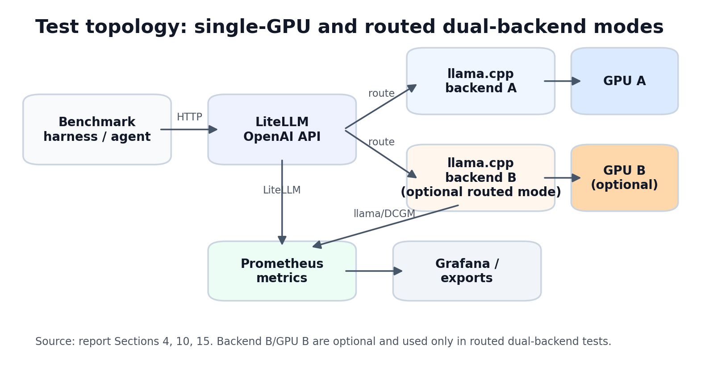
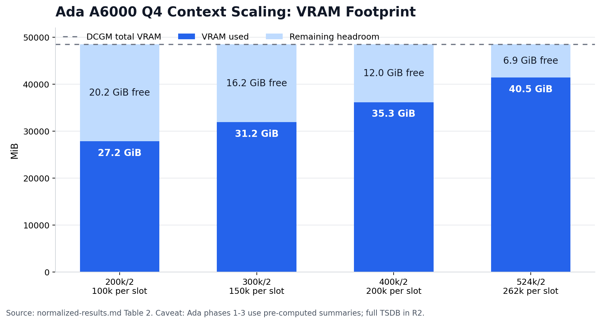
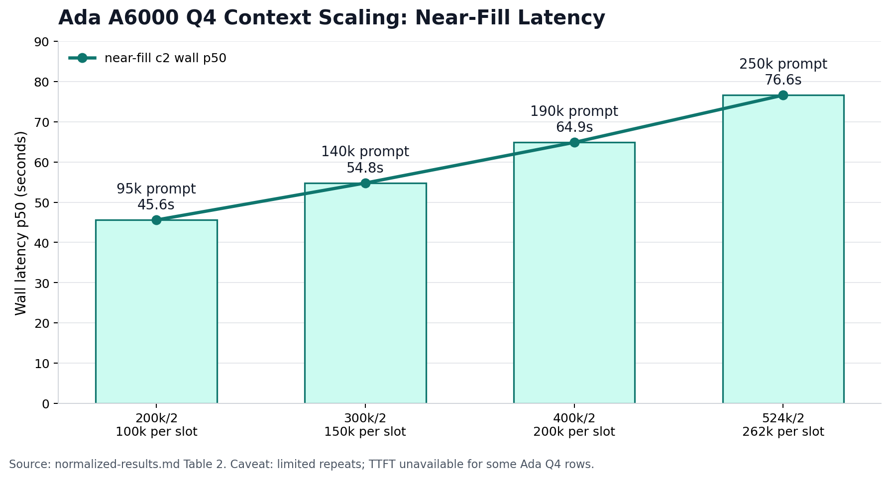
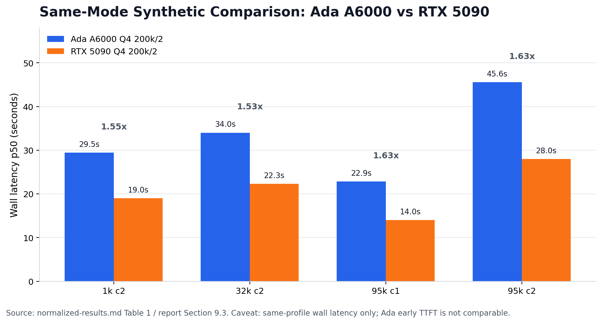
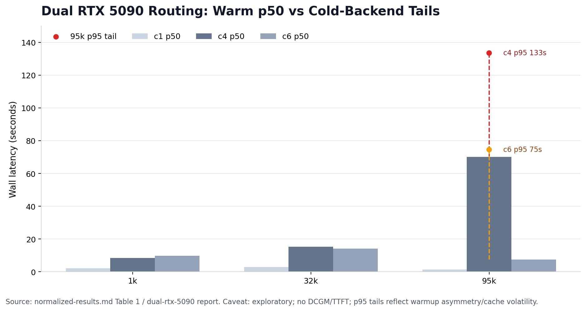
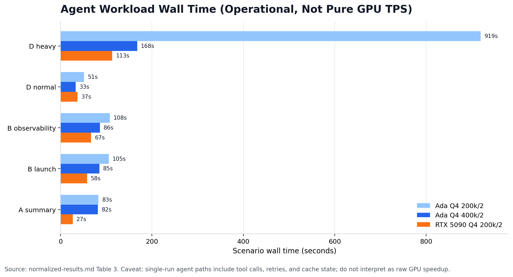
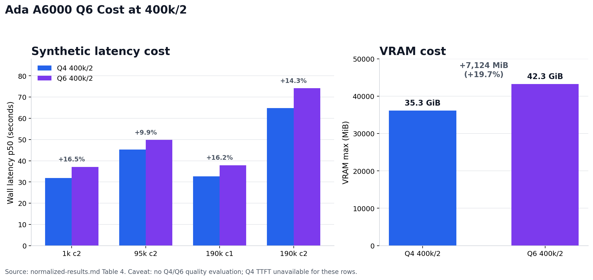
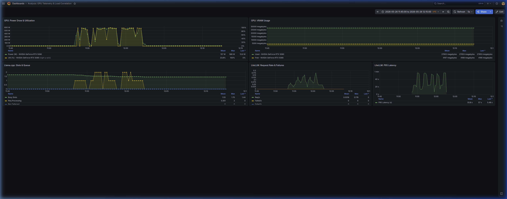
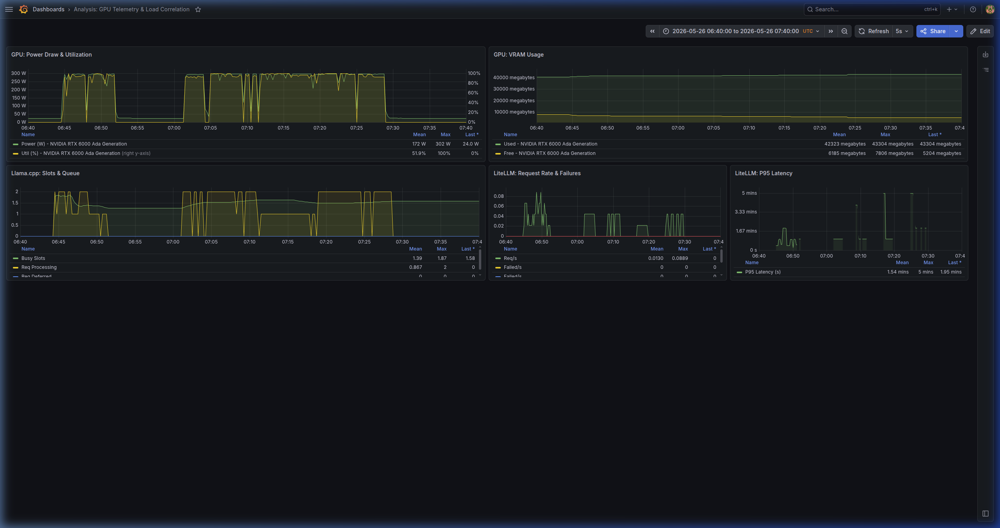

# GPU Runtime Research Report (May 2026)

## 1. Document status and scope

This is a full research artifact. A separate executive summary can be derived from it.

This report consolidates the May 2026 GPU runtime tests for OpenAI-compatible llama.cpp endpoints behind LiteLLM on rented Vast.ai GPUs. It covers RTX 6000 Ada, RTX 5090, and exploratory dual RTX 5090 configurations using Qwen3.6 27B UD GGUF profiles, primarily `Qwen3.6-27B-UD-Q4_K_XL.gguf` and `Qwen3.6-27B-UD-Q6_K_XL.gguf`, with emphasis on runtime behavior, context capacity, latency, VRAM, power, telemetry coverage, and agent-workload completion.

The intended audience is engineering and operations. The report is not a purchasing memo, a production SLO certification, or a universal GPU ranking. Conclusions are scoped to the tested stack, run IDs, model files, quantizations, and benchmark harnesses listed below.

---

## 2. Research questions

The test program was organized around these questions:

- How far can the Ada A6000 context window be expanded while keeping two-slot serving operational?
- At the same `200k / 2` Q4 profile, how much faster is the RTX 5090 than Ada A6000 under synthetic and agent workloads?
- Does the RTX 5090 have enough VRAM headroom for profiles beyond the tested `200k / 2` envelope?
- Does Ada Q6 at `400k / 2` work operationally, and what are its latency and VRAM costs versus Q4?
- Can LiteLLM route benchmark traffic across two independent RTX 5090 llama.cpp backends, and what telemetry is missing for that topology?
- Which observations are Prometheus/DCGM-confirmed, which are harness-only, and which are agent-workload observations rather than pure GPU benchmarks?

---

## 3. Test environment

The tested stack used llama.cpp (`llama-server`) backends behind LiteLLM. Synthetic tests used controlled prompt sizes generated by `scripts/token-target-bench.py`; agent tests used OpenCode through `scripts/phase3_opencode_local.py` or the related remote harness.

Primary hardware profiles:

| hardware | reported VRAM | driver/CUDA notes | tested role |
|---|---:|---|---|
| RTX 6000 Ada Generation | 48,508 MiB DCGM-confirmed, 49,140 MiB OS-reported | Driver `580.119.02` in source notes | Long-context Q4 and Q6 profiles |
| RTX 5090 | 32,607 MiB | Driver `570.211.01`, CUDA `12.9`, Blackwell compute `12.0`; tested run required host CUDA library override | Fast `200k / 2` Q4 worker |
| 2x RTX 5090 | 32,607 MiB per GPU | Dual independent llama.cpp backends behind LiteLLM | Exploratory routed pool |

The environment does not represent all GPU serving configurations. No A100, H100, vLLM, TensorRT-LLM, tensor-parallel, FP16 KV, A3B/MoE, or production multi-tenant service was tested in this report.

---

## 4. Runtime architecture

The runtime under test exposes a LiteLLM OpenAI-compatible endpoint in front of one or more independent llama.cpp backends. Single-GPU runs used one llama.cpp backend with two slots. The dual RTX 5090 run used two independent llama.cpp backends, each with two slots, routed through LiteLLM using a `least-busy` strategy.

This section describes topology only. Performance and routing claims are made later only where tied to specific run IDs and artifacts.



**Figure 4.1: Test topology.** Source: Sections 4, 10, and 15. Supports: the tested runtime is a LiteLLM OpenAI-compatible proxy routing to one or more independent llama.cpp backends, with Prometheus/Grafana used for telemetry. Caveat: architecture context only; this figure makes no performance claim.

---

## 5. Instrumentation and metric sources

### 5.1 Collection pipeline

Metrics were collected via a multi-layer Prometheus stack running inside the container alongside the inference backend:

| layer | exporter | scrape interval | metric prefix |
|---|---|---|---|
| GPU hardware | DCGM Exporter (NVML-backed) | 15 s | `DCGM_FI_*`, relabelled to `gpu_*` |
| LLM runtime | `llama-server` built-in `/metrics` | 15 s | `llamacpp:*` |
| Proxy | LiteLLM Prometheus exporter (port 4001) | 15 s | `litellm_*` |
| System | `node_exporter` | 15 s | `node_*` |

Metrics were exported in two forms:
- **TSDB snapshots** via `scripts/vast-pull-snapshot.sh` for Grafana visualization.
- **PromQL range exports** as per-metric JSON files (`rtx-5090/metrics/*.json`, source repo) for offline analysis.

See `data/metrics_index.md` for the full metric catalogue and DCGM relabelling map.

### 5.2 Coverage by run

| run | DCGM exported JSON | LiteLLM JSON | llama.cpp JSON | TSDB (local `:9191`) |
|---|:---:|:---:|:---:|:---:|
| RTX 5090 phase1+3 (`20260526T094329Z`) | yes | yes | yes | yes |
| Ada A6000 all phases (`20260525T202108Z`) | no (private archive only) | no (private archive only) | no (private archive only) | **partial** (Q6 phase only) |
| Dual RTX 5090 (`20260526T134901Z`) | no | no | NaN | yes (Go metrics only) |

For Ada A6000, hardware and TTFT stats for the Q6 phase (2026-05-26T06:44Z–07:28Z) were computed directly from local Prometheus `:9191`. Phases 1–3 numeric summaries (VRAM max, power avg, GPU util avg/p95) were pre-computed and are cited in Sections 8 and 12. Full per-sample timeseries for phases 1–3 are archived privately and not included in the public dataset.

### 5.3 Limitations

- The 15-second DCGM scrape interval is sufficient for 28–45 second requests but may miss sub-15s transient spikes on very small prompts (e.g. 1k c1 ~15s wall time falls at the margin).
- `DCGM_FI_DEV_MEM_COPY_UTIL` reports PCIe DMA copy engine utilization, not VRAM-to-SM bandwidth. This is an important distinction: the metric does not directly measure how saturated the GDDR7/ECC bandwidth is.
- LiteLLM **does** export TTFT as a Prometheus histogram: `litellm_llm_api_time_to_first_token_metric_bucket`. Server-side TTFT was computed for RTX 5090 (p50=1.67s / p95=22.17s) and Ada Q6 phase (p50=0.46s / p95=190s) from local Prometheus. Note: server-side TTFT includes LiteLLM proxy overhead (~0.5–1.5s) not present in harness-side `curl time_starttransfer`.
- Prometheus/DCGM scraping overhead was not directly measured in this study. It is assumed to be small enough for benchmark observability, but no numerical overhead claim is made.

Full metric analysis: `data/prometheus-observability-analysis.md`.

---

## 6. Methodology

### 6.1 Synthetic benchmark design

#### 6.1.1 Token-target prompts

All synthetic benchmark rows used `scripts/token-target-bench.py`, which constructs prompts of controlled token length. Prompt size is verified by submitting the candidate text to the llama.cpp `/tokenize` endpoint before the request is issued. This avoids the tokenizer mismatch error that arises when a client-side character-count estimate is used as a proxy for token count. The env var `TARGET_TOKENS` accepts a space-separated list of target sizes; the script iterates over them in sequence. Prompt content is pseudo-random filler text, not natural-language queries, so results reflect runtime scheduling, context pressure, latency, and memory footprint rather than semantic workload shape or answer quality.

#### 6.1.2 Prompt calibration

Calibration runs one pre-request to `/tokenize` and adjusts the prompt string until the returned token count is within a small tolerance of the target. The calibrated prompt is saved as a payload artifact under the run directory. Near-context-limit targets (e.g., 95k, 140k, 190k, 250k) require calibration to be precise, because over-limit requests fail immediately with a context overflow error and are not retried as part of the measured set.

#### 6.1.3 max_tokens

`MAX_TOKENS=1024` was used for all synthetic rows unless noted otherwise. This keeps decode time bounded and makes prefill/TTFT the primary variable at long prompt lengths. The fixed decode budget also allows wall latency to function as a consistent proxy for total request cost across different prompt sizes.

#### 6.1.4 Concurrency labels: c1, c2, c4, c6

The label `c<N>` denotes the number of simultaneous HTTP requests fired in parallel by the benchmark client (`PARALLEL=N` in the harness). The mapping to the run register is:

| Label | Client parallel requests |
|-------|--------------------------|
| c1    | 1                        |
| c2    | 2                        |
| c4    | 4                        |
| c6    | 6                        |

Single-GPU runs used 2 llama.cpp slots (`--parallel 2`). Dual-GPU runs used 2 slots per GPU (4 total across both backends, routed by LiteLLM). The concurrency label describes the client load, not the backend slot count.

#### 6.1.5 Slots vs concurrency

A llama.cpp slot (`--parallel`) is a stateful KV-cache reservation. A request occupies one slot for its entire lifetime (prefill + decode). When all slots are busy a new request is queued inside llama.cpp until a slot is released. The client-side `PARALLEL` setting is independent: it controls how many HTTP requests are in flight simultaneously from the benchmark process. These two numbers are related but not equal.

At c2 on a 2-slot backend, steady-state occupancy is approximately 1-2 slots. At c1, at most 1 slot is ever occupied. At c4 or c6 on a 2-slot backend, the backend queue is almost always non-empty.

#### 6.1.6 Warmup and measured repeats

Each benchmark cell runs `WARMUP=1` request before the timed window. The warmup request is issued, its response is awaited, and then the measured repeats begin. `REPEATS=3` measured requests are issued per cell. The warmup exists to bring KV cache, GPU clock state, and memory allocator into a steady state before recording latencies. Warmup results are excluded from all reported statistics. Where `SLEEP_BETWEEN` is set, a sleep is inserted between requests to avoid back-to-back saturation.

Single-run summaries aggregate across the 3 measured repeats. P50/P95 statistics over a 3-repeat window have high variance; they are directional, not precise percentile estimates.

#### 6.1.7 Why concurrency greater than slots measures queueing and scheduling

When `PARALLEL > --parallel`, every request beyond the slot count must wait in the backend's internal queue. The measured wall latency then reflects:

1. Queue wait time (idle GPU time for this request)
2. Prefill time (GPU compute)
3. Decode time (GPU compute)

This is useful for observing scheduling overhead and fairness, but it cannot be directly compared to a c1 or c2 result on the same hardware as a raw throughput measurement. The dual-5090 run used c4 and c6 against 4 total slots to probe LiteLLM routing latency in addition to backend queueing.

---

### 6.2 TTFT measurement model

#### 6.2.1 Non-streaming curl TTFT problem

`token-target-bench.py` uses non-streaming HTTP requests via curl. In non-streaming mode, the server buffers the full completion and returns it as a single response body. curl's `time_starttransfer` metric captures the time from request send to first byte of the HTTP response body — which is the complete JSON response, not the first generated token. This means `time_starttransfer` from curl equals end-to-end latency in non-streaming mode, not TTFT.

Any `prefill_ms` or `time_starttransfer` value from non-streaming curl runs in this study must be treated as an approximation of total wall latency and not as TTFT. These values were noted as unreliable in `docs/agent-and-benchmark-harness.md` and discarded from TTFT columns in the run register for the relevant runs (e.g., `ada6000-phase1-baseline-20260525T202158Z`).

#### 6.2.2 Backend TTFT from llama.cpp logs

llama.cpp writes per-request timing to its log in the format:

```
prompt eval time = <N> ms / <T> tokens (<ms/token> ms per token)
eval time        = <N> ms / <T> tokens (<ms/token> ms per token)
```

`prompt eval time` represents the time the backend spent processing the input tokens (prefill). This is the backend-side TTFT. It excludes:

- Network latency between client and server
- LiteLLM proxy routing time
- Time the request spent in the llama.cpp queue before a slot was available

Backend TTFT from logs is labeled `backend_ttft_ms` wherever it appears in result tables. It is useful for comparing GPU prefill throughput but must not be conflated with the latency a client application would observe.

#### 6.2.3 Streaming TTFT measurement

The remote agent harness (`scripts/phase3_agent_remote.py`) and the pilot harness used streaming requests. In streaming mode, the server sends the first token as a server-sent event (SSE) chunk as soon as it is generated. The client records the timestamp of the first received chunk. This gives a client-side streaming TTFT that includes:

- Queue wait time (if the request waited for a slot)
- Prefill time (GPU compute)
- Network RTT for the first chunk

This is the closest available measure to what an interactive user would experience. It is labeled `streaming_ttft_ms` when present. It was available in `phase3_agent_remote.py` outputs but not in `token-target-bench.py` outputs.

#### 6.2.4 Relationship between backend TTFT, client streaming TTFT, and full wall latency

```
backend_ttft_ms  ≤  streaming_ttft_ms  ≤  wall_latency_ms
```

- `backend_ttft_ms`: prefill compute only, measured inside llama.cpp. Excludes queue wait and network.
- `streaming_ttft_ms`: prefill + queue wait + first-chunk network RTT. Measured by the client.
- `wall_latency_ms`: total time from request send to final response byte. Includes everything above plus decode time.

When comparing TTFT across hardware, use the same measurement type. Mixing backend TTFT from one run with streaming TTFT from another is not valid.

---

### 6.3 Agent workload methodology

#### 6.3.1 OpenCode / local agent workflow

Agent workloads used `scripts/phase3_opencode_local.py`. The script runs `opencode run --format json` with a run-local configuration injected through `OPENCODE_CONFIG_CONTENT`, avoiding global `~/.config/opencode` state. OpenCode is pointed at the LiteLLM endpoint (via SSH tunnel when running locally against a remote instance). Per-scenario metrics are collected: wall time, event-derived counts, slot state before/after, sanitized OpenCode logs, and Prometheus/DCGM windows for the scenario duration.

Scenarios A, B, and D were defined in advance and used consistently across Ada A6000 and RTX 5090 runs to allow cross-hardware comparison. Scenario naming is the only guarantee of workload comparability; the actual token counts emitted by OpenCode vary per run based on the agent's reasoning path.

#### 6.3.2 Why agent workloads are operational tests, not pure TPS

OpenCode performs tool calls (file reads, shell commands, code edits) between LLM requests. The GPU is idle during tool execution. The measured wall time therefore includes:

- LLM inference time (GPU active)
- Tool call execution time (GPU idle)
- Inter-step latency from the agent framework
- Prompt construction overhead per step

Total scenario wall time cannot be converted into a TPS figure for the GPU. Agent results answer the question "did the system complete this task, and how long did it take end-to-end?" not "what is the maximum token throughput of this hardware?"

#### 6.3.3 Tool calls, cache state, and execution path caveats

Each scenario's prompt grows as the agent accumulates context. Later steps in a scenario have longer input prompts than earlier steps. The KV cache may or may not contain useful prefix state for subsequent steps depending on whether the agent resubmits an overlapping prefix. No explicit KV cache prefix pinning was applied.

Scenarios that involve tool failures or retries produce more LLM requests than identical scenarios that succeed on the first attempt. This inflates wall time and request count in a way that is not controlled for. Scenario pass/fail classification is partly heuristic (pattern matching on OpenCode output events) and requires manual review before any claim about agent task success rate is made.

#### 6.3.4 Pass/fail criteria and their limitations

A scenario is counted as "passed" if the OpenCode run exits without a fatal error and the output log contains the expected completion marker. It is counted as "failed" if OpenCode exits with a non-zero code, the model returns a 5xx error, or the harness detects a tool-call timeout.

Limitations:
- A "passed" scenario may have produced incorrect code or a wrong answer. Runtime success is not quality evaluation.
- A single run of each scenario was executed per hardware configuration. Single-run variance cannot be characterized. Agent results in this study are directional observations only.
- `--dangerously-skip-permissions` was used in the controlled benchmark worktree; this must not be replicated in any environment where the agent could access sensitive paths.

---

### 6.4 Prometheus/DCGM methodology

#### 6.4.1 Hardware metrics collected (DCGM Exporter)

The DCGM exporter ran inside the container and exported the following metrics (relabelled for readability in Prometheus):

| Metric | Unit | Meaning |
|--------|------|---------|
| `gpu_utilization` | % | SM utilization |
| `gpu_memory_utilization` | % | Memory controller utilization |
| `gpu_memory_used_mb` | MB | Occupied VRAM |
| `gpu_memory_free_mb` | MB | Free VRAM |
| `gpu_memory_total_mb` | MB | Total VRAM |
| `gpu_power_draw` | W | Instantaneous power draw |
| `gpu_temperature` | °C | Die temperature |
| `gpu_sm_clock` | MHz | SM clock frequency |
| `gpu_memory_clock` | MHz | Memory clock frequency |

`nvidia-smi` CSV logging ran in parallel as a required fallback in case the DCGM exporter was unavailable or misconfigured. Both sources were collected for all runs in this study.

#### 6.4.2 LiteLLM metrics collected

LiteLLM exposed Prometheus metrics scraped at the configured interval:

| Metric | Meaning |
|--------|---------|
| `litellm_requests` | Total requests through the proxy |
| `litellm_failed_requests` | Requests ending in HTTP 4xx/5xx |
| `litellm_latency_p95` | P95 proxy-side latency (includes routing overhead) |
| `litellm_up` | Proxy liveness (1 = up, 0 = down) |

LiteLLM latency metrics include routing time and any retry logic applied by the proxy. They do not isolate backend compute time.

#### 6.4.3 llama.cpp metrics collected

llama.cpp exposed Prometheus metrics (requires `--metrics` flag at startup):

| Metric | Meaning |
|--------|---------|
| `llama_busy_slots` | Currently occupied slots (real-time concurrency) |
| `llama_predicted_tokens_per_second` | Instantaneous decode throughput |
| `llama_predicted_tokens_rate_5m` | 5-minute rolling decode throughput |
| `llama_prompt_tokens_per_second` | Instantaneous prefill throughput |
| `llama_prompt_tokens_rate_5m` | 5-minute rolling prefill throughput |
| `llama_requests_processing` | Requests actively being served |
| `llama_requests_deferred` | Requests waiting for a free slot |

`llama_requests_deferred` is the primary indicator of backend queue pressure. A non-zero sustained value means client concurrency exceeds slot capacity.

#### 6.4.4 How to use these metrics to interpret results

| Interpretation goal | Primary metric(s) |
|---------------------|-------------------|
| **Stability** | `gpu_temperature`, `gpu_power_draw` over time; absence of ECC/XID errors in logs; `litellm_up` continuity |
| **Saturation** | `gpu_utilization` approaching 100%; `llama_busy_slots` at max (`--parallel`) for sustained periods |
| **Memory ceiling** | `gpu_memory_used_mb` approaching `gpu_memory_total_mb`; OOM events in `dmesg.log` or `backend.log` |
| **Queueing** | `llama_requests_deferred > 0` sustained; rising `litellm_latency_p95` without matching GPU utilization increase |
| **Routing (dual-GPU)** | Per-backend `llama_busy_slots` balance; `llama_requests_deferred` per backend; LiteLLM routing logs |

Metrics from Prometheus TSDB snapshots were exported using `promql-range-export` for the benchmark window of each run. PromQL instant and range exports were written to `metrics/promql-export/` under each run directory.

> **Note:** Raw TSDB snapshots contain internal labels that may include hashed API keys or internal identifiers. They are excluded from git. Only sanitized JSON exports derived from the TSDB are considered shareable artifacts.

---

### 6.5 Data quality rules

The following rules apply to all claims made in this report. Any result that does not satisfy the applicable rule must be marked as a caveat or excluded from the body of the report.

1. **No claim without a named source.** Every numerical result must be traceable to a specific run ID, artifact file, or metric export. Unattributed figures are not admissible.

2. **Warm/cached vs cold behavior must be labeled.** Results from the first request after a server start, after a slot eviction, or after a context-size restart are cold-path results. Results from subsequent requests under stable load are warm-path results. These must not be averaged together or compared directly without explicit labeling. The warmup request defined in the harness (`WARMUP=1`) mitigates but does not eliminate cold-start effects for the measured window.

3. **Single-run agent results must not be overgeneralized.** Each agent scenario was executed once per hardware configuration in this study. A single-run pass or fail result is an observation, not a rate. Statements such as "Scenario B always completes on the RTX 5090" are not supported by the data. Agent results should be reported as "Scenario B passed in N s (single run, run ID: X)" and interpreted accordingly.

4. **Quality claims require separate evaluation and are not proven by runtime benchmarks.** This study measures system performance: latency, throughput, memory use, and stability. It does not measure output correctness, reasoning quality, or task accuracy. No result in this report — including scenario pass/fail, decode speed, or TTFT — is evidence that one quantization level or hardware configuration produces better LLM outputs. Quality evaluation requires a separate benchmark suite with defined evaluation criteria.

---

## 7. Run inventory

This register lists the successful or analytically relevant runs used by the body of the report. Failed, superseded, or sandbox runs are documented in `data/artifact-inventory.md` but are not used for primary conclusions unless a caveat explicitly says so.

### Active Runs Register

Below is the detailed list of benchmark runs captured during this research phase:

| run_id | hardware | model | quant/model file | ctx_size | parallel/slots | workload type | rows/scenarios completed | success status | benchmark CSV available | request rows available | Prometheus/DCGM available | LiteLLM metrics available | llama.cpp metrics/logs available | caveats |
|---|---|---|---|---|---|---|---|---|:---:|:---:|:---:|:---:|:---:|---|
| `ada6000-phase0-20260525T191508Z` | RTX 6000 Ada | Qwen3.6 27B UD | Q4_K_XL | 200k | 2 | Smoke Test | 1 scenario | success | no | no | no | yes | yes | connection/validation smoke check only |
| `ada6000-phase1-baseline-20260525T202158Z` | RTX 6000 Ada | Qwen3.6 27B UD | Q4_K_XL | 200k | 2 | Synthetic | 6 (1k, 32k, 95k c1/c2) | success | yes | yes | yes | yes | yes | Non-streaming TTFT was backend-only and discarded from CLI metrics |
| `ada6000-phase2-ctx300k-20260525T215448Z` | RTX 6000 Ada | Qwen3.6 27B UD | Q4_K_XL | 300k | 2 | Synthetic | 8 (1k, 32k, 95k, 140k c1/c2) | success | yes | yes | yes | yes | yes | Baseline for 300k scaling |
| `ada6000-ctx400k-bench-20260525T224858Z` | RTX 6000 Ada | Qwen3.6 27B UD | Q4_K_XL | 400k | 2 | Synthetic | 8 (1k, 32k, 95k, 190k c1/c2) | success | yes | yes | yes | yes | yes | Baseline for 400k scaling |
| `ada6000-ctx524k-bench-20260526T001055Z` | RTX 6000 Ada | Qwen3.6 27B UD | Q4_K_XL | 524k | 2 | Synthetic | 10 (up to 250k c1/c2) | success | yes | yes | yes | yes | yes | Tighter VRAM footprint limits |
| `ada6000-phase3-agent-200k-vs-400k-20260526T042003Z` | RTX 6000 Ada | Qwen3.6 27B UD | Q4_K_XL | 200k & 400k | 2 | Agent | 5 scenarios per mode | success | yes | yes | yes | yes | yes | Agent workload comparison; single-run variance |
| `ada6000-phase4-q6-agent-20260526T054743Z` | RTX 6000 Ada | Qwen3.6 27B UD | Q6_K_XL | 400k | 2 | Agent | 4 scenarios (missing A) | success | yes | yes | yes | yes | yes | Slower decode rates and higher VRAM footprint |
| `ada6000-phase4-q6-synthetic-sanity-20260526T065829Z` | RTX 6000 Ada | Qwen3.6 27B UD | Q6_K_XL | 400k | 2 | Synthetic | 4 (1k c2, 95k c2, 190k c1/c2) | success | yes | yes | yes | yes | yes | Direct Q6 synthetic validation vs Q4 |
| `5090-phase1-bench-20260526T111748Z` | RTX 5090 | Qwen3.6 27B UD | Q4_K_XL | 200k | 2 | Synthetic | 4 (1k c2, 32k c2, 95k c1/c2) | success | yes | yes | yes | yes | yes | Blackwell override needed; Slow TTFT anomaly |
| `5090-phase3-agent-20260526T115516Z` | RTX 5090 | Qwen3.6 27B UD | Q4_K_XL | 200k | 2 | Agent | 5 scenarios | success | yes | yes | yes | yes | yes | Main 5090 agent benchmark. All scenarios passed |
| `dual-5090-bench-20260526T150629Z` | 2x RTX 5090 | Qwen3.6 27B UD | Q4_K_XL | 200k per GPU | 2 per GPU (total 4) | Synthetic | 9 (1k, 32k, 95k for c1, c4, c6) | success | no | yes | yes | yes | yes | LiteLLM routing; warmup asymmetry, cache eviction risks |

---

## 8. Ada 6000 Results

### 8.1 200k/2 baseline

- **Goal of test**: Establish synthetic stability baseline and resource envelope for the standard 200k-context configuration.
- **Config**: `Qwen3.6-27B-UD-Q4_K_XL.gguf`, 200k total context, 2 slots (100k per slot), `q8_0` KV cache, flash attention on.
- **Completed rows/scenarios**: 6 synthetic rows (1k, 32k, 95k at c1 and c2).
- **Key numeric results**: 95k c2 wall p50 = 45.581s. 1k c1 wall p50 = 15.325s.
- **Hardware metrics**: VRAM max = 27,854 MiB. GPU util avg/p95 = 84%/100%. Power avg/p95 = 264 W/300 W. Temp max = 64°C.
- **Interpretation**: The baseline configuration is stable within the tested synthetic window. The near-limit 95k prompt is viable under two slots. The GPU operates below its observed ~300 W active power envelope, indicating it was not power-limited in this run. The exact compute-versus-memory bottleneck was not directly measured.
- **Limitations**: Phase 1 used non-streaming curl requests, making client-side TTFT unreliable (it acted as full response latency). Backend-only TTFT was recovered from llama.cpp logs but lacks network and LiteLLM proxy overhead. Concurrency 3 was not tested.

### 8.2 300k/2 context expansion

- **Goal of test**: Evaluate the resource cost and stability of expanding context to 150k per slot.
- **Config**: `Qwen3.6-27B-UD-Q4_K_XL.gguf`, 300k total context, 2 slots (150k per slot).
- **Completed rows/scenarios**: 8 synthetic rows (1k, 32k, 95k, 140k at c1 and c2).
- **Key numeric results**: 140k c2 wall p50 = 54.770s. 1k c1 wall p50 = 16.259s (+0.9s vs 200k/2). Streaming TTFT p50 ranged from 0.080s (1k c1) to 0.366s (140k c2); p95 ranged from 0.081s to 0.477s.
- **Hardware metrics**: VRAM max = 31,906 MiB (+4,052 MiB vs 200k/2). GPU util avg/p95 = 93%/100%. Power avg/p95 = 290 W/300 W. Temp max = 64°C.
- **Interpretation**: 300k/2 is viable but not free. It incurs roughly +4 GiB VRAM overhead and a modest latency cost on small requests (+0.9s for 1k c1). Latency remains stable at higher loads, and the configuration successfully opens up 140k contexts. Streaming client TTFT was fixed and correctly introduced in this phase; values are low for warm-cache prefix requests (sub-0.4s p50 for all tested rows).
- **Limitations**: Agent workloads were not tested on this configuration. Synthetic samples consist of only 3 measured repeats, making p95 tracking directional.

### 8.3 400k/2 operating candidate

- **Goal of test**: Identify the best-supported high-capacity Ada candidate among the tested Q4 profiles by comparing performance against 200k/2 under synthetic load and realistic agent stress tests.
- **Config**: `Qwen3.6-27B-UD-Q4_K_XL.gguf`, 400k total context, 2 slots (200k per slot).
- **Completed rows/scenarios**: 10 synthetic rows (1k, 32k, 95k, 180k, 190k at c1 and c2). 5 agent workload scenarios (A, B-launch, B-obs, D-normal, D-heavy).
- **Key numeric results**: Synthetic 190k c2 wall p50 = 64.868s. Agent Scenario D (heavy) wall time dropped dramatically from 919.4s (on 200k/2) to 167.7s (on 400k/2).
- **Hardware metrics**: VRAM max = 36,180 MiB (synthetic), p50 = 35,400 MiB; ~34.7 GiB peak during agent run. Power avg/p95 = 287 W/300 W. GPU util avg/p95 = 92%/100%. Temp max/p95 = 64°C/63°C.
- **Interpretation**: Among the tested Ada Q4 profiles, 400k/2 is the best-supported long-context agent candidate. Scenario D wall time dropped sharply from 919.4s on 200k/2 to 167.7s on 400k/2 in one run; the likely explanation is reduced context pressure, fewer retries, or less cache/eviction pressure, but the trace data needed to prove the exact cause was not extracted. With a VRAM footprint of ~36.1 GiB, it leaves ~12.3 GiB headroom (DCGM total 48,508 MiB). This supports 400k/2 as the recommended default candidate for long-context tasks in this tested stack, not as a universal default.
- **Limitations**: The Scenario D heavy delta (919s vs 168s) reflects execution path divergence (agent retries/tool calls), not a direct GPU inference speedup ratio. Agent workloads were single runs, so variance is uncontrolled. Streaming TTFT was captured by the harness but is not reported in the primary run summary for 400k/2 synthetic rows.

### 8.4 524288/2 aggressive mode

- **Goal of test**: Probe the maximum stable context ceiling before VRAM exhaustion on the 48 GiB Ada A6000.
- **Config**: `Qwen3.6-27B-UD-Q4_K_XL.gguf`, 524288 total context, 2 slots (~262k per slot).
- **Completed rows/scenarios**: 12 synthetic rows (1k, 32k, 95k, 180k, 190k, 250k at c1 and c2).
- **Key numeric results**: 250k c2 wall p50 = 76.620s, p95 = 77.774s.
- **Hardware metrics**: VRAM max = 41,434 MiB. VRAM free at max ≈ 7,074 MiB (using DCGM-confirmed total 48,508 MiB); source docs cite ~7.5 GiB using the OS-reported 49,140 MiB total.
- **Interpretation**: 524288/2 works cleanly through 250k concurrency 2. However, it must be treated as an aggressive mode because VRAM headroom shrinks to ~7 GiB, leaving a narrow margin for any VRAM spike. Latency is high but predictable.
- **Limitations**: DCGM power/temperature metrics were not extracted locally (available only in the private archive). TTFT per-row was not extracted from the run artifacts.

### 8.5 Q6 on Ada

- **Goal of test**: Evaluate the operational viability and resource penalty of using the Q6_K_XL quant compared to the Q4 baseline.
- **Config**: `Qwen3.6-27B-UD-Q6_K_XL.gguf`, 400k total context, 2 slots (200k per slot).
- **Completed rows/scenarios**: 4 synthetic rows (1k c2, 95k c2, 190k c1, 190k c2). 4 agent scenarios (B-launch, B-obs, D-normal, D-heavy). Scenario A was not run.
- **Key numeric results**: Synthetic 190k c2 wall p50 = 74.157s (vs 64.868s on Q4, +14%). Agent Scenario D (heavy) = 227s (vs 168s on Q4, +35%). Agent Scenario B-obs = 196s (vs 86s on Q4, +128%).
- **Hardware metrics**: VRAM max = 43,304 MiB (+7,124 MiB vs Q4 400k/2), leaving ~5,204 MiB free (DCGM-confirmed). GPU util avg/p50/p95 = 69%/95%/100%. Power avg/p95 = 221.5 W/299.4 W. `MEM_COPY_UTIL` p50 = 84%, but this metric is PCIe DMA copy-engine utilization and not direct VRAM-to-SM bandwidth. Temp max = 64°C.
- **Interpretation**: Q6 is operationally viable for the tested subset; it completed the selected synthetic rows and agent scenarios without reported crash or OOM. However, it is slower (+9.9% to +16.5% synthetically; +35.4% to +128.2% on single-run agent tasks depending on path) and consumes ~7.1 GiB more VRAM. At 43.3 GiB VRAM, only 5.2 GiB of measured headroom remains, so contexts above Q6 400k/2 are likely to have narrow or insufficient headroom, but they were not tested. There is no evidence of Q6 quality improvement justifying the cost, as no quality evaluation was performed.
- **Limitations**: Do not claim Q6 quality improvement without a dedicated quality evaluation. Scenario A was not run in the Q6 phase. Not all synthetic rows were run (32k and 180k omitted from sanity subset).

### 8.6 Ada Prometheus/DCGM interpretation

**VRAM scaling profile across configurations:**

| config | VRAM max (MiB) | delta vs prior | VRAM free (MiB)¹ |
|---|---:|---:|---:|
| Q4 200k/2 | 27,854 | — | 20,654 |
| Q4 300k/2 | 31,906 | +4,052 | 16,602 |
| Q4 400k/2 | 36,180 | +4,274 | 12,328 |
| Q4 524k/2 | 41,434 | +5,254 | 7,074 |
| Q6 400k/2 | 43,304 | +7,124 vs Q4 400k/2 | 5,204 |

¹ VRAM free computed using DCGM-confirmed total of **48,508 MiB**. The OS-reported total (49,140 MiB via `nvidia-smi`) overstates headroom by ~632 MiB; the DCGM figure is authoritative.

VRAM scales at roughly +4–5 GiB per +100k context step for Q4 (consistent across the 200k→300k→400k→524k progression). The jump from Q4 to Q6 at the same 400k context adds ~7.1 GiB, consistent with the larger Q6_K_XL weight tensor footprint.



**Figure 8.1: Ada context scaling, VRAM footprint.** Source: `normalized-results.md` Table 2. Supports: Ada A6000 Q4 VRAM use rises predictably as context grows, preserving larger long-context capacity than RTX 5090. Caveat: Ada phases 1–3 use pre-computed summaries; full raw TSDB for those phases is in the private archive.



**Figure 8.2: Ada context scaling, near-fill latency.** Source: `normalized-results.md` Table 2. Supports: Ada Q4 remains viable through larger near-fill prompts, with latency increasing but staying predictable through the tested 524k/2 profile. Caveat: limited repeats; TTFT is unavailable for some Ada Q4 rows.

**GPU utilization — bimodal behavior:**

The Ada Q6 phase shows GPU util avg=69% with p50=95%. This bimodal distribution is expected: the GPU is near-fully saturated during active decode (p50=95%, p95=100%) but drops to near-zero between agent tool calls and during inter-request idle periods. The 69% avg reflects the idle-weighted mean across the full observation window. This is normal for agent workloads, not a hardware utilization problem. The same pattern (lower avg, high active-period p50) is expected for Q4 agent configurations but was not captured locally for Ada phases 1–3.

**Power behavior and bottleneck limits:**

Across all Ada configurations (200k/2 through Q6 400k/2), reported power remains at 221–290 W, below the 350 W TDP spec and near the observed ~300 W sustained board limit in these runs. Power behavior does not indicate power throttling in the tested Q4 configurations. The exact compute-versus-memory bottleneck was not directly measured because VRAM-to-SM bandwidth was not exported. The Q6 phase did show `MEM_COPY_UTIL` p50=84%, but that metric is PCIe DMA copy-engine utilization, not direct GDDR bandwidth. The SM clock during Q6 active inference peaks at 2,730 MHz (p95 = 2,520 MHz), supporting the narrower conclusion that no thermal throttling was observed in the Q6 window.

**LiteLLM TTFT server-side distribution (Q6 phase, n=310 requests):**

The LiteLLM TTFT histogram (`litellm_llm_api_time_to_first_token_metric_bucket`) for the Q6 agent+synthetic window shows a strongly bimodal distribution: p50=0.46s (cache-hit tool calls and short synthetic prompts), p95=190s (long-context Q6 agent initial loads at 400k tokens). The 190s tail is consistent with the large prefill time for Q6 400k context. This metric is available only for the Q6 phase in local Prometheus; TTFT server-side data for Ada phases 1–3 is archived privately, not in public dataset.

**Limitations**: Per-scenario p50/p95 Prometheus stats for Ada phases 1–3 were not extracted locally; hardware stats for those phases rely on pre-computed summaries. The full TSDB remains in the private archive. Ada llama.cpp slot/deferred metrics are not available locally for any phase (zero failures confirmed from run outcomes only).

### 8.7 Ada-specific caveats

- **FP16 KV cache**: FP16 KV cache was not tested; all configurations relied on `q8_0`.
- **Phase 1 TTFT non-streaming issue**: The curl harness recorded full wall latency instead of TTFT during Phase 1. Backend-only TTFT was recovered from llama.cpp logs but lacks proxy/network overhead. Streaming client-side TTFT was fixed and correctly introduced for Phase 2 (300k) and beyond.
- **Concurrency bounds**: Concurrency 3 was not tested synthetically on any Ada configuration, limiting the view of backend queuing behavior on the 2-slot setup.
- **Agent workloads**: Agent workloads were un-replicated single runs. Wall times reflect both GPU compute and variable agent execution paths, making them operational observations rather than controlled throughput numbers.
- **Q6 Scenario A not run**: The Q6 agent phase skipped Scenario A (repo summary). The Q6 agent comparison covers scenarios B and D only.
- **VRAM total discrepancy**: DCGM reports 48,508 MiB total VRAM; `nvidia-smi` (OS-level) reports 49,140 MiB. All headroom calculations in this report use the DCGM-confirmed figure.

---

## 9. RTX 5090 results

### 9.1 Environment and runtime quirks

The RTX 5090 introduces specific runtime requirements due to its Blackwell (compute `12.0`) architecture. The GPU natively rejects the compatibility library `libcuda.so.1` (typically located in `/usr/local/cuda-12.9/compat/`). If `llama-server` is started without explicitly overriding the `LD_LIBRARY_PATH` to point to the host's primary CUDA libraries, the GPU is silently ignored, falling back to CPU inference with ~2 MiB VRAM allocated. This override does not persist across container restarts and must be enforced at the entrypoint layer.

### 9.2 200k/2 synthetic baseline

The RTX 5090 is an exceptionally fast worker at the `200k / 2 slots` configuration (Q4_K_XL). 

| row | c | ok | wall p50 (s) | streaming_ttft_p50 (s) | decode_tps_p50 | vram_max_mib |
|---|---:|---:|---:|---:|---:|---:|
| 1k | 2 | 6/6 | 18.994 | 0.445 | 55.3 | 27,943 |
| 32k | 2 | 6/6 | 22.286 | 0.729 | 47.5 | 27,943 |
| 95k | 1 | 3/3 | 13.997 | 0.818 | 77.7 | 27,943 |
| 95k | 2 | 6/6 | 27.964 | 1.018 | 38.0 | 27,951 |

The 5090 processed up to 95k context reliably at concurrency 2, demonstrating stable scheduling. However, the `streaming_ttft_p50` measurements (0.445s–1.018s) are anomalously slow for a warm-cache prefix request. This latency is suspected to be overhead from the `draft-mtp` speculative decoding configuration penalizing the first decode step, though further isolation is required.

### 9.3 Comparison against Ada 200k/2

At the identical `200k / 2` configuration, the RTX 5090 significantly outperforms the Ada A6000 on decode and end-to-end wall time. 

| row | Ada wall_p50 | 5090 wall_p50 | Speedup | Ada decode | 5090 decode |
|---|---:|---:|---:|---:|---:|
| 1k c2 | 29.454s | 18.994s | **1.55x** | 35.1 tok/s | 55.3 tok/s |
| 32k c2 | 34.016s | 22.286s | **1.53x** | 30.3 tok/s | 47.5 tok/s |
| 95k c1 | 22.851s | 13.997s | **1.63x** | 45.3 tok/s | 77.7 tok/s |
| 95k c2 | 45.582s | 27.964s | **1.63x** | 22.6 tok/s | 38.0 tok/s |

This ~1.5x–1.6x speedup is consistent with the RTX 5090's broader hardware advantages, including higher published memory bandwidth (~1,790 GB/s vs ~960 GB/s for Ada A6000). It does not by itself confirm that decode throughput is memory-bandwidth bound, because VRAM-to-SM bandwidth was not directly measured in this study.



**Figure 9.1: Same-mode synthetic comparison, Ada A6000 vs RTX 5090.** Source: `normalized-results.md` Table 1 and Section 9.3. Supports: RTX 5090 is the faster `200k / 2` Q4 worker in identical synthetic rows. Caveat: this compares wall latency for compatible profiles only; Ada early TTFT is not comparable because of the non-streaming TTFT issue.

### 9.4 Agent workload results

The RTX 5090 successfully passed all five OpenCode agent scenarios at `200k / 2` with noticeably faster execution times.

| scenario | 5090 wall (s) | Ada 200k wall (s) | Ratio |
|---|---:|---:|---:|
| A: repo summary | 26.7 | 83.0 | 3.1x |
| B: launch/runtime | 58.1 | 105.4 | 1.8x |
| B: bench/observability | 66.8 | 107.7 | 1.6x |
| D: normal | 37.3 | 51.3 | 1.4x |
| D: heavy | 113.2 | 919.4 | 8.1x |

**Important caveat on agent speedups:** Agent scenarios measure total end-to-end task time, including tool execution and framework overhead. They are operational confirmations, not pure GPU throughput metrics. The 8.1x apparent speedup in the "D: heavy" scenario should not be interpreted as raw GPU acceleration. The Ada A6000 200k run (919.4s) likely encountered a context-limit or agent reasoning pathology, as evidenced by the Ada 400k run completing the same scenario in 167.7s. 

### 9.5 Prometheus/DCGM/LiteLLM/llama.cpp interpretation

Observability metrics confirm the RTX 5090 ran efficiently without systemic bottlenecks at this concurrency:
- **llama.cpp internal queueing:** `llama_requests_deferred` remained at 0 throughout all test windows. `llama_busy_slots` p50 sat between 1.54 (agent) and 1.73 (synthetic), showing high slot utilization but no client queuing.
- **LiteLLM proxy health:** `litellm_failed_requests` for inference traffic remained at zero. Server-side TTFT registered at p50=1.67s / p95=22.17s across all workloads.
- **Agent prompt churn:** `llama_prompt_tokens_rate_5m` was higher during the agent phase than the synthetic phase in the exported RTX 5090 metrics. The p50 comparison is 799 t/s vs 232 t/s (~3.4x); the p95 comparison is 1,034 t/s vs 667 t/s (~1.55x). This supports the interpretation that agent runs create many short tool-call prompts, but the exact multiplier depends on which percentile is compared.
- **GPU utilization:** Saturated comfortably at 92% (synthetic) to 97% (agent phase), demonstrating the 5090 was continuously fed by the routing stack.

### 9.6 VRAM and power limitations

Despite exceptional speed, the RTX 5090 operates within tight physical constraints that limit scaling:
- **VRAM ceiling:** At `200k / 2 slots`, the model and KV cache occupy 27,953 MiB out of the available 32,607 MiB. This leaves only ~4.6 GB of free headroom. Larger profiles such as `256k / 2` or `300k / 2` were not tested on RTX 5090; based on the measured headroom and Ada context-scaling deltas, they are likely to be tight or fail. The tested evidence does not show the 5090 matching the deep context capacity of the 48 GB Ada A6000.
- **Power draw and thermals:** The RTX 5090 runs at or near its 575 W TDP during active inference. The Prometheus-computed window-averaged power was ~476 W (Prometheus; covers idle gaps between requests). During active inference the p50 power draw was ~575 W and p95 was ~577 W, with a single 586.1 W transient recorded during the agent phase. Temperatures remained entirely safe (max 73°C) and clocks did not throttle, but sustained near-TDP per-GPU power draw has serious thermal and rack-density implications for any multi-GPU server deployment.

### 9.7 RTX 5090-specific caveats

When planning deployments around the RTX 5090, the following operational bounds must be respected:
1. **Strict tested boundary:** The 5090 is a high-speed worker for the tested `200k / 2` profile, or roughly 100k context per slot. Do not project long-context scaling beyond that boundary without a separate run. If deeper context is required in this stack, Ada A6000 is the supported target from the current evidence.
2. **First-token latency:** The anomalously slow streaming TTFT (0.45s–1.02s) on cached prefixes may impact user-facing interactive workloads. Disabling MTP is required to verify if the speculative drafting engine is responsible.
3. **Power budgeting:** Do not deploy RTX 5090 instances without ensuring the host chassis and power delivery can sustain flat 575 W continuous loads per GPU.

---

## 10. Dual RTX 5090 exploratory topology probe

### 10.1 Topology

Two independent NVIDIA GeForce RTX 5090 backends running on a single instance.
- **Hardware**: 2x NVIDIA GeForce RTX 5090
- **Total capacity**: 4 concurrent slots across 2 GPUs (2 slots per backend).

This topology is an exploratory topology probe. It checks whether the LiteLLM plus independent llama.cpp backend shape can serve benchmark traffic at all. It must not be presented as benchmark proof, routing proof, or a final capacity baseline.

### 10.2 LiteLLM routing strategy

LiteLLM serves as the single OpenAI-compatible endpoint, routing traffic across the two independent `llama.cpp` backends using a `least-busy` routing strategy. This strategy attempts to distribute incoming requests to the backend with the fewest active slots.

### 10.3 Backend configuration

Each independent `llama.cpp` backend is configured with:
- `200k` context limit
- `2` slots (`LLAMA_PARALLEL=2`)
- Model: `Qwen3.6-27B-UD-Q4_K_XL.gguf`

### 10.4 c1/c4/c6 synthetic results

The harness used 1 warmup request (`WARMUP=1`), 3 measured repeats, and `max_tokens: 1024`.

| concurrency | prompt size | wall p50 (s) | wall p95 (s) | note |
|---|---|---:|---:|---|
| c1 | 1k | 2.26 | — | Single-slot, warm cache |
| c1 | 32k | 2.89 | — | Single-slot, warm cache |
| c1 | 95k | 1.45 | — | Cache-warm prefill near-zero |
| c4 | 1k | 8.48 | — | Full 4-slot saturation |
| c4 | 32k | 15.30 | — | Full 4-slot saturation |
| c4 | 95k | 70.08 | 133.47 | High variance; cold-backend assignment in batch 1 |
| c6 | 1k | 9.77 | — | Over-saturation; queueing |
| c6 | 32k | 14.25 | — | Over-saturation |
| c6 | 95k | 7.42 | 74.53 | After warm-up: fast; p95 tail from cold batch 1 |



**Figure 10.1: Dual RTX 5090 topology probe, warm p50 vs cold-backend tails.** Source: `normalized-results.md` Table 1 and `dual-rtx-5090/report-draft.md`. Supports: the dual 5090 topology produced client-side timing data with sharp divergence between warm-cache p50 and cold-backend tail latency. Caveat: no DCGM, no TTFT, no per-row success counts, and invalid llama.cpp metrics for this run; use only as exploratory topology evidence.

### 10.5 Warmup asymmetry

A single warmup request (`WARMUP=1`) was insufficient for a dual-backend setup because it only warmed up one of the two backends. When the first concurrent batch (e.g., `c4` or `c6`) arrived, one backend was completely cold and had to perform a full context prefill from scratch. This caused massive latency spikes on the cold backend (e.g., ~70s for 95k prefill), skewing initial batch results.

### 10.6 Cache volatility and routing caveats

At `c4` with 95k contexts, an extreme latency spike (134s) was observed in a later batch, indicating that maintaining 4 heavy contexts perfectly cached across 2 backends is volatile. The 95k c4/c6 results are highly cache-state sensitive: near-OOM KV cache shifting or imperfect `least-busy` balancing can easily lead to cache evictions and cold-start prefill behavior. 

It is critical to distinguish the steady-state warm-cache behavior from the cold/full-prefill behavior. When requests hit a warm cache (e.g., steady-state c6 p50 = 7.42s or c1 p50 = 1.45s), throughput is blazing fast, proving the immense potential throughput when the cache is managed properly. The cold-start full prefill (70–134s) illustrates what happens when this cache state is lost or misrouted.

### 10.7 Prometheus/LiteLLM/runtime observations

- **Missing hardware metrics**: No DCGM JSON exports were pulled for the dual-5090 run. While `Prometheus/DCGM available: yes` is noted in the private archive, local range exports are absent. Therefore, hardware characterizations (power, VRAM, temp) are unmeasured and classifications remain inferred.
- **Unreachable backend metrics**: `llama.cpp` metrics exist in the TSDB for the scrape window, but all series return `NaN` (suspected backend connectivity issue during the 13:54–15:13Z scrape window).
- **Missing LiteLLM latency and TTFT data**: No `litellm_latency_p95` or `litellm_llm_api_time_to_first_token_metric_bucket` data is available in the TSDB for the dual-5090 run. 
- **Routing-layer blind spot**: Because a cold backend accepts a request without queuing it, `llama_requests_deferred` would read `0` on the cold backend, while the client experiences a 70–134s latency delay. The deferred metric completely fails to surface this cross-backend routing imbalance.
- **Zero LiteLLM inference failures**: Despite the latency variance and missing telemetry, LiteLLM confirmed zero inference failures for the dual-5090 test session.

### 10.8 What this topology probe shows

- The topology served client benchmark requests through one OpenAI-compatible endpoint backed by two independent `llama.cpp` backends on the same instance.
- Warm-cache client-side timings were very fast in some batches, especially after both backends had seen large prompts.
- All characterization is from client-side timings only. The run does not prove reliable routing balance, backend-level capacity, or production-ready multi-GPU behavior because route attribution, DCGM exports, LiteLLM TTFT, per-row success counts, and valid llama.cpp metrics were missing or incomplete.

### 10.9 What this does not prove

- This does not represent a final, tuned capacity baseline for a dual RTX 5090 system.
- Thermal and power stability at full dual-GPU saturation remains unproven due to missing DCGM data.
- The `least-busy` strategy is not proven to perfectly protect heavy KV caches from eviction under high concurrency.

Full detail: `docs/benchmarks/dual-rtx-5090/report-draft.md (source repo)`.

---

## 11. Agent Workload Study

### 11.1 Why synthetic benchmarks are insufficient

Synthetic benchmarks isolate maximum context limits, power boundaries, and VRAM ceilings. They fail to reflect autonomous agent workloads.
Agent runs introduce:
- Variable-length context growth.
- Cache prefix shifting.
- Inter-step tool latency (GPU idle).
- Variable execution paths driven by intermediate model outputs.
Operational viability requires testing against real-world agent scenarios.

### 11.2 Agent harness and scenarios

Agent workloads used the `scripts/phase3_opencode_local.py` harness.
This runs a local `opencode` instance through an SSH tunnel to the LiteLLM proxy. It avoids global config pollution by injecting run-local `OPENCODE_CONFIG_CONTENT`.

**Table 11.1: Scenario Definitions**

| scenario | description | workload type | expected stressor |
|---|---|---|---|
| A: repo summary | General summarization of a small repository | Read-heavy | Basic prefill and context accumulation |
| B: launch/runtime | Executing application launch and observing errors | Mixed read/execute | Iterative context growth with tool latency |
| B: bench/observability | Running a benchmark and reading observability outputs | Mixed read/execute | Parsing structured outputs and iteration |
| D: normal | Running a standard development task alongside a heavy one | Multi-turn coding | Cache retention under concurrent load |
| D: heavy | A complex, multi-step debugging and refactoring task | Heavy multi-turn | Deep context pressure, cache eviction risk, high token churn |

### 11.3 Ada 200k/2 vs Ada 400k/2

Tested Ada A6000 at `200k / 2 slots` and `400k / 2 slots` (Q4_K_XL).

The "D: heavy" scenario wall time dropped from 919.4s at 200k/2 to 167.7s at 400k/2. 
Treat this heavy scenario speedup carefully. It is not a pure inference-speed multiplier.
The larger per-slot context limit (200k vs 100k) reduced context pressure, preventing the excessive agent retry loops and heavy cache eviction behavior observed in the 200k run.

### 11.4 RTX 5090 200k/2 agent results

The RTX 5090 completed all scenarios successfully at `200k / 2 slots` (100k per slot).
Execution was noticeably faster than the Ada A6000 at the same configuration. This aligns with the synthetic ~1.5x-1.6x raw decode advantage. 

### 11.5 Cross-comparison and interpretation

**Table 11.2: Agent Results Cross-Comparison**

| scenario | Ada 200k wall (s) | Ada 400k wall (s) | RTX 5090 200k wall (s) | pass/fail | notes |
|---|---:|---:|---:|---|---|
| A: repo summary | 83.0 | 81.9 | 26.7 | pass | 5090 cache was warm from prior run. |
| B: launch/runtime | 105.4 | 85.0 | 58.1 | pass | 5090 noticeably faster. |
| B: bench/observability | 107.7 | 86.1 | 66.8 | pass | Consistent 5090 speed advantage. |
| D: normal | 51.3 | 33.3 | 37.3 | pass | Remained usable during heavy concurrent task. |
| D: heavy | 919.4 | 167.7 | 113.2 | pass | Ada 200k encountered severe path/context pressure. |

For workloads fitting the tested `200k / 2` envelope, the RTX 5090 is the faster measured worker. For tasks that may exceed roughly 100k per slot, Ada A6000 at 400k/2 is the supported long-context target in this study. The agent-loop explanation remains a plausible interpretation of the Ada 200k D-heavy run, not a proven general failure mode.



**Figure 11.1: Agent workload comparison.** Source: `normalized-results.md` Table 3. Supports: RTX 5090 is the fast medium-context worker, while Ada 400k/2 is the long-context agent endpoint that avoids the Ada 200k/2 D-heavy path/context pressure. Caveat: operational wall time includes tool calls, retries, prompt growth, and cache state; it is not pure GPU throughput.

### 11.6 Tool failure and pass/fail limitations

Zero tool failures were recorded across tested scenarios. All scenarios reached a "pass" status based on completion keyword checks. 

This pass/fail status is an operational heuristic. It does not measure or claim quality superiority. Passing indicates the agent did not crash or loop indefinitely under the harness criteria; it does not evaluate reasoning quality or code correctness.

### 11.7 Why these results are operational, not pure GPU benchmarks

Do not convert agent wall times into tokens-per-second. Agent runs include:
- Model inference speed.
- Context pressure.
- Cache behavior.
- Tool execution latency.
- Execution path divergence.

**Table 11.3: Agent Workload Caveats**

| observed result | possible cause | whether confirmed | evidence needed |
|---|---|---|---|
| 5.5x speedup on Ada D:heavy (200k vs 400k) | Larger slot context may have reduced agent retry loops, context pressure, or cache eviction. | Plausible, not confirmed | Trace logs of agent steps and token usage per turn. |
| 5090 faster than Ada across scenarios | Equal-profile synthetic speed advantage plus warm cache state on 5090. | Yes, directionally | Controlled multi-run statistical sample. |
| Single-run speedups | Varied execution paths heavily influence total wall time. | Yes | Repeated runs to establish variance. |

Do not claim exact reproducible speedups without repeated runs.
These results serve as valuable operational evidence confirming hardware viability under real task constraints.

---

## 12. Quantization / Q6 study

### 12.1 What was compared

This study evaluated the operational viability and resource penalty of using `Qwen3.6-27B-UD-Q6_K_XL.gguf` compared to the `Qwen3.6-27B-UD-Q4_K_XL.gguf` baseline used in Phases 1–3. The comparison was executed on Ada A6000 hardware at the `400k / 2 slots` configuration.

### 12.2 Current baseline quant caveat

All comparisons in this section treat `Q4_K_XL` as the baseline because it was the established control variable for the context scaling tests. If the exact current production baseline quantization differs from `Q4_K_XL` (e.g., if it is `Q5_K_M`), the deltas reported here do not represent the actual upgrade cost. The findings below strictly define a `Q4_K_XL` vs `Q6_K_XL` hardware envelope.

### 12.3 Q6 synthetic sanity results

A restricted subset of synthetic tests (1k c2, 95k c2, 190k c1/c2) was run against the Q6 endpoint to verify basic stability and scheduling.

- **190k c2 wall p50:** 74.157s (vs 64.868s on Q4)
- **1k c2 wall p50:** 37.088s (vs 31.839s on Q4)
- **Streaming TTFT p50:** Ranged from 0.574s (1k) to 1.537s (190k). 

Synthetically, Q6 inference introduces an approximate 10%–16.5% latency penalty compared to Q4 across various prompt lengths. It successfully served near-limit contexts without failure.

### 12.4 Q6 agent workload results

The Q6 configuration was subjected to four OpenCode scenarios (B-launch, B-obs, D-normal, D-heavy) to evaluate end-to-end task completion.

- **D: heavy scenario:** 227.044s (vs 167.697s on Q4)
- **B: bench/observability:** 196.418s (vs 86.058s on Q4)

Wall time deltas for the agent workloads were significantly higher than synthetic penalties, ranging from +35.4% to +128.2%. Because agent execution paths vary on every run based on model reasoning, these deltas reflect both the slower Q6 decode speed *and* the specific tool-call sequence the agent happened to choose. They are not a controlled measurement of inference overhead.

### 12.5 VRAM and latency cost

- **VRAM footprint:** The Q6 configuration required a maximum of 43,304 MiB of VRAM. This is a +7,124 MiB (+19.7%) penalty compared to the Q4 baseline (36,180 MiB). 
- **Latency cost:** At the 400k context limit, Q6 is slower in the tested rows, with an end-to-end synthetic wall latency cost of ~+5 to +9 seconds per request. The benchmark does not isolate whether the added latency comes from memory bandwidth, compute, quantization overhead, or request-path effects.



**Figure 12.1: Ada Q6 latency and VRAM cost.** Source: `normalized-results.md` Table 4. Supports: Q6 is operationally viable but has clear latency and VRAM cost versus Q4 at `400k / 2`. Caveat: no strict Q4/Q6 quality evaluation was performed; Q4 TTFT is unavailable for these rows.

### 12.6 What Q6 results show

The results show that Q6 is **operationally viable for the tested subset** on the Ada A6000 at the `400k / 2 slots` configuration. It completed the selected synthetic sanity rows and four agent scenarios without reported crash or Out Of Memory (OOM) errors, leaving ~5.2 GiB of measured VRAM headroom. Scenario A and several synthetic rows were not run in Q6, and normalized tool-failure evidence is incomplete.

### 12.7 What Q6 results do not prove

These results **do not prove quality superiority**. No perplexity or task quality benchmarks were performed. A scenario passing the operational test only means the agent did not crash; it does not indicate whether the Q6 model wrote better code or reasoned more effectively than the Q4 model.

### 12.8 Possible role of Q6 endpoint

Given its higher latency and +7 GiB VRAM footprint, Q6 should not be deployed as the default high-concurrency worker backend from this evidence alone. It can only be considered for a selective planner/reviewer experiment if future quality evaluations show a measurable benefit over Q4. Until that quality evaluation is complete, Q4 remains the recommended default candidate for the tested Ada long-context profile.

---

## 13. Prometheus and observability findings

Full analysis: `data/prometheus-observability-analysis.md`.

### 13.1 What the telemetry stack revealed

The Prometheus + DCGM + LiteLLM metric stack functioned correctly for the RTX 5090 runs. Key confirmed findings:

- **RTX 5090 power saturation is constant and confirmed.** Power draw hits 575 W (TDP) within the first inference request and stays there for the entire active window. This is not recoverable by tuning llama.cpp parameters — it is the hardware's thermal/power envelope for this workload.
- **Zero inference failures across all runs.** LiteLLM `/v1/chat/completions` error rate = 0 for both RTX 5090 and (from run outcome logs) all Ada A6000 runs. The only non-zero `litellm_failed_requests` entries are `/health` endpoint exceptions at 0.007 req/s — monitoring noise, not inference instability.
- **No request queuing on single-GPU runs.** `llama_requests_deferred = 0` throughout all RTX 5090 synthetic and agent windows. The 2-slot config was never over-saturated at concurrency ≤ 2.
- **VRAM is flat once loaded.** DCGM shows VRAM_USED varies by only ±10 MiB over the entire benchmark window. No compaction events, no growing KV cache spill. VRAM pressure is determined entirely by model load configuration, not runtime behavior.
- **SM and memory clocks confirm no thermal throttling.** RTX 5090 SM clock range during active inference: 2,460–2,895 MHz (active-inference max; 2,917 MHz appears only in idle/transition samples at phase edges). Memory clock is constant at 13,801 MHz (GDDR7 max). Temperature peaks at 73°C, well below throttle onset.
- **LiteLLM p95 latency is a workload fingerprint, not a stability metric.** Rising from 19.75 s to 112 s during the RTX 5090 synthetic run directly traces the benchmark sequence (1k → 32k → 95k c2). Flat p95 would indicate a stable repeated workload; rising p95 indicates increasing context complexity.
- **LiteLLM TTFT histogram is available.** `litellm_llm_api_time_to_first_token_metric_bucket` exists in Prometheus. RTX 5090 server-side TTFT: p50=1.67s / p95=22.17s across 74 requests. Ada Q6 phase: p50=0.46s / p95=190s across 310 requests. The 190s Ada p95 reflects long-context Q6 400k agent initial loads. Server-side values include ~0.5–1.5s of LiteLLM proxy overhead not present in harness-side curl timings.
- **Ada A6000 Q6 phase hardware now verified from Prometheus.** VRAM max=43,304 MiB (89.3% of 48,508 MiB confirmed total), power avg=221.5W / p95=299.4W (well below 350W TDP), temp max=64°C, GPU util p50=95% during active decode. Min VRAM headroom ~5,204 MiB at Q6 400k/2 peak.
- **Agent workload increases prompt token rate, depending on percentile compared.** RTX 5090 `llama_prompt_tokens_rate_5m` was higher during the agent phase than synthetic: p50 799 t/s vs 232 t/s (~3.4x), and p95 1,034 t/s vs 667 t/s (~1.55x). This is consistent with many short tool-call prompts dominating agent prefill behavior.

### 13.2 Gaps in observability

The telemetry stack has the following confirmed gaps (see full evidence gaps table in `data/prometheus-observability-analysis.md`):

1. **Ada A6000 phases 1–3 raw timeseries not exported locally.** Hardware summaries for Q4 200k/400k/524k profiles are pre-computed maximums from run summaries. Full p50/p95 verification requires `promql-range-export` from the private archive. The Q6 phase is now covered (computed from local Prometheus this session).
2. **Dual RTX 5090 — no DCGM, no TTFT, llama.cpp metrics all NaN.** All dual-run characterization relies on client-side timings only. llama.cpp series exist in TSDB (`instance=127.0.0.1:8001`) but return NaN values — backend was likely unreachable during the scrape window (13:54–15:13Z).
3. **TTFT server-side histogram exists and was queried.** `litellm_llm_api_time_to_first_token_metric_bucket` is present. RTX 5090 p50=1.67s/p95=22.17s; Ada Q6 p50=0.46s/p95=190s. Note: server-side includes ~0.5–1.5s proxy overhead not in harness-side curl timing.
4. **`llama_requests_deferred` cannot detect cross-backend routing imbalance.** In the dual-5090 configuration, a cold backend that accepts a 95k request reports `deferred=0` while the client experiences 70–134s latency. This is a structural blind spot in the current LiteLLM + llama.cpp metric topology.
5. **VRAM-to-SM bandwidth not directly measured.** `DCGM_FI_DEV_MEM_COPY_UTIL` is PCIe DMA copy engine utilization, not GDDR7/HBM-to-SM bandwidth. VRAM bandwidth saturation cannot be confirmed from current exports.
6. **Per-scenario TSDB attribution is approximate.** A single TSDB snapshot covers all benchmark scenarios; sub-benchmark windows are identified by gap analysis on GPU utilization, not by explicit scenario tagging.

### 13.3 Stack readiness assessment

The current observability stack is sufficient for:
- Confirming GPU power and thermal envelope during benchmarks.
- Detecting inference failures at the proxy layer.
- Confirming slot utilization and absence of queuing.
- Fingerprinting workload complexity from LiteLLM latency trends.

It is not sufficient (without enhancements) for:
- Per-request latency decomposition (prefill vs decode split).
- Detecting cross-backend routing imbalance in multi-GPU setups.
- Direct VRAM bandwidth saturation measurement.
- TTFT tracking as a first-class SLO metric.

### 13.4 Hardware summary table

Stats computed from active-inference samples only (GPU util > 0) except where noted. Sources: `rtx-5090/metrics/*.json (source repo)` (RTX 5090); local Prometheus `:9191` (Ada Q6 phase); pre-computed summaries from `docs/benchmarks/ada-a6000/report-draft.md (source repo)` (Ada phases 1–3); behavioral observations only (Dual RTX 5090).

| hardware | profile | VRAM max (MiB) | VRAM p95 (MiB) | GPU util avg | GPU util p95 | Power avg (W) | Power p95 (W) | Temp max (°C) | interpretation |
|---|---|---:|---:|---:|---:|---:|---:|---:|---|
| RTX 5090 | 200k/2, synthetic (phase1) | 27,951 | 27,951 | 94%¹ | 100% | 558¹ | 576 | 72 | stable; compute-limited; thermally safe; at TDP |
| RTX 5090 | 200k/2, agent (phase3) | 27,953 | 27,953 | 91%¹ | 99% | 536¹ | 577 | 73 | stable; compute-limited; thermally safe; minor power transient (586 W) |
| Ada A6000 | 200k/2, synthetic (phase1) | 27,854 | 27,854² | 84% | 100% | 264 | 300 | 64 | stable; not at TDP; thermally safe |
| Ada A6000 | 300k/2, synthetic (phase2) | 31,906 | n/a² | n/a | n/a | 290 | n/a | n/a | stable; not at TDP |
| Ada A6000 | 400k/2, mixed | 36,180 | n/a² | 91.5% | n/a | 287 | n/a | n/a | stable; not at TDP; thermally safe |
| Ada A6000 | 524k/2, synthetic | 41,434 | n/a² | n/a | n/a | n/a | n/a | n/a | exploratory; VRAM ceiling near (~7.5 GiB free) |
| Ada A6000 | Q6 400k/2, Q6 agent+synthetic | 43,304 | 43,304³ | 69.1%³ | 100%³ | 221.5³ | 299.4³ | 64³ | stable; thermally safe; ~5.2 GiB VRAM headroom; 300 W cap not exceeded |
| Dual RTX 5090 | 2×200k/2, routing c1–c6 | n/a | n/a | n/a | n/a | n/a | n/a | n/a | exploratory; DCGM absent; warmup asymmetry at c4–c6 |

¹ Computed from active-inference samples only (GPU util > 0). Avg over active window is lower than per-sample peak because some active samples capture ramp-up.  
² Ada phases 1–3 p95 not available locally; pre-computed maximums from run summaries (full TSDB archived privately).  
³ Computed from local Prometheus `:9191`, window 2026-05-26T06:44Z–07:28Z (44 min, 181 active samples, 15 s scrape).

### 13.5 Runtime metric table

`llama_requests_deferred` and `llama_busy_slots` are from Prometheus JSON timeseries (RTX 5090) or inferred from run outcomes (Ada, Dual). LiteLLM p95 latency is a rolling quantile that tracks context complexity, not a stability indicator.

| run / profile | busy slots p50 | deferred reqs | failed reqs (inference) | LiteLLM p95 latency (s) | prompt TPS (5m rate p95) | decode TPS (5m rate p95) | interpretation |
|---|---:|---:|---:|---:|---:|---:|---|
| RTX 5090 synthetic (phase1) | 1.73 | 0 | 0 | 110 | 667 | 57.5 | stable; no queueing; latency tracks context size |
| RTX 5090 agent (phase3) | 1.54 | 0 | 0 | 51 | 1,034 | 51.3 | stable; no queueing; high prompt rate from tool calls |
| Ada A6000 (all phases) | n/a⁴ | 0⁴ | 0⁴ | n/a⁴ | n/a⁴ | n/a⁴ | metric available but run-window attribution uncertain; zero failures confirmed from run outcomes |
| Dual RTX 5090 (c1–c6) | n/a | n/a | 0⁴ | n/a | n/a | n/a | exploratory; warmup asymmetry creates effective deferral-equivalent cold-backend latency not surfaced by deferred counter⁵ |

⁴ Run outcome and CSV summaries confirm no failures; Prometheus JSON not exported for Ada runs.  
⁵ In the dual-5090 setup, a cold backend accepting a `95k c2` batch shows `deferred=0` at the backend level while the client experiences 70–134s latency. This is a structural blind spot: `llama_requests_deferred` is per-backend and cannot surface cross-backend imbalance.

### 13.6 Evidence gaps table

| metric | expected source | available? | consequence for conclusions |
|---|---|---|---|
| Ada A6000 DCGM timeseries (phases 1–3) | private archive | **Partial** (Q6 phase in local Prometheus; phases 1–3 archived privately, not in public dataset) | Ada phases 1–3 hardware stats are summary-only; p50/p95 for Q4 200k/400k/524k profiles cannot be verified locally |
| Ada A6000 Q6 DCGM timeseries | Local Prometheus `:9191` | **Yes** (computed this session) | Ada Q6 hardware stats verified with p50/p95; VRAM confirmed 48,508 MiB total |
| Ada A6000 LiteLLM TTFT (Q6 phase) | Local Prometheus `:9191` | **Yes** (computed this session) | RTX 5090 server-side TTFT: p50=1.67s/p95=22.17s; Ada Q6: p50=0.46s/p95=190s |
| Ada A6000 llama.cpp runtime metrics (busy_slots, deferred) | private archive | **No (local)** | Cannot confirm zero deferral or slot utilization for Ada runs from local data |
| Dual RTX 5090 DCGM | TSDB `20260526T134901Z` | **No** | No hardware metrics for dual run; cannot assess thermal or power stability |
| Dual RTX 5090 LiteLLM TTFT | TSDB | **No** | No server-side TTFT for dual run |
| Dual RTX 5090 llama.cpp metrics | TSDB (`20260526T134901Z`) | **Partial — all NaN** | Series exist (`instance=127.0.0.1:8001`) but return NaN; backend unreachable during scrape window 13:54–15:13Z |
| Per-scenario TSDB window attribution | Tagged TSDB labels / run_id per scenario | **Partial** | Sub-benchmark attribution approximated by gap analysis on GPU utilization |
| LiteLLM inference request count (absolute) | `litellm_requests` counter value | **Rate only** | Cannot verify exact total request count from metrics alone |
| llama.cpp per-request latency histogram | llamacpp histogram metrics | **No** | Cannot decompose per-request decode latency; only aggregate slot counts available |
| VRAM-to-SM bandwidth | `DCGM_FI_PROF_DRAM_ACTIVE` or equivalent | **No** | `DCGM_FI_DEV_MEM_COPY_UTIL` is PCIe DMA copy engine, not GDDR7/ECC bandwidth; bandwidth saturation unconfirmed |
| Ada Q4 300k/2 / 524k/2 power and temp timeseries | private archive phase2/3 | **No (local)** | Power budget and thermal behavior for these profiles not directly characterized locally |
| VRAM per-slot KV cache breakdown | Not exported by llama.cpp | **No** | VRAM is total FB_USED; cannot attribute split between weights and KV cache |

Full per-metric discussion and cross-metric interpretations: `data/prometheus-observability-analysis.md`.

---

## 14. Cross-GPU interpretation
The tested results do not identify a single best GPU or a single universal runtime profile. They identify different operating envelopes:

- RTX 5090 is the fastest tested `200k / 2 slots` worker for short and medium agent contexts.
- Ada A6000 is the stronger long-context and capacity endpoint because it can run `300k / 2`, `400k / 2`, and `524288 / 2` profiles that the 32 GiB RTX 5090 cannot support.
- Ada Q6 is operationally viable at `400k / 2`, but the report contains no quality evidence proving it should replace Q4 as the default.
- Dual RTX 5090 remains an exploratory topology probe. The current evidence is client-side timing only, with key telemetry missing and cache-state sensitivity high.

### 14.1 RTX 5090: fast 200k/2 worker

At the identical `200k / 2` Q4_K_XL configuration, the RTX 5090 is consistently faster than Ada A6000 in the synthetic rows extracted in Section 9.3:

| row | Ada wall p50 | RTX 5090 wall p50 | observed speedup | evidence |
|---|---:|---:|---:|---|
| 1k c2 | 29.454s | 18.994s | 1.55x | Section 9.3 |
| 32k c2 | 34.016s | 22.286s | 1.53x | Section 9.3 |
| 95k c1 | 22.851s | 13.997s | 1.63x | Section 9.3 |
| 95k c2 | 45.582s | 27.964s | 1.63x | Section 9.3 |

Agent workload evidence points in the same direction for tasks that fit inside the `200k / 2` envelope. The RTX 5090 completed all five OpenCode scenarios at `200k / 2`; wall times were 26.7s, 58.1s, 66.8s, 37.3s, and 113.2s across scenarios A, B-launch, B-obs, D-normal, and D-heavy respectively (Sections 9.4 and 11.5). This supports using RTX 5090 as the fast interactive worker when each slot only needs roughly 100k context.

The caveat is physical capacity. Section 9.6 shows the RTX 5090 uses about 27,953 MiB at `200k / 2`, leaving only about 4.6 GB of free VRAM. Section 9.7 explicitly warns not to project long-context scaling beyond the tested `200k / 2` boundary. The same section notes sustained near-TDP behavior around 575 W during active inference, so the speed advantage carries power and thermal planning costs.

### 14.2 Ada A6000: long-context and capacity endpoint

Ada A6000 is slower than RTX 5090 at the same `200k / 2` profile, but it supports larger contexts with measured stability. Section 8 reports successful Q4_K_XL runs at:

| Ada profile | per-slot context | max tested prompt | max-context c2 wall p50 | VRAM max | evidence |
|---|---:|---:|---:|---:|---|
| 200k/2 | 100k | 95k | 45.581s | 27,854 MiB | Section 8.1 |
| 300k/2 | 150k | 140k | 54.770s | 31,906 MiB | Section 8.2 |
| 400k/2 | 200k | 190k | 64.868s | 36,180 MiB | Section 8.3 |
| 524288/2 | ~262k | 250k | 76.620s | 41,434 MiB | Section 8.4 |

The operational agent evidence favors Ada `400k / 2` for deep-context tasks. In Section 8.3 and Section 11.3, Scenario D-heavy dropped from 919.4s on Ada `200k / 2` to 167.7s on Ada `400k / 2`. The report does not treat that as a raw GPU speedup; it is evidence that the larger-context profile behaved better in that single agent run. Context pressure, retry loops, or cache eviction are plausible explanations but were not proven from per-step traces.

The caveat is that Ada's long-context advantage is capacity-driven, not raw decode speed. Section 9.3 shows RTX 5090 is faster at equal `200k / 2`; Section 8.6 shows Ada Q4 VRAM grows roughly +4-5 GiB per +100k context step. Ada is therefore the better endpoint when the request needs capacity that RTX 5090 cannot safely provide, not when the task is simply a short interactive completion.

### 14.3 Ada Q6: viable but not proven as default

Q6_K_XL on Ada A6000 at `400k / 2` completed the tested synthetic sanity rows and four agent scenarios without reported crashes or OOM (Sections 8.5 and 12.6). That supports operational viability for the tested subset. Scenario A and several synthetic rows were not run, and normalized tool-failure evidence is incomplete.

It does not prove Q6 should be the default. Section 12.3 reports Q6 synthetic latency penalties of about 10%-16.5% versus Q4. Section 12.4 reports larger agent wall-time deltas, from +35.4% to +128.2%, while also cautioning that agent execution paths vary and those deltas are not controlled quant-overhead measurements. Section 12.5 reports a +7,124 MiB VRAM penalty versus Q4 at the same `400k / 2` context, with Q6 using 43,304 MiB. Section 12.7 states no quality benchmark was performed.

The supported interpretation is narrow: Ada Q6 is only a candidate for future selective planner or reviewer experiments if quality evaluation proves a measurable benefit. It should not displace Q4 as the default from the evidence in this report alone.

### 14.4 Dual RTX 5090: promising but exploratory

The dual RTX 5090 run is an exploratory topology probe showing client-side timings from a single OpenAI-compatible endpoint backed by two independent `llama.cpp` backends (Section 10.8). Warm-cache client timings were low in some batches: Section 10.4 reports 95k c6 wall p50 = 7.42s after warm-up, while Section 10.6 explains that warm-cache hits can be extremely fast.

The same evidence also shows why the result is not a production capacity baseline. Section 10.5 reports that one warmup request only warmed one backend, causing a cold-backend full prefill when the first concurrent batch arrived. Section 10.6 reports 70-134s latency spikes for 95k c4/c6 cases due to cold assignment or cache volatility. Section 10.7 reports missing DCGM exports, missing LiteLLM TTFT data, and `llama.cpp` metric series returning `NaN`; Section 13.2 adds that `llama_requests_deferred` cannot detect cross-backend routing imbalance when a cold backend accepts work immediately.

Dual 5090 routing is therefore best interpreted as an exploratory topology probe, not benchmark proof and not a final throughput result. It justifies further routing and warmup work; it does not yet justify a claim of stable multi-GPU capacity.

### 14.5 Bottleneck interpretation

The evidence points to different bottlenecks by hardware and profile:

| area | observed evidence | interpretation |
|---|---|---|
| RTX 5090 speed | 1.5x-1.6x faster wall/decode at `200k / 2` than Ada in Section 9.3 | Strong fit for fast 100k-per-slot work |
| RTX 5090 capacity | ~27,953 MiB used out of 32,607 MiB at `200k / 2` in Section 9.6 | VRAM ceiling blocks tested long-context expansion |
| RTX 5090 power | Active inference near 575 W TDP in Sections 9.6 and 13.1 | Power/thermal envelope is a deployment constraint |
| Ada context scaling | Q4 profiles run through `524288 / 2` with 250k c2 success in Section 8.4 | Strong fit for long-context capacity |
| Ada Q6 cost | +7,124 MiB VRAM and slower wall times in Sections 8.5 and 12 | Viable selective endpoint, not proven default |
| Dual routing | Warm-cache speed plus 70-134s cold-backend spikes in Sections 10.4-10.7 | Routing and cache state dominate tail latency |

No cost-to-performance conclusion is made here because the sections cited above do not contain rental cost data or normalized price/performance measurements.

---

## 15. Operational architecture implications

The operational conclusion is to run a heterogeneous endpoint pool rather than force one universal endpoint. The pool should route by context requirement, latency sensitivity, quantization requirement, and cache/routing state.

### 15.1 Recommended endpoint roles

| role | hardware | model/profile | evidence | caveat |
|---|---|---|---|---|
| fast interactive worker | RTX 5090 | `Qwen3.6-27B-UD-Q4_K_XL.gguf`, `200k / 2` | Section 9.3 shows 1.5x-1.6x wall/decode advantage over Ada at equal `200k / 2`; Section 9.4 shows all five agent scenarios passed. | Section 9.6 shows only ~4.6 GB VRAM headroom and active power near 575 W; do not route deep-context jobs here. |
| medium-context agent worker | RTX 5090 | Q4_K_XL, `200k / 2`, about 100k per slot | Section 11.5 shows RTX 5090 passed scenarios A, B-launch, B-obs, D-normal, and D-heavy with 26.7s-113.2s wall times. | Agent results are single-run operational observations; Section 11.7 says not to convert wall time into pure GPU TPS. |
| long-context agent endpoint | Ada A6000 | Q4_K_XL, `400k / 2`, 200k per slot | Section 8.3 and Section 11.3 show D-heavy improved from 919.4s at Ada `200k / 2` to 167.7s at Ada `400k / 2`; VRAM max was 36,180 MiB with meaningful headroom. | The D-heavy delta reflects execution path and context pressure, not raw inference speedup. |
| aggressive huge-context endpoint | Ada A6000 | Q4_K_XL, `524288 / 2`, ~262k per slot | Section 8.4 shows successful synthetic rows through 250k c2 with wall p50 76.620s and VRAM max 41,434 MiB. | Section 8.4 says this is aggressive mode with only ~7 GiB DCGM-confirmed free VRAM; use selectively. |
| selective Q6 experiment | Ada A6000 | Q6_K_XL, `400k / 2` | Sections 8.5 and 12.6 show Q6 completed tested synthetic and agent workloads without reported crash or OOM. | Sections 12.3-12.7 show slower latency, +7,124 MiB VRAM, incomplete Q6 scenario coverage, and no quality proof; not default. |
| exploratory dual-backend topology probe | 2x RTX 5090 | Two Q4_K_XL `200k / 2` backends behind LiteLLM least-busy routing | Section 10.8 reports client-side timings from traffic sent through two independent backends; Section 10.4 shows fast warm-cache p50 cases. | No DCGM, no TTFT, no per-row success counts, invalid llama.cpp metrics; Sections 10.5-10.7 and 13.2 show warmup asymmetry, 70-134s cold-backend tails, missing telemetry, and a deferred-metric blind spot. |

### 15.2 Routing policy implied by the evidence

Route short and medium interactive work to RTX 5090 first when the request fits inside the `200k / 2` profile. This follows from the equal-profile comparison in Section 9.3 and the successful RTX 5090 agent run in Section 9.4.

Route long-context agent work to Ada A6000 `400k / 2` when the request risks exceeding the 100k-per-slot 5090 envelope. This follows from Section 8.3 and Section 11.3, where Ada `400k / 2` avoided the severe D-heavy behavior seen at Ada `200k / 2`.

Reserve Ada `524288 / 2` for explicit huge-context work, not general serving. Section 8.4 shows it works through 250k c2, but also identifies the VRAM margin as narrow.

Route Q6 only for explicit experiments where the caller accepts higher latency and the goal is to collect evidence for or against a future planner/reviewer role. Section 12.8 frames Q6 as selective rather than default, and Section 12.7 states that quality superiority is unproven.

Treat dual RTX 5090 routing as an experimental pool until warmup and telemetry gaps are closed. Section 10.5 shows one warmup request is insufficient for two backends, and Section 13.2 shows current metrics do not reveal cross-backend imbalance reliably.

### 15.3 Warmup and cache-state implications

Multi-backend pools need backend-aware warmup. The dual RTX 5090 run shows that warming only one backend creates a misleadingly healthy endpoint before the first routed batch hits the cold backend. A warmup procedure for routed pools should exercise every backend and every intended slot class before accepting production-like load. This recommendation is grounded in the Section 10.5 warmup asymmetry and Section 10.6 cache-volatility findings.

Cache state must be treated as part of the endpoint contract for large prompts. Section 10.6 shows that warm-cache 95k requests can be very fast while cold or misrouted 95k requests can produce 70-134s tails. Routing policy therefore needs to distinguish warm steady-state behavior from cold-prefill behavior; `least-busy` alone is not proven to protect heavy KV caches.

### 15.4 Observability requirements for operation

Single-GPU RTX 5090 observability is sufficient for the benchmark-level decisions made in this report: Section 13.1 confirms power, thermals, zero inference failures, no deferred requests, stable VRAM, and available LiteLLM TTFT histograms for the tested windows. It is not a production SLO instrumentation claim.

That is not true for routed multi-backend operation. Section 13.2 identifies the key missing signals: dual RTX 5090 has no local DCGM exports, no LiteLLM TTFT, `llama.cpp` metrics returning `NaN`, and no metric that exposes cross-backend routing imbalance when a cold backend accepts a request. Before treating routed dual-GPU pools as stable capacity, the observability stack needs per-backend health, per-backend warm/cache state, and request-level route attribution.

### 15.5 Lifecycle implications

Endpoint lifecycle changes can invalidate cache and warmup assumptions. The evidence in Section 10 shows that cold backends are operationally different from warm backends, and Section 13.2 shows the current metrics can miss that difference. After container restart, backend recycle, model reload, or routing topology change, the safe operational assumption is that each backend is cold until directly warmed and observed.

The architecture should therefore prefer explicit profile-specific endpoints over one mutable endpoint that changes context, quant, and backend count. The evidence supports separate roles for fast RTX 5090 `200k / 2`, Ada Q4 `400k / 2`, Ada Q4 `524288 / 2`, and Ada Q6 `400k / 2`. This keeps routing decisions tied to measured profiles instead of relying on untested extrapolation.

### 15.6 Telemetry and load correlation

The following figures add qualitative visual evidence for how backend request load aligns with hardware telemetry. They should be read as correlation plots, not per-request causal traces. Prometheus scrape intervals, rolling-rate windows, cache state, tool-call wait states, and mixed agent steps prevent exact attribution of each latency or power movement to a single request.



**Figure 15.1: RTX 5090 load correlation**

| field | value |
|---|---|
| run_id | `5090-phase3-agent-20260526T115516Z` |
| workload | RTX 5090 Q4 `200k / 2` agent workload, scenarios A/B/D |
| time window | 2026-05-26 11:45:00 to 12:15:00 UTC |
| visible correlation | `litellm_requests` activity and high `llama_busy_slots` align with RTX 5090 GPU power rising to the near-575 W active-inference envelope discussed in Sections 9.5, 9.6, and 13.1. VRAM remains flat during the active window, matching the Prometheus/DCGM finding that RTX 5090 memory pressure is dominated by the loaded model and allocated KV/cache profile rather than short-term request volume. |
| cannot be concluded | Exact per-row causality cannot be inferred from this plot. Rolling-window metrics and agent tool-call waits mean LiteLLM p95 latency, power, and slot occupancy will not align perfectly at request granularity. |



**Figure 15.2: Ada A6000 load correlation**

| field | value |
|---|---|
| run_id | `ada6000-phase4-q6-agent-20260526T054743Z` |
| workload | Ada A6000 Q6 `400k / 2` agent workload |
| time window | 2026-05-26 05:30:00 to 06:30:00 UTC |
| visible correlation | The refreshed Ada chart shows backend activity and hardware telemetry in the same Q6 window. `llama_busy_slots`, LiteLLM request-rate bursts, GPU utilization, and power draw rise during the active workload periods around 06:45-06:51, 07:02-07:10, 07:19-07:29. VRAM remains high and mostly flat at ~42-43 GiB, with ~5-8 GiB free, consistent with the Q6 footprint reported in Sections 8.5 and 13.1. Power stays near the observed ~300 W Ada active envelope rather than the RTX 5090's ~575 W envelope. |
| cannot be concluded | This chart supports qualitative load/telemetry correlation, but it does not prove a memory-bandwidth bottleneck or exact per-request causality. Prometheus scrape intervals, rolling request-rate windows, cache state, and tool-call waits prevent strict isolation of context prefill, decode, and agent framework delays. As noted in Sections 8.6 and 13.2, `MEM_COPY_UTIL` is not direct VRAM-to-SM bandwidth. |

---

## 16. Limitations

This report is a preliminary engineering research artifact, not a formal academic benchmark. The results are still useful because they are tied to named runs, artifacts, and metric sources, but the conclusions should be read as operational guidance for the tested stack rather than universal claims about all GPU serving configurations.

### 16.1 Scope limitations

This is a runtime and performance study, not a model quality benchmark. The report measures latency, throughput proxies, VRAM footprint, power behavior, cache sensitivity, routing behavior, and agent completion behavior. It does not measure answer correctness, coding quality, reasoning quality, perplexity, or task accuracy. This directly limits the Q6 conclusion: Q6 is operationally viable on Ada `400k / 2`, but there is no strict Q4/Q6 quality evaluation proving that Q6 should be preferred for planner, reviewer, or default traffic.

The current baseline quantization may still be unresolved outside this report. Section 12 treats `Q4_K_XL` as the baseline because it was the control variable used for the measured context-scaling tests. If the actual operational baseline is a different quant, such as `Q5_K_M`, then the Q4-to-Q6 deltas in Section 12 define only the measured Q4/Q6 envelope, not the final production upgrade cost.

No systematic A3B or MoE evaluation was performed. The architecture implications in Section 15 are therefore limited to the tested Qwen3.6 27B UD GGUF profiles and the observed LiteLLM plus llama.cpp runtime behavior. They should not be generalized to aggregator, RAG, MoE, or multi-model routing workloads without separate tests.

No full FP16 KV-cache comparison was run. All reported context-scaling conclusions are based on the tested KV settings, primarily `q8_0`. The report can identify that Ada has more long-context headroom than RTX 5090 under the tested setup, but it cannot quantify the latency, memory, or quality tradeoff of FP16 KV versus `q8_0`.

No formal cost/performance model is included. The report deliberately avoids rental price, amortized power cost, utilization-adjusted cost, or tokens-per-dollar conclusions because the body of evidence does not contain normalized cost data. RTX 5090 is faster at `200k / 2`; Ada carries larger contexts; neither statement is a price/performance ranking.

No production multi-user load test was performed. The synthetic runs cover specific prompt sizes and client concurrency labels; the agent runs cover controlled OpenCode scenarios. They do not model a long-lived multi-tenant service with heterogeneous users, bursty arrivals, cross-region network effects, admission control, quota behavior, or 24/7 thermal cycling.

### 16.2 Measurement limitations

Warm and cache effects materially affect the results. Several fast dual-5090 rows reflect warm KV cache behavior, while the same topology produced 70-134s tails when a cold backend received a large request. This means warm-cache p50 results and cold-prefill tail results must not be averaged into a single simple capacity number.

Early synthetic runs had a non-streaming TTFT issue. Section 6.2 explains that `curl time_starttransfer` in non-streaming mode measures time to the buffered full JSON response, not true time to first generated token. Those values were discarded where applicable, and backend-only TTFT was recovered from llama.cpp logs for some rows. This preserves the wall-latency findings but limits early client-side TTFT comparisons.

TTFT sources differ across phases. Some TTFT values are backend-side llama.cpp prefill timings, some are harness-side streaming first-token timings, and some are LiteLLM server-side Prometheus histogram estimates. Section 6.2 defines the relationship between these metrics. Cross-phase TTFT comparisons are valid only when the same TTFT source is compared to the same source.

Repeat counts are limited. Synthetic benchmark cells generally use one warmup and three measured repeats. P50 and p95 values from three repeats are directional, not statistically precise estimates. They are strong enough to identify large differences such as 5090 versus Ada `200k / 2`, Ada context-capacity scaling, and Q6 VRAM cost, but not enough to support tight percentile SLO claims.

Agent workloads are mostly single-run and path-dependent. OpenCode scenarios include tool calls, file reads, shell commands, retries, prompt growth, and model-dependent execution paths. A faster wall time can reflect better cache fit, fewer retries, a different tool path, or faster inference. This is why agent results support operational viability and directional comparison, but not reproducible speedup ratios or model-quality claims.

The dual RTX 5090 run is exploratory. It provides client-side timing observations for a routed topology and shows warm-cache behavior, but it is sensitive to warmup asymmetry and cache placement. The dual run also lacks complete DCGM, LiteLLM TTFT, per-row success counts, and valid llama.cpp metrics. It should be treated as an exploratory topology probe and diagnostic target, not as routing proof or a final capacity baseline.

### 16.3 Validity of conclusions

The strongest conclusions are the ones supported by multiple evidence types. RTX 5090 as the fast `200k / 2` worker is supported by equal-profile synthetic comparison, agent completion results, and Prometheus confirmation of stable single-GPU operation. Ada A6000 as the long-context endpoint is supported by successful `300k / 2`, `400k / 2`, and `524288 / 2` runs plus the agent improvement at `400k / 2` for D-heavy.

The moderate-confidence conclusions are operational but not final. Q6 is viable at Ada `400k / 2`, but not proven as a default because quality was not evaluated and the latency/VRAM cost is clear. Dual 5090 routing is promising, but not production-proven because warmup asymmetry and telemetry gaps directly affect tail latency conclusions.

The weakest conclusions are intentionally not made. This report does not claim universal GPU superiority, model-quality superiority, normalized cost/performance leadership, production SLO readiness, or behavior of untested architectures such as A3B/MoE, FP16 KV profiles, tensor-parallel runtimes, or long-lived multi-user services.

---

## 17. Future work

The next research slice should preserve the same rule used in this report: every conclusion needs a named run, artifact, or metric source.

### 17.1 Routing and warmup

Build a clean dual-backend warmup protocol. The protocol should warm every backend, exercise every intended slot class, and verify route attribution before measured traffic begins. This directly addresses the dual RTX 5090 warmup asymmetry in Section 10.5 and the cold-backend tail behavior in Section 10.6.

Add per-backend route attribution to the benchmark artifacts. The current observability stack cannot reliably explain which backend served each request in the dual setup. Request-level route labels would make it possible to separate cold-prefill, warm-cache, queueing, and routing effects.

### 17.2 Model and quantization studies

Run a strict Q4 versus Q6 quality A/B for the proposed planner/reviewer role. The test should hold prompts, tools, context budget, and evaluation criteria constant. Without this, Q6 remains operationally viable but not justified as a default or specialized quality endpoint.

Run an A3B aggregator/RAG evaluation. This should test the actual intended retrieval or aggregation workflow rather than extrapolating from single-model Qwen3.6 27B UD results. Required outputs should include runtime metrics, retrieval/context behavior, answer-quality scoring, and failure cases.

Run an FP16 versus `q8_0` KV-cache study. The study should measure VRAM footprint, max context, TTFT, wall latency, decode speed, and any model-quality-sensitive effects if an evaluator is available. This is needed before changing the default KV-cache policy.

Resolve the operational baseline quant. If production or future testing uses Q5, Q6, or another baseline, rerun the quant comparison against that actual baseline rather than relying on the current Q4/Q6 envelope.

### 17.3 Load, power, and cost

Run a server thermal and power study for sustained RTX 5090 and dual RTX 5090 operation. Section 9.6 shows single 5090 active inference near 575 W; the next study should measure chassis-level stability, dual-GPU saturation, thermal soak, clocks, throttling, and power delivery over longer windows.

Build a cost/performance table. It should include rental price, effective usable context, measured wall latency, power behavior where available, failure rate, and role suitability. This should be a separate model from raw speed because Ada and RTX 5090 serve different endpoint roles.

Run a production-style multi-user load test. The test should include mixed prompt lengths, mixed agent and non-agent traffic, bursty arrivals, routing decisions, backpressure behavior, and long-lived cache churn. This is the missing bridge between benchmark viability and production SLO confidence.

### 17.4 Observability and reporting

Create Grafana dashboards and capture screenshots for the standard benchmark windows. Minimum panels should include GPU power, VRAM, SM utilization, memory utilization, LiteLLM request/error rate, LiteLLM TTFT histogram, llama.cpp busy slots, deferred requests, prompt token rate, and decode token rate.

Improve Prometheus exports for multi-backend runs. The next dual-backend run should produce valid DCGM exports, valid llama.cpp metrics for every backend, LiteLLM TTFT data, and backend route labels. This directly addresses the Section 13.2 observability gaps.

Repeat agent runs with tool-call and token parity controls. Each scenario should run multiple times per hardware/profile, with captured token counts, tool-call counts, retries, context size per turn, and route/cache state. This would separate inference speed from agent path variance and turn the current directional observations into stronger operational estimates.

---

## 18. Artifact index

This section points to sanitized or local-only artifacts used by the report. Raw TSDB snapshots, run logs, `.env` values, keys, and local state must remain uncommitted and must be sanitized before external sharing.

### Key Repository Artifacts

Please refer to [data/artifact-inventory.md](../../data/artifact-inventory.md) for the complete list of all document assets. The primary raw data directories are located at:
- Single RTX 5090 synthetic baseline: `runs/5090-phase1-bench-20260526T111748Z/` — local artifact, not published
- Single RTX 5090 agent run: `runs/5090-phase3-agent-20260526T115516Z/` — local artifact, not published
- Dual RTX 5090 multi-GPU baseline: `runs/dual-5090-bench-20260526T150629Z/` — local artifact, not published
- Ada A6000 synthetic baselines (all ctx steps):
  - 200k baseline: `runs/ada6000-phase1-baseline-20260525T202158Z/` — local artifact, not published
  - 300k baseline: `runs/ada6000-phase2-ctx300k-20260525T215448Z/` — local artifact, not published
  - 400k baseline: `runs/ada6000-ctx400k-bench-20260525T224858Z/` — local artifact, not published
  - 524k baseline: `runs/ada6000-ctx524k-bench-20260526T001055Z/` — local artifact, not published
- Ada A6000 agent workload (200k vs 400k): `runs/ada6000-phase3-agent-200k-vs-400k-20260526T042003Z/` — local artifact, not published
- Ada A6000 Q6 quant agent run: `runs/ada6000-phase4-q6-agent-20260526T054743Z/` — local artifact, not published
- Ada A6000 Q6 synthetic sanity run: `runs/ada6000-phase4-q6-synthetic-sanity-20260526T065829Z/` — local artifact, not published

*Note: All raw TSDB snapshot databases are kept locally in the untracked folder `<local Prometheus data dir>` and must not be committed directly to Git.*

---

## 19. Appendix: raw tables and metric mappings

Normalized data tables are in [`data/normalized-results.md`](../../data/normalized-results.md).

That file contains:
- **Table 1:** Synthetic benchmark master table — all hardware × profile × prompt × concurrency rows with wall latency, streaming TTFT, decode TPS, VRAM, GPU util, power.
- **Table 2:** Context scaling table — Ada A6000 200k/300k/400k/524k per-slot ctx, VRAM, wall at near-fill, c2 success.
- **Table 3:** Agent workload table — all hardware × profile × scenario rows with wall time, pass/fail, per-run caveats.
- **Table 4:** Quant comparison table — Q4_K_XL vs Q6_K_XL at Ada A6000 400k/2, synthetic and agent rows, delta_vs_baseline, VRAM delta.

### 19.1 Synthetic benchmark master table (summary excerpt)

Full table in `normalized-results.md` Table 1. Key confirmed data per hardware group:

**Ada A6000 — Q4_K_XL 200k/2** (`ada6000-phase1-baseline-20260525T202158Z`)

| prompt | c | ok | wall p50 (s) | wall p95 (s) | streaming_ttft_p50 | decode_tps_p50 | vram_max_mib | power_avg_w |
|---|---:|---:|---:|---:|---|---|---:|---:|
| 1k | 1 | 3/3 | 15.325 | 15.348 | not available | not available | 27854 | 264.06 |
| 1k | 2 | 6/6 | 29.454 | 29.598 | not available | 35.1 | 27854 | 264.06 |
| 32k | 1 | 3/3 | 18.024 | 18.038 | not available | not available | 27854 | 264.06 |
| 32k | 2 | 6/6 | 34.016 | 34.233 | not available | 30.3 | 27854 | 264.06 |
| 95k | 1 | 3/3 | 22.851 | 22.855 | not available | 45.3 | 27854 | 264.06 |
| 95k | 2 | 6/6 | 45.581 | 45.830 | not available | 22.6 | 27854 | 264.06 |

*TTFT not available: non-streaming curl used in phase1; values were discarded per §6.2.1.*

**Ada A6000 — Q4_K_XL 300k/2** (`ada6000-phase2-ctx300k-20260525T215448Z`)

| prompt | c | ok | wall p50 (s) | wall p95 (s) | streaming_ttft_p50 (s) | streaming_ttft_p95 (s) | vram_max_mib | power_avg_w |
|---|---:|---:|---:|---:|---:|---:|---:|---:|
| 1k | 1 | 3/3 | 16.259 | 16.709 | 0.080 | 0.081 | 31906 | 289.92 |
| 1k | 2 | 6/6 | 31.746 | 31.822 | 0.125 | 0.169 | 31906 | 289.92 |
| 32k | 1 | 3/3 | 20.055 | 20.112 | 0.127 | 0.127 | 31906 | 289.92 |
| 32k | 2 | 6/6 | 34.760 | 35.799 | 0.179 | 0.241 | 31906 | 289.92 |
| 95k | 1 | 3/3 | 22.435 | 22.440 | 0.212 | 0.219 | 31906 | 289.92 |
| 95k | 2 | 6/6 | 45.346 | 45.630 | 0.287 | 0.377 | 31906 | 289.92 |
| 140k | 1 | 3/3 | 27.260 | 27.270 | 0.253 | 0.262 | 31906 | 289.92 |
| 140k | 2 | 6/6 | 54.770 | 54.891 | 0.366 | 0.477 | 31906 | 289.92 |

**Ada A6000 — Q4_K_XL 400k/2** (`ada6000-ctx400k-bench-20260525T224858Z`) — partial (from Q6 sanity comparison)

| prompt | c | ok | wall p50 (s) | streaming_ttft_p50 (s) | vram_max_mib | power_avg_w |
|---|---:|---|---:|---|---:|---:|
| 1k | 2 | 6/6 | 31.839 | not available | 36180 | 286.82 |
| 95k | 2 | 6/6 | 45.322 | not available | 36180 | 286.82 |
| 190k | 1 | 3/3 | 32.600 | not available | 36180 | 286.82 |
| 190k | 2 | 6/6 | 64.868 | not available | 36180 | 286.82 |

*Full 8-row result set is in run artifacts; only 4 rows extracted into source documents. TTFT not extracted for Q4 400k.*

**Ada A6000 — Q4_K_XL 524k/2** (`ada6000-ctx524k-bench-20260526T001055Z`)

| prompt | c | ok | wall p50 (s) | wall p95 (s) | streaming_ttft_p50 (s) | vram_max_mib |
|---|---:|---:|---:|---:|---|---:|
| 1k | 1 | 3/3 | 16.267 | 16.505 | not available | 41434 |
| 1k | 2 | 6/6 | 31.806 | 31.867 | not available | 41434 |
| 32k | 1 | 3/3 | 19.996 | 20.077 | not available | 41434 |
| 32k | 2 | 6/6 | 34.789 | 36.002 | not available | 41434 |
| 95k | 1 | 3/3 | 22.505 | 22.506 | not available | 41434 |
| 95k | 2 | 6/6 | 45.172 | 45.459 | not available | 41434 |
| 180k | 1 | 3/3 | 31.870 | 31.875 | not available | 41434 |
| 180k | 2 | 6/6 | 63.784 | 63.793 | not available | 41434 |
| 190k | 1 | 3/3 | 32.657 | 32.658 | not available | 41434 |
| 190k | 2 | 6/6 | 64.763 | 64.828 | not available | 41434 |
| 250k | 1 | 3/3 | 37.887 | 37.902 | not available | 41434 |
| 250k | 2 | 6/6 | 76.620 | 77.774 | not available | 41434 |

*DCGM archived privately, not in public dataset; power_avg and gpu_util_avg not extracted locally for 524k run.*

**RTX 5090 — Q4_K_XL 200k/2** (`5090-phase1-bench-20260526T111748Z`)

| prompt | c | ok | wall p50 (s) | streaming_ttft_p50 (s) | decode_tps_p50 | vram_max_mib | power_avg_w |
|---|---:|---:|---:|---:|---:|---:|---:|
| 1k | 2 | 6/6 | 18.994 | 0.445 | 55.3 | 27943 | 574.7 |
| 32k | 2 | 6/6 | 22.286 | 0.729 | 47.5 | 27943 | 574.7 |
| 95k | 1 | 3/3 | 13.997 | 0.818 | 77.7 | 27943 | 574.7 |
| 95k | 2 | 6/6 | 27.964 | 1.018 | 38.0 | 27951 | 574.7 |

*streaming_ttft: harness-side. Server-side LiteLLM TTFT is aggregate only: p50=1.67s/p95=22.17s across 74 requests (includes ~0.5–1.5s proxy overhead). These are different measurements; do not combine.*

**2× RTX 5090 — Q4_K_XL 200k/2 per GPU** (`dual-5090-bench-20260526T150629Z`)

| prompt | c | wall p50 (s) | wall p95 (s) | notes |
|---|---:|---:|---:|---|
| 1k | 1 | 2.26 | — | warm KV cache |
| 32k | 1 | 2.89 | — | warm KV cache |
| 95k | 1 | 1.45 | — | KV cache hit |
| 1k | 4 | 8.48 | — | 4-slot saturation |
| 32k | 4 | 15.30 | — | 4-slot saturation |
| 95k | 4 | 70.08 | 133.47 | cold-backend assignment; p95 tail from batch 1 |
| 1k | 6 | 9.77 | — | over-saturation |
| 32k | 6 | 14.25 | — | over-saturation |
| 95k | 6 | 7.42 | 74.53 | p50 warm steady-state; p95 tail from cold batch 1 |

*No DCGM, no TTFT, no per-row success counts. All characterization from client-side timings only.*

---

### 19.2 Context scaling table

Full table in `normalized-results.md` Table 2.

| profile | ctx_size | per_slot_ctx | max_tested_prompt | c2_success_at_max | vram_max_mib | vram_headroom_mib | wall_p50_at_max_c2_s |
|---|---:|---:|---:|---|---:|---:|---:|
| Q4 200k/2 | 200000 | 100000 | 95k | 6/6 | 27854 | ~21286 | 45.581 |
| Q4 300k/2 | 300000 | 150000 | 140k | 6/6 | 31906 | ~17234 | 54.770 |
| Q4 400k/2 | 400000 | 200000 | 190k | 6/6 | 36180 | ~12960 | 64.868 |
| Q4 524k/2 | 524288 | 262144 | 250k | 6/6 | 41434 | ~7706 | 76.620 |

All rows: RTX 6000 Ada, `Qwen3.6-27B-UD-Q4_K_XL.gguf`. VRAM scales ~4,000–5,000 MiB per +100k context. At 524k/2, headroom is ~7.5 GB — viable but limited.

---

### 19.3 Agent workload table

Full table in `normalized-results.md` Table 3. All agent results are single-run with no variance estimate.

**Ada A6000 Q4 200k/2 vs 400k/2** (`ada6000-phase3-agent-200k-vs-400k-20260526T042003Z`):

| scenario | 200k wall (s) | 400k wall (s) | delta (s) |
|---|---:|---:|---:|
| A: repo summary | 83.0 | 81.9 | −1.1 |
| B: launch/runtime | 105.4 | 85.0 | −20.4 |
| B: bench/observability | 107.7 | 86.1 | −21.6 |
| D: normal | 51.3 | 33.3 | −18.0 |
| D: heavy | 919.4 | 167.7 | −751.7 |

*D:heavy 200k result (919s) is anomalous for a single run. The 400k result (168s) is more consistent with other scenarios. Both are single-run observations.*

**Ada A6000 Q6 400k/2** (`ada6000-phase4-q6-agent-20260526T054743Z`):

| scenario | Q4 400k wall (s) | Q6 400k wall (s) | delta (s) |
|---|---:|---:|---:|
| A: repo summary | 81.9 | not available | — |
| B: launch/runtime | 85.006 | 137.974 | +52.968 |
| B: bench/observability | 86.058 | 196.418 | +110.360 |
| D: normal | 33.275 | 70.289 | +37.014 |
| D: heavy | 167.697 | 227.044 | +59.347 |

**RTX 5090 Q4 200k/2** (`5090-phase3-agent-20260526T115516Z`):

| scenario | wall (s) | result |
|---|---:|---|
| A: repo summary | 26.7 | pass |
| B: launch/runtime | 58.1 | pass |
| B: bench/observability | 66.8 | pass |
| D: normal | 37.3 | pass |
| D: heavy | 113.2 | pass |

*KV cache was warm from prior synthetic run. Wall times are not pure GPU inference; tool execution and agent framework overhead are included and uncontrolled.*

---

### 19.4 Quant comparison table

Full table in `normalized-results.md` Table 4. Q4_K_XL vs Q6_K_XL at Ada A6000 400k/2.

**Synthetic (selected rows):**

| row | Q4 wall p50 (s) | Q6 wall p50 (s) | Q6 streaming_ttft p50 (s) | Q6 streaming_ttft p95 (s) | vram_delta_mib | wall_delta_pct |
|---|---:|---:|---:|---:|---:|---:|
| 1k c2 | 31.839 | 37.088 | 0.574 | 1.507 | +7124 | +16.5% |
| 95k c2 | 45.322 | 49.790 | 1.218 | 1.228 | +7124 | +9.9% |
| 190k c1 | 32.600 | 37.894 | 1.154 | 1.186 | +7124 | +16.2% |
| 190k c2 | 64.868 | 74.157 | 1.537 | 1.542 | +7124 | +14.3% |

*Q4 TTFT not extracted for 400k artifacts; Q6 TTFT is streaming (harness-side). Quality evidence: not available for either quant.*

**Agent (selected rows):**

| scenario | Q4 wall (s) | Q6 wall (s) | wall_delta_s | wall_delta_pct |
|---|---:|---:|---:|---:|
| B: launch/runtime | 85.006 | 137.974 | +52.968 | +62.3% |
| B: bench/observability | 86.058 | 196.418 | +110.360 | +128.2% |
| D: normal | 33.275 | 70.289 | +37.014 | +111.2% |
| D: heavy | 167.697 | 227.044 | +59.347 | +35.4% |

*Agent deltas reflect both slower Q6 decode and execution path variance across single runs. They are not a controlled measurement of quant overhead alone.*

---

## 20. Source documents, remaining artifacts, and next analysis tasks

### 20.1 Source documents used

- `data/normalized-results.md`
- `data/artifact-inventory.md`
- `data/prometheus-observability-analysis.md`
- `data/claim-audit.md`
- `docs/benchmarks/ada-a6000/report-draft.md (source repo)`
- `docs/benchmarks/ada-a6000/progress.md (source repo)`
- `docs/benchmarks/rtx-5090/report-draft.md (source repo)`
- `docs/benchmarks/rtx-5090/progress.md (source repo)`
- `docs/benchmarks/dual-rtx-5090/report-draft.md (source repo)`
- `docs/benchmarks/dual-rtx-5090/litellm-routing-plan.md (source repo)`
- `docs/benchmarks/dual-rtx-5090/test-plan.md (source repo)`
- `data/metrics_index.md`
- `docs/benchmarks/process/workflows.md (source repo)`
- `docs/agent-and-benchmark-harness.md`
- `docs/observability-artifact-handoff.md`
- `docs/vast-run-harness-plan.md`

### 20.2 Artifacts not yet fully analyzed

- Ada A6000 phases 1-3 raw Prometheus/DCGM timeseries archived privately; local analysis uses pre-computed summaries.
- Ada Q4 400k/2 and 524288/2 per-row streaming TTFT; harness support existed but values were not extracted into the normalized tables.
- Ada agent per-scenario token counts, request counts, tool-call counts, retries, and context size per turn.
- Q6 agent normalized tool-failure evidence; current report relies on completion status and source notes.
- Dual RTX 5090 DCGM metrics; local range exports are absent.
- Dual RTX 5090 LiteLLM TTFT; no usable TTFT data was found in the audited local sources.
- Dual RTX 5090 valid per-backend llama.cpp metrics; available series returned `NaN` during the scrape window.
- Dual RTX 5090 request-level route attribution; current interpretation relies on client timings and warm/cold behavior.
- Exact LiteLLM inference request counts from counters; current analysis uses rate shape where absolute counts were not available.
- VRAM-to-SM bandwidth metrics such as `DCGM_FI_PROF_DRAM_ACTIVE`; current `MEM_COPY_UTIL` is not a substitute.
- Per-request server-side latency decomposition into prefill, queue wait, and decode.
- Cost data, rental price normalization, utilization-adjusted cost, and tokens-per-dollar calculations.

### 20.3 Recommended next analysis tasks

- Export and analyze Ada phases 1-3 PromQL range data from the private archive so Q4 200k/300k/400k/524k hardware p50/p95 values can be verified locally.
- Extract streaming TTFT for Ada Q4 400k/2 and 524288/2 from run artifacts or rerun those profiles with current harness output.
- Parse agent logs and bodies for token counts, request counts, tool calls, retries, context growth, and per-step timings.
- Repeat key agent scenarios with multiple runs per hardware/profile to estimate variance and separate inference speed from agent path divergence.
- Run a controlled Q4 versus Q6 quality A/B before assigning Q6 any planner, reviewer, or default-serving role.
- Rerun dual RTX 5090 with backend-aware warmup, request-level route attribution, valid per-backend llama.cpp metrics, DCGM exports, and LiteLLM TTFT.
- Test RTX 5090 without MTP/draft speculative decoding to isolate the streaming TTFT anomaly.
- Run a bounded RTX 5090 context-headroom probe before making stronger claims about `256k / 2` or `300k / 2` OOM behavior.
- Add VRAM-to-SM bandwidth instrumentation or profiler data if future reports need bottleneck claims beyond observed latency, power, clocks, and utilization.
- Build a separate cost/performance model only after rental price, utilization, power behavior, and role suitability are normalized.
