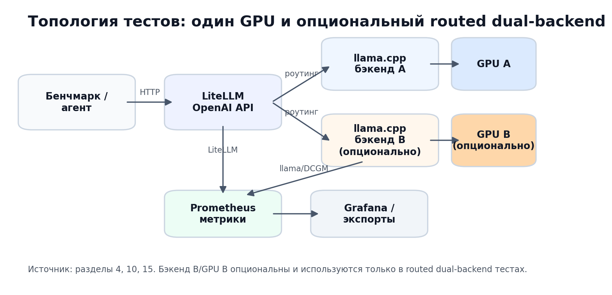
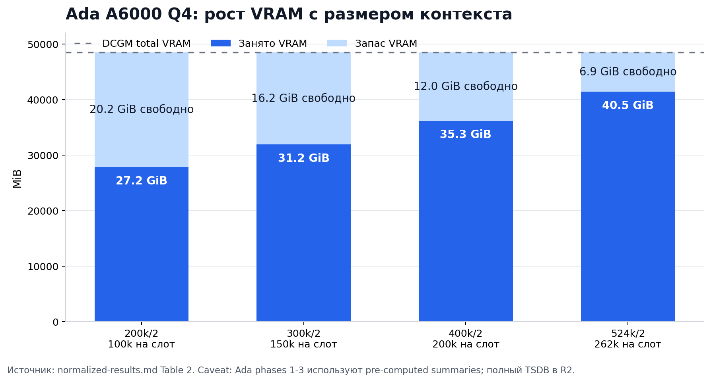
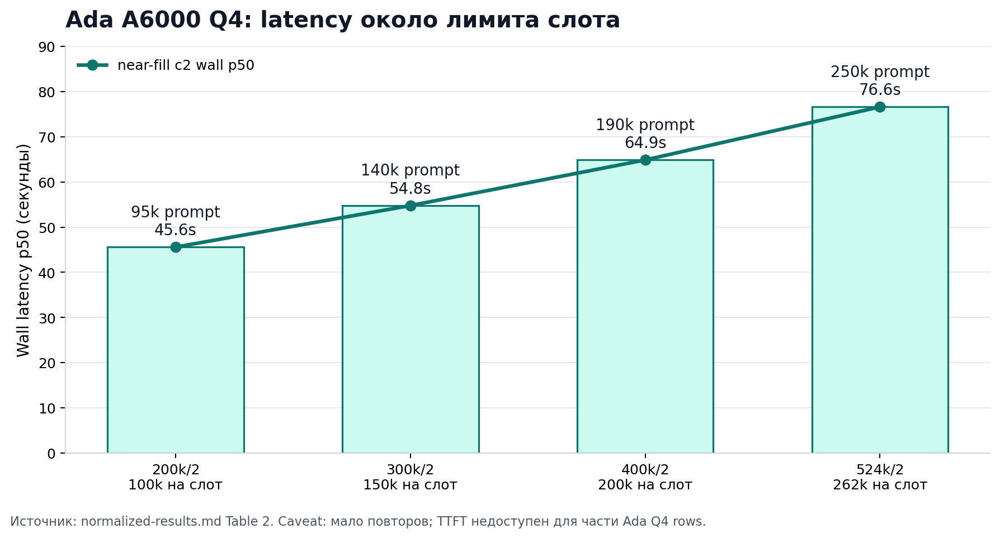
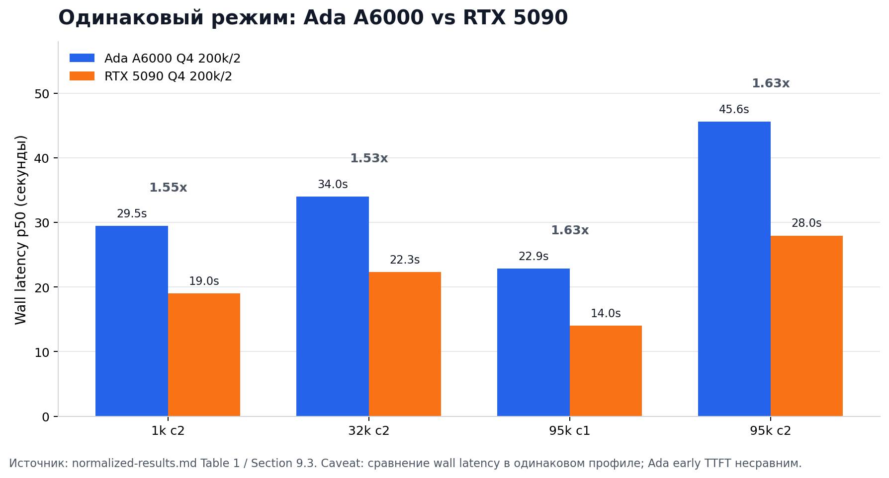
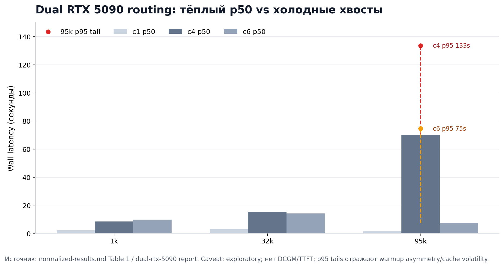
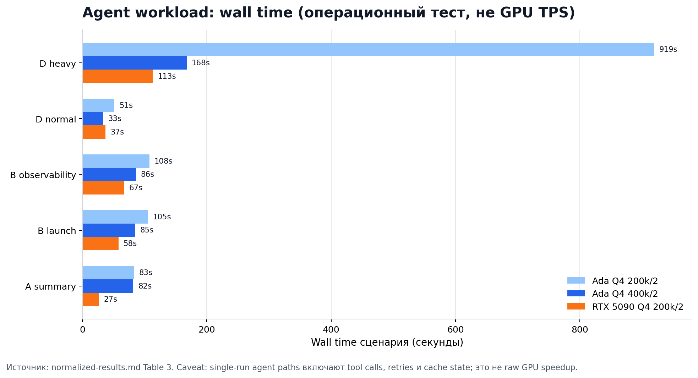
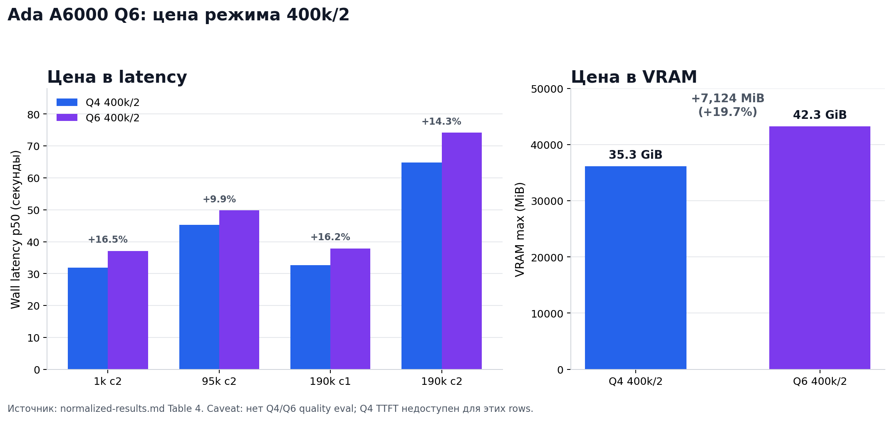

# Исследовательский отчёт по среде выполнения GPU (Май 2026)

## 1. Статус и область применения документа

Это полный исследовательский артефакт. Отдельное краткое резюме для руководства может быть составлено на его основе.

В этом отчете консолидированы результаты майских тестов 2026 года для OpenAI-совместимых эндпоинтов llama.cpp, работающих за LiteLLM на арендованных GPU Vast.ai. В отчете рассматриваются конфигурации RTX 6000 Ada, RTX 5090 и исследовательские конфигурации с двумя RTX 5090, использующие профили Qwen3.6 27B UD GGUF, прежде всего `Qwen3.6-27B-UD-Q4_K_XL.gguf` и `Qwen3.6-27B-UD-Q6_K_XL.gguf`. Основное внимание уделяется поведению среды выполнения, емкости контекста, задержкам, VRAM, энергопотреблению, покрытию телеметрии и выполнению агентских нагрузок.

Целевая аудитория — инженеры и специалисты по эксплуатации. Этот отчет не является рекомендацией к закупке, сертификацией SLO для продакшена или универсальным рейтингом GPU. Выводы ограничены протестированным стеком, конкретными запусками (run IDs), файлами моделей, квантизациями и тестовыми обвязками (harnesses), перечисленными ниже.

---

## 2. Исследовательские вопросы

Программа тестирования была построена вокруг следующих вопросов:

- Насколько можно расширить окно контекста для Ada A6000, сохраняя работоспособность обслуживания в два слота?
- При одинаковом профиле `200k / 2` Q4, насколько RTX 5090 быстрее, чем Ada A6000 под синтетическими и агентскими нагрузками?
- Достаточно ли у RTX 5090 запаса VRAM для профилей за пределами протестированного конверта `200k / 2`?
- Работает ли профиль Ada Q6 при `400k / 2` с эксплуатационной точки зрения, и каковы его затраты на VRAM и задержки по сравнению с Q4?
- Может ли LiteLLM маршрутизировать тестовый трафик на два независимых бэкенда llama.cpp на RTX 5090, и какой телеметрии не хватает для такой топологии?
- Какие наблюдения подтверждены метриками Prometheus/DCGM, какие только тестовой обвязкой, а какие являются наблюдениями агентских нагрузок, а не чистыми бенчмарками GPU?

---

## 3. Тестовая среда

Протестированный стек использовал бэкенды llama.cpp (`llama-server`) за LiteLLM. Синтетические тесты использовали контролируемые размеры промптов, генерируемые скриптом `scripts/token-target-bench.py`; агентские тесты использовали OpenCode через `scripts/phase3_opencode_local.py` или соответствующую удаленную обвязку.

Основные аппаратные профили:

| оборудование | заявленная VRAM | драйвер/CUDA | протестированная роль |
|---|---:|---|---|
| RTX 6000 Ada Generation | 48,508 MiB подтверждено DCGM, 49,140 MiB сообщает ОС | Драйвер `580.119.02` в примечаниях | Длинный контекст, профили Q4 и Q6 |
| RTX 5090 | 32,607 MiB | Драйвер `570.211.01`, CUDA `12.9`, Blackwell compute `12.0`; требовалось переопределение библиотек CUDA хоста | Быстрый исполнитель `200k / 2` Q4 |
| 2x RTX 5090 | 32,607 MiB на GPU | Два независимых бэкенда llama.cpp за LiteLLM | Исследовательский маршрутизируемый пул |

Данная среда не представляет все возможные конфигурации обслуживания на GPU. В этом отчете не тестировались A100, H100, vLLM, TensorRT-LLM, тензорный параллелизм, FP16 KV кэш, A3B/MoE, а также продакшен-сервисы с многопользовательской нагрузкой (multi-tenant).

---

## 4. Архитектура среды выполнения

Тестируемая среда выполнения предоставляет OpenAI-совместимый эндпоинт LiteLLM перед одним или несколькими независимыми бэкендами llama.cpp. Прогоны с одним GPU использовали один бэкенд llama.cpp с двумя слотами. Прогон с двумя RTX 5090 использовал два независимых бэкенда llama.cpp, каждый с двумя слотами, маршрутизируемых через LiteLLM с использованием стратегии `least-busy` (наименее загруженный).

В этом разделе описывается только топология. Утверждения о производительности и маршрутизации приводятся далее только в привязке к конкретным ID запусков и артефактам.



**Рисунок 4.1: Топология тестирования.** Источник: Разделы 4, 10 и 15. Подтверждает: тестируемая среда выполнения представляет собой OpenAI-совместимый прокси LiteLLM, маршрутизирующий на один или несколько независимых бэкендов llama.cpp, с использованием Prometheus/Grafana для телеметрии. Оговорка: только архитектурный контекст; этот рисунок не содержит утверждений о производительности.

---

## 5. Инструментарий и источники метрик

### 5.1 Пайплайн сбора

Метрики собирались через многоуровневый стек Prometheus, работающий внутри контейнера вместе с бэкендом инференса:

| уровень | экспортер | интервал сбора | префикс метрики |
|---|---|---|---|
| Оборудование GPU | DCGM Exporter (на базе NVML) | 15 с | `DCGM_FI_*`, перемаркировано в `gpu_*` |
| Среда LLM | Встроенный `/metrics` в `llama-server` | 15 с | `llamacpp:*` |
| Прокси | Экспортер LiteLLM Prometheus (порт 4001) | 15 с | `litellm_*` |
| Система | `node_exporter` | 15 с | `node_*` |

Метрики экспортировались в двух форматах:
- **Снапшоты TSDB** через `scripts/vast-pull-snapshot.sh` для визуализации в Grafana.
- **Экспорты диапазонов PromQL** в виде JSON-файлов для каждой метрики (`rtx-5090/metrics/*.json`, source repo) для офлайн-анализа.

Полный каталог метрик и карта переименования DCGM находятся в `data/metrics_index.md`.

### 5.2 Покрытие по запускам (runs)

| запуск | DCGM JSON экспорт | LiteLLM JSON | llama.cpp JSON | TSDB (локально `:9191`) |
|---|:---:|:---:|:---:|:---:|
| RTX 5090 фазы 1+3 (`20260526T094329Z`) | да | да | да | да |
| Ada A6000 все фазы (`20260525T202108Z`) | нет (только private archive) | нет (только private archive) | нет (только private archive) | **частично** (только фаза Q6) |
| Dual RTX 5090 (`20260526T134901Z`) | нет | нет | NaN | да (только Go метрики) |

Для Ada A6000 статистика оборудования и TTFT для фазы Q6 (2026-05-26T06:44Z–07:28Z) вычислялась напрямую из локального Prometheus `:9191`. Численные сводки по фазам 1–3 (макс. VRAM, средняя мощность, утилизация GPU ср/p95) были рассчитаны заранее и цитируются в Разделах 8 и 12. Полные временные ряды с каждым сэмплом для фаз 1–3 остаются в private archive `20260525T202108Z` в каталоге `promql-range-export/`.

### 5.3 Ограничения

- 15-секундный интервал сбора DCGM достаточен для запросов длительностью 28–45 секунд, но может пропустить кратковременные всплески менее 15 секунд на очень коротких промптах (например, 1k c1 с полной задержкой ~15s находится на границе).
- `DCGM_FI_DEV_MEM_COPY_UTIL` сообщает об утилизации DMA движка копирования PCIe, а не о пропускной способности VRAM-к-SM. Это важное отличие: метрика не показывает напрямую, насколько насыщена шина GDDR7/ECC.
- LiteLLM **экспортирует** TTFT как гистограмму Prometheus: `litellm_llm_api_time_to_first_token_metric_bucket`. Server-side TTFT был вычислен для RTX 5090 (p50=1.67s / p95=22.17s) и фазы Ada Q6 (p50=0.46s / p95=190s) из локального Prometheus. Примечание: серверный TTFT включает накладные расходы прокси LiteLLM (~0.5–1.5s), которых нет на стороне клиента в `curl time_starttransfer`.
- Накладные расходы от сбора Prometheus/DCGM в данном исследовании напрямую не измерялись. Предполагается, что они достаточно малы для обеспечения наблюдаемости бенчмарков, но никаких количественных заявлений об их влиянии не делается.

Полный анализ метрик: `data/prometheus-observability-analysis.md`.

---

## 6. Методология

### 6.1 Дизайн синтетического бенчмарка

#### 6.1.1 Промпты с целевым количеством токенов

Все синтетические тесты использовали `scripts/token-target-bench.py`, который конструирует промпты контролируемой длины. Размер промпта верифицируется путем отправки текста-кандидата на эндпоинт `/tokenize` в llama.cpp перед выполнением основного запроса. Это позволяет избежать ошибки несоответствия токенизатора, которая возникает, когда на стороне клиента используется оценка по количеству символов. Переменная окружения `TARGET_TOKENS` принимает разделенный пробелами список целевых размеров; скрипт проходит по ним последовательно. Содержимое промпта — это псевдослучайный текст-заполнитель, а не запросы на естественном языке, поэтому результаты отражают планирование среды выполнения, давление на контекст, задержку и объем потребляемой памяти, а не семантический профиль нагрузки или качество ответов.

#### 6.1.2 Калибровка промптов

Калибровка выполняет один предварительный запрос к `/tokenize` и корректирует строку промпта до тех пор, пока возвращаемое количество токенов не окажется в пределах небольшого допуска от цели. Откалиброванный промпт сохраняется как артефакт payload (нагрузки) в каталоге запуска. Для размеров, близких к пределу контекста (например, 95k, 140k, 190k, 250k), требуется точная калибровка, поскольку запросы, превышающие предел, немедленно завершаются с ошибкой переполнения контекста и не повторяются в рамках измеряемого набора.

#### 6.1.3 max_tokens

Во всех синтетических строках использовалось `MAX_TOKENS=1024`, если не указано иное. Это удерживает время генерации (decode) в рамках заданных границ и делает префилл/TTFT основной переменной при большой длине промпта. Фиксированный бюджет генерации также позволяет использовать полную задержку запроса (wall latency) как согласованный прокси для общей стоимости запроса при разных размерах промптов.

#### 6.1.4 Метки конкурентности: c1, c2, c4, c6

Метка `c<N>` обозначает количество одновременных HTTP-запросов, запущенных параллельно бенчмарк-клиентом (`PARALLEL=N` в скрипте). Соответствие в реестре запусков:

| Метка | Параллельные запросы клиента |
|-------|------------------------------|
| c1    | 1                            |
| c2    | 2                            |
| c4    | 4                            |
| c6    | 6                            |

В запусках с одним GPU использовалось 2 слота llama.cpp (`--parallel 2`). В запусках с двумя GPU использовалось по 2 слота на каждый GPU (всего 4 на оба бэкенда, маршрутизируемые LiteLLM). Метка конкурентности описывает нагрузку со стороны клиента, а не количество слотов бэкенда.

#### 6.1.5 Слоты против конкурентности

Слот llama.cpp (`--parallel`) — это резервирование KV-кэша с сохранением состояния. Запрос занимает один слот на протяжении всего своего жизненного цикла (префилл + генерация). Когда все слоты заняты, новый запрос помещается в очередь внутри llama.cpp, пока слот не освободится. Клиентская настройка `PARALLEL` независима: она контролирует, сколько HTTP-запросов одновременно находятся в полете от процесса бенчмарка. Эти два числа связаны, но не равны.

При c2 на 2-слотовом бэкенде стационарная занятость составляет примерно 1-2 слота. При c1 всегда занят максимум 1 слот. При c4 или c6 на 2-слотовом бэкенде очередь бэкенда почти всегда не пуста.

#### 6.1.6 Прогрев (Warmup) и измеряемые повторения

Каждая ячейка бенчмарка выполняет `WARMUP=1` запрос перед началом измеряемого окна. Запрос на прогрев отправляется, ожидается ответ на него, после чего начинаются измеряемые повторения. Выполняется `REPEATS=3` измеряемых запросов на ячейку. Прогрев существует для того, чтобы вывести KV-кэш, тактовые частоты GPU и аллокатор памяти в стационарное состояние перед записью задержек. Результаты прогрева исключаются из всей отчетной статистики. Там, где установлен `SLEEP_BETWEEN`, между запросами вставляется пауза (sleep), чтобы избежать непрерывного насыщения запросами подряд.

Сводки по отдельным запускам агрегируются по 3 измеряемым повторениям. Статистики P50/P95 по окну из 3 повторений имеют высокую дисперсию; они являются ориентировочными, а не точными оценками перцентилей.

#### 6.1.7 Почему конкурентность выше количества слотов измеряет очереди и планирование

Когда `PARALLEL > --parallel`, каждый запрос сверх количества слотов должен ждать во внутренней очереди бэкенда. Измеренная задержка (wall latency) в этом случае отражает:

1. Время ожидания в очереди (время простоя GPU для этого запроса)
2. Время префилла (вычисления на GPU)
3. Время генерации (вычисления на GPU)

Это полезно для наблюдения за накладными расходами на планирование и честностью (fairness), но это нельзя напрямую сравнивать с результатами c1 или c2 на том же оборудовании как измерение чистой пропускной способности. В запуске с двумя 5090 использовались c4 и c6 против 4 общих слотов, чтобы проверить задержку маршрутизации LiteLLM в дополнение к очередям бэкенда.

---

### 6.2 Модель измерения TTFT (Time To First Token)

#### 6.2.1 Проблема с не-стриминговым curl TTFT

Скрипт `token-target-bench.py` использует не-стриминговые HTTP-запросы через curl. В не-стриминговом режиме сервер буферизирует всю генерацию и возвращает её как единое тело ответа. Метрика `time_starttransfer` в curl фиксирует время от отправки запроса до первого байта тела HTTP-ответа — что является *полным* JSON-ответом, а не первым сгенерированным токеном. Это означает, что `time_starttransfer` из curl равен end-to-end задержке в не-стриминговом режиме, а не TTFT.

Любое значение `prefill_ms` или `time_starttransfer` из не-стриминговых запусков curl в этом исследовании следует рассматривать как аппроксимацию полной задержки стены (wall latency), а не как TTFT. Эти значения были отмечены как ненадежные в `docs/agent-and-benchmark-harness.md` и удалены из столбцов TTFT в реестре для соответствующих запусков (например, `ada6000-phase1-baseline-20260525T202158Z`).

#### 6.2.2 Backend TTFT из логов llama.cpp

llama.cpp записывает время каждого запроса в свой лог в формате:

```
prompt eval time = <N> ms / <T> tokens (<ms/token> ms per token)
eval time        = <N> ms / <T> tokens (<ms/token> ms per token)
```

`prompt eval time` представляет собой время, которое бэкенд потратил на обработку входных токенов (префилл). Это *TTFT на стороне бэкенда*. Он исключает:

- Сетевую задержку между клиентом и сервером
- Время маршрутизации через прокси LiteLLM
- Время, которое запрос провел в очереди llama.cpp до освобождения слота

TTFT бэкенда из логов помечен как `backend_ttft_ms` везде, где он появляется в таблицах результатов. Он полезен для сравнения пропускной способности префилла на GPU, но его нельзя смешивать с задержкой, которую бы наблюдало клиентское приложение.

#### 6.2.3 Измерение потокового (стримингового) TTFT

Удаленная обвязка агента (`scripts/phase3_agent_remote.py`) и пилотная обвязка использовали стриминговые запросы. В стриминговом режиме сервер отправляет первый токен как Server-Sent Event (SSE) чанк сразу же, как только он сгенерирован. Клиент записывает временную метку первого полученного чанка. Это дает стриминговый TTFT на стороне клиента, который включает:

- Время ожидания в очереди (если запрос ждал слот)
- Время префилла (вычисления на GPU)
- Сетевой RTT для первого чанка

Это наиболее близкая доступная мера к тому, что испытал бы интерактивный пользователь. Если он присутствует, он помечается как `streaming_ttft_ms`. Это было доступно в результатах `phase3_agent_remote.py`, но не в результатах `token-target-bench.py`.

#### 6.2.4 Взаимосвязь между Backend TTFT, клиентским Streaming TTFT и полной задержкой (wall latency)

```
backend_ttft_ms  ≤  streaming_ttft_ms  ≤  wall_latency_ms
```

- `backend_ttft_ms`: только вычисления префилла, измеряемые внутри llama.cpp. Исключает ожидание в очереди и сеть.
- `streaming_ttft_ms`: префилл + ожидание в очереди + сетевой RTT первого чанка. Измеряется клиентом.
- `wall_latency_ms`: общее время от отправки запроса до последнего байта ответа. Включает всё вышеперечисленное плюс время генерации.

При сравнении TTFT на разном оборудовании используйте один и тот же тип измерения. Смешивать TTFT бэкенда из одного запуска со стриминговым TTFT из другого недопустимо.

---

### 6.3 Методология агентских нагрузок

#### 6.3.1 OpenCode / локальный рабочий процесс агента

В агентских нагрузках использовался скрипт `scripts/phase3_opencode_local.py`. Он запускает `opencode run --format json` с локальной для запуска конфигурацией, передаваемой через `OPENCODE_CONFIG_CONTENT`, избегая глобального состояния `~/.config/opencode`. OpenCode направлен на эндпоинт LiteLLM (через SSH-туннель при локальном запуске против удаленного инстанса). Собираются метрики для каждого сценария: полное время выполнения, счетчики на основе событий, состояние слотов до/после, очищенные логи OpenCode и окна Prometheus/DCGM для длительности сценария.

Сценарии A, B и D были определены заранее и использовались одинаково в запусках Ada A6000 и RTX 5090, чтобы позволить кросс-аппаратное сравнение. Название сценария — единственная гарантия сопоставимости нагрузок; фактическое количество токенов, генерируемых OpenCode, варьируется в каждом запуске в зависимости от пути рассуждений агента.

#### 6.3.2 Почему агентские нагрузки — это эксплуатационные тесты, а не чистые TPS

OpenCode выполняет вызовы инструментов (чтение файлов, команды shell, редактирование кода) между запросами к LLM. Во время выполнения инструментов GPU простаивает. Следовательно, измеренное полное время выполнения включает:

- Время логического вывода LLM (GPU активен)
- Время выполнения вызова инструмента (GPU простаивает)
- Межшаговая задержка фреймворка агента
- Накладные расходы на формирование промпта на каждом шаге

Общее время выполнения сценария не может быть конвертировано в показатель TPS (токенов в секунду) для GPU. Агентские результаты отвечают на вопрос "выполнила ли система эту задачу, и сколько времени это заняло от начала до конца?", а не "какова максимальная пропускная способность токенов у этого оборудования?".

#### 6.3.3 Оговорки о вызовах инструментов, состоянии кэша и путях выполнения

Промпт каждого сценария растет по мере того, как агент накапливает контекст. Более поздние шаги в сценарии имеют более длинные входные промпты, чем более ранние. KV-кэш может содержать или не содержать полезное состояние префикса для последующих шагов в зависимости от того, отправляет ли агент перекрывающийся префикс. Явное закрепление префикса в KV-кэше не применялось.

Сценарии, включающие сбои инструментов или повторные попытки, генерируют больше запросов к LLM, чем идентичные сценарии, которые завершаются успешно с первой попытки. Это неконтролируемым образом увеличивает полное время выполнения и количество запросов. Классификация успешности сценария (pass/fail) частично эвристическая (поиск шаблонов в логах событий OpenCode) и требует ручной проверки перед тем, как делать какие-либо заявления о вероятности успешного выполнения задач агентом.

#### 6.3.4 Критерии Pass/Fail и их ограничения

Сценарий считается "успешным" (passed), если запуск OpenCode завершается без фатальной ошибки и выходной лог содержит ожидаемый маркер завершения. Он считается "неудачным" (failed), если OpenCode завершается с ненулевым кодом, модель возвращает ошибку 5xx или обвязка обнаруживает таймаут вызова инструмента.

Ограничения:
- "Успешный" сценарий мог сгенерировать неправильный код или неверный ответ. Успех среды выполнения — это не оценка качества.
- Для каждой аппаратной конфигурации выполнялся один запуск каждого сценария. Дисперсия одиночных запусков не может быть охарактеризована. Результаты агентов в этом исследовании носят исключительно ориентировочный характер.
- В контролируемом рабочем дереве бенчмарка использовался флаг `--dangerously-skip-permissions`; это недопустимо повторять в любой среде, где агент мог бы получить доступ к конфиденциальным путям.

---

### 6.4 Методология Prometheus/DCGM

#### 6.4.1 Собираемые аппаратные метрики (DCGM Exporter)

Экспортер DCGM работал внутри контейнера и экспортировал следующие метрики (переименованные для удобства чтения в Prometheus):

| Метрика | Ед. изм. | Значение |
|--------|------|---------|
| `gpu_utilization` | % | Утилизация SM (потоковых мультипроцессоров) |
| `gpu_memory_utilization` | % | Утилизация контроллера памяти |
| `gpu_memory_used_mb` | MB | Занятая VRAM |
| `gpu_memory_free_mb` | MB | Свободная VRAM |
| `gpu_memory_total_mb` | MB | Общая VRAM |
| `gpu_power_draw` | W | Мгновенное энергопотребление |
| `gpu_temperature` | °C | Температура кристалла |
| `gpu_sm_clock` | MHz | Тактовая частота SM |
| `gpu_memory_clock` | MHz | Тактовая частота памяти |

Логирование в CSV через `nvidia-smi` работало параллельно как обязательный резервный вариант на случай недоступности или неправильной конфигурации экспортера DCGM. Оба источника собирались для всех запусков в этом исследовании.

#### 6.4.2 Собираемые метрики LiteLLM

LiteLLM предоставлял метрики Prometheus, собираемые с заданным интервалом:

| Метрика | Значение |
|--------|---------|
| `litellm_requests` | Общее количество запросов через прокси |
| `litellm_failed_requests` | Запросы, завершившиеся ошибкой HTTP 4xx/5xx |
| `litellm_latency_p95` | P95 задержка на стороне прокси (включает накладные расходы на маршрутизацию) |
| `litellm_up` | Живучесть прокси (1 = жив, 0 = лежит) |

Метрики задержки LiteLLM включают время маршрутизации и любую логику повторных попыток, применяемую прокси. Они не изолируют время вычислений бэкенда.

#### 6.4.3 Собираемые метрики llama.cpp

llama.cpp предоставлял метрики Prometheus (требуется флаг `--metrics` при запуске):

| Метрика | Значение |
|--------|---------|
| `llama_busy_slots` | В настоящее время занятые слоты (конкурентность в реальном времени) |
| `llama_predicted_tokens_per_second` | Мгновенная пропускная способность генерации (decode) |
| `llama_predicted_tokens_rate_5m` | Скользящая пропускная способность генерации за 5 минут |
| `llama_prompt_tokens_per_second` | Мгновенная пропускная способность префилла |
| `llama_prompt_tokens_rate_5m` | Скользящая пропускная способность префилла за 5 минут |
| `llama_requests_processing` | Запросы, активно обрабатываемые в данный момент |
| `llama_requests_deferred` | Запросы, ожидающие свободного слота |

`llama_requests_deferred` — основной индикатор давления на очередь бэкенда. Устойчивое ненулевое значение означает, что клиентская конкурентность превышает пропускную способность слотов.

#### 6.4.4 Как использовать эти метрики для интерпретации результатов

| Цель интерпретации | Основные метрики |
|---------------------|-------------------|
| **Стабильность** | `gpu_temperature`, `gpu_power_draw` во времени; отсутствие ошибок ECC/XID в логах; непрерывность `litellm_up` |
| **Насыщение** | `gpu_utilization` приближается к 100%; `llama_busy_slots` на максимуме (`--parallel`) в течение длительного времени |
| **Потолок памяти** | `gpu_memory_used_mb` приближается к `gpu_memory_total_mb`; события OOM в `dmesg.log` или `backend.log` |
| **Очереди** | `llama_requests_deferred > 0` устойчиво; растущая `litellm_latency_p95` без соответствующего роста утилизации GPU |
| **Маршрутизация (dual-GPU)** | Баланс `llama_busy_slots` по бэкендам; `llama_requests_deferred` по бэкендам; логи маршрутизации LiteLLM |

Метрики из снапшотов Prometheus TSDB экспортировались с помощью `promql-range-export` для окна бенчмарка каждого запуска. Экспорты мгновенных значений и диапазонов PromQL записывались в `metrics/promql-export/` в каталоге каждого запуска.

> **Примечание:** Сырые снапшоты TSDB содержат внутренние метки, которые могут включать хешированные ключи API или внутренние идентификаторы. Они исключены из git. В качестве артефактов, которыми можно делиться, рассматриваются только очищенные (sanitized) экспорты JSON, полученные из TSDB.

---

### 6.5 Правила качества данных

Следующие правила применяются ко всем утверждениям, сделанным в этом отчете. Любой результат, который не удовлетворяет применимому правилу, должен быть отмечен оговоркой или исключен из основного текста отчета.

1. **Никаких заявлений без указания источника.** Каждый численный результат должен быть прослеживаемым до конкретного ID запуска, файла артефакта или экспорта метрик. Неатрибутированные цифры не допускаются.

2. **Поведение прогретого/закэшированного состояния и холодного состояния должно быть четко разделено.** Результаты первого запроса после запуска сервера, после вытеснения слота или после перезапуска из-за изменения размера контекста — это результаты "холодного пути". Результаты последующих запросов под стабильной нагрузкой — это результаты "прогретого пути". Их нельзя усреднять вместе или сравнивать напрямую без явной маркировки. Запрос на прогрев, определенный в обвязке (`WARMUP=1`), смягчает, но не устраняет эффекты холодного старта для измеряемого окна.

3. **Одиночные результаты агентских прогонов не должны чрезмерно обобщаться.** В данном исследовании каждый сценарий агента выполнялся один раз для каждой аппаратной конфигурации. Результат "успех/провал" одиночного запуска является наблюдением, а не статистической вероятностью. Утверждения типа "Сценарий B всегда завершается на RTX 5090" не подтверждаются данными. Результаты агентов следует описывать как "Сценарий B завершился успешно за N секунд (один запуск, ID запуска: X)" и интерпретировать соответствующим образом.

4. **Утверждения о качестве требуют отдельной оценки и не доказываются бенчмарками среды выполнения.** Данное исследование измеряет производительность системы: задержки, пропускную способность, использование памяти и стабильность. Оно не измеряет правильность вывода, качество рассуждений или точность выполнения задач. Ни один результат в этом отчете — включая успех/провал сценария, скорость генерации или TTFT — не является доказательством того, что один уровень квантования или аппаратная конфигурация выдает лучшие результаты LLM. Оценка качества требует отдельного набора бенчмарков с определенными критериями оценки.

---

## 7. Инвентарь запусков (Run inventory)

Этот реестр содержит список успешных или аналитически релевантных запусков, используемых в основном тексте отчета. Неудачные, замененные или тестовые (sandbox) запуски задокументированы в `data/artifact-inventory.md`, но не используются для основных выводов, если в оговорке явно не сказано обратное.

### Реестр активных запусков

Ниже приведен подробный список бенчмарк-запусков, зафиксированных в ходе этой фазы исследований:

| run_id | оборудование | модель | квантизация/файл | ctx_size | parallel/slots | тип нагрузки | выполнено строк/сценариев | статус | доступен CSV бенчмарка | доступны строки запросов | доступны метрики Prometheus/DCGM | доступны метрики LiteLLM | доступны метрики/логи llama.cpp | оговорки |
|---|---|---|---|---|---|---|---|---|:---:|:---:|:---:|:---:|:---:|---|
| `ada6000-phase0-20260525T191508Z` | RTX 6000 Ada | Qwen3.6 27B UD | Q4_K_XL | 200k | 2 | Smoke Test | 1 сценарий | успех | нет | нет | нет | да | да | только дымовой тест соединения/валидации |
| `ada6000-phase1-baseline-20260525T202158Z` | RTX 6000 Ada | Qwen3.6 27B UD | Q4_K_XL | 200k | 2 | Синтетика | 6 (1k, 32k, 95k c1/c2) | успех | да | да | да | да | да | Не-стриминговый TTFT был только на бэкенде и удален из метрик CLI |
| `ada6000-phase2-ctx300k-20260525T215448Z` | RTX 6000 Ada | Qwen3.6 27B UD | Q4_K_XL | 300k | 2 | Синтетика | 8 (1k, 32k, 95k, 140k c1/c2) | успех | да | да | да | да | да | Базовая линия для масштабирования до 300k |
| `ada6000-ctx400k-bench-20260525T224858Z` | RTX 6000 Ada | Qwen3.6 27B UD | Q4_K_XL | 400k | 2 | Синтетика | 8 (1k, 32k, 95k, 190k c1/c2) | успех | да | да | да | да | да | Базовая линия для масштабирования до 400k |
| `ada6000-ctx524k-bench-20260526T001055Z` | RTX 6000 Ada | Qwen3.6 27B UD | Q4_K_XL | 524k | 2 | Синтетика | 10 (до 250k c1/c2) | успех | да | да | да | да | да | Более жесткие пределы по VRAM |
| `ada6000-phase3-agent-200k-vs-400k-20260526T042003Z` | RTX 6000 Ada | Qwen3.6 27B UD | Q4_K_XL | 200k & 400k | 2 | Агент | по 5 сценариев на режим | успех | да | да | да | да | да | Сравнение агентской нагрузки; дисперсия одиночного запуска |
| `ada6000-phase4-q6-agent-20260526T054743Z` | RTX 6000 Ada | Qwen3.6 27B UD | Q6_K_XL | 400k | 2 | Агент | 4 сценария (нет A) | успех | да | да | да | да | да | Более медленная генерация и больший след VRAM |
| `ada6000-phase4-q6-synthetic-sanity-20260526T065829Z` | RTX 6000 Ada | Qwen3.6 27B UD | Q6_K_XL | 400k | 2 | Синтетика | 4 (1k c2, 95k c2, 190k c1/c2) | успех | да | да | да | да | да | Прямая валидация синтетики Q6 vs Q4 |
| `5090-phase1-bench-20260526T111748Z` | RTX 5090 | Qwen3.6 27B UD | Q4_K_XL | 200k | 2 | Синтетика | 4 (1k c2, 32k c2, 95k c1/c2) | успех | да | да | да | да | да | Требовалось переопределение Blackwell; Аномалия медленного TTFT |
| `5090-phase3-agent-20260526T115516Z` | RTX 5090 | Qwen3.6 27B UD | Q4_K_XL | 200k | 2 | Агент | 5 сценариев | успех | да | да | да | да | да | Основной тест агента на 5090. Все сценарии пройдены |
| `dual-5090-bench-20260526T150629Z` | 2x RTX 5090 | Qwen3.6 27B UD | Q4_K_XL | 200k на GPU | 2 на GPU (всего 4) | Синтетика | 9 (1k, 32k, 95k для c1, c4, c6) | успех | нет | да | да | да | да | Маршрутизация LiteLLM; асимметрия прогрева, риски вытеснения кэша |

---

## 8. Результаты Ada 6000

### 8.1 Базовая линия 200k/2

- **Цель теста**: Установить синтетическую базовую линию стабильности и ресурсный конверт для стандартной конфигурации контекста 200k.
- **Конфигурация**: `Qwen3.6-27B-UD-Q4_K_XL.gguf`, общий контекст 200k, 2 слота (100k на слот), KV-кэш `q8_0`, flash attention включен.
- **Завершенные строки/сценарии**: 6 синтетических строк (1k, 32k, 95k на c1 и c2).
- **Ключевые числовые результаты**: 95k c2 wall p50 = 45.581с. 1k c1 wall p50 = 15.325с.
- **Аппаратные метрики**: Макс. VRAM = 27,854 MiB. Утилизация GPU средняя/p95 = 84%/100%. Мощность средняя/p95 = 264 Вт/300 Вт. Макс. темп. = 64°C.
- **Интерпретация**: Базовая конфигурация стабильна в пределах протестированного синтетического окна. Промпт в 95k (почти предел) жизнеспособен при двух слотах. GPU работает ниже наблюдаемого активного энергетического конверта ~300 Вт, что указывает на отсутствие ограничения по мощности в этом прогоне. Точное узкое место между вычислениями и памятью напрямую не измерялось.
- **Ограничения**: Фаза 1 использовала не-стриминговые curl запросы, что сделало TTFT на стороне клиента ненадежным (он действовал как задержка полного ответа). TTFT на стороне бэкенда был восстановлен из логов llama.cpp, но ему не хватает накладных расходов прокси/сети. Конкурентность 3 не тестировалась.

### 8.2 Расширение контекста 300k/2

- **Цель теста**: Оценить стоимость ресурсов и стабильность при расширении контекста до 150k на слот.
- **Конфигурация**: `Qwen3.6-27B-UD-Q4_K_XL.gguf`, общий контекст 300k, 2 слота (150k на слот).
- **Завершенные строки/сценарии**: 8 синтетических строк (1k, 32k, 95k, 140k на c1 и c2).
- **Ключевые числовые результаты**: 140k c2 wall p50 = 54.770с. 1k c1 wall p50 = 16.259с (+0.9с по сравнению с 200k/2). Streaming TTFT p50 варьировался от 0.080с (1k c1) до 0.366с (140k c2); p95 варьировался от 0.081с до 0.477с.
- **Аппаратные метрики**: Макс. VRAM = 31,906 MiB (+4,052 MiB к 200k/2). Утилизация GPU средняя/p95 = 93%/100%. Мощность средняя/p95 = 290 Вт/300 Вт. Макс. темп. = 64°C.
- **Интерпретация**: 300k/2 жизнеспособна, но не бесплатна. Она потребляет примерно на +4 ГиБ VRAM больше и дает умеренный прирост задержки на коротких запросах (+0.9с для 1k c1). Задержка остается стабильной при более высоких нагрузках, и эта конфигурация успешно открывает контексты до 140k. Клиентский стриминговый TTFT был исправлен и корректно введен на этой фазе; значения низкие для запросов с прогретым кэшем префикса (p50 ниже 0.4с для всех протестированных строк).
- **Ограничения**: Агентские нагрузки на этой конфигурации не тестировались. Синтетические сэмплы состоят всего из 3 измеряемых повторений, поэтому отслеживание p95 является только ориентировочным.

### 8.3 Рабочий кандидат 400k/2

- **Цель теста**: Определить кандидата с максимальной стабильной емкостью на Ada среди протестированных Q4-профилей, сравнивая его производительность с 200k/2 под синтетической нагрузкой и реалистичными стресс-тестами агентов.
- **Конфигурация**: `Qwen3.6-27B-UD-Q4_K_XL.gguf`, общий контекст 400k, 2 слота (200k на слот).
- **Завершенные строки/сценарии**: 10 синтетических строк (1k, 32k, 95k, 180k, 190k на c1 и c2). 5 сценариев агентской нагрузки (A, B-launch, B-obs, D-normal, D-heavy).
- **Ключевые числовые результаты**: Синтетика 190k c2 wall p50 = 64.868с. Для агента в сценарии D (тяжелый) полное время выполнения резко упало с 919.4с (на 200k/2) до 167.7с (на 400k/2).
- **Аппаратные метрики**: Макс. VRAM = 36,180 MiB (синтетика), p50 = 35,400 MiB; пик ~34.7 ГиБ во время агентского прогона. Мощность средняя/p95 = 287 Вт/300 Вт. Утилизация GPU средняя/p95 = 92%/100%. Темп. макс/p95 = 64°C/63°C.
- **Интерпретация**: Среди протестированных Q4-профилей на Ada, 400k/2 является лучшим кандидатом для длинных контекстов в задачах агента. Время сценария D резко сократилось с 919.4с на 200k/2 до 167.7с на 400k/2 в одном прогоне; вероятное объяснение — снижение давления на контекст, меньше повторных попыток или меньшее давление вытеснения кэша, но данные трассировки, необходимые для доказательства точной причины, не были извлечены. При размере VRAM ~36.1 ГиБ остается запас около 12.3 ГиБ (от 48,508 MiB по DCGM). Это поддерживает выбор 400k/2 как рекомендуемого кандидата по умолчанию для задач с длинным контекстом в данном стеке, но не как универсального значения по умолчанию.
- **Ограничения**: Дельта в тяжелом сценарии D (919с против 168с) отражает расхождение путей выполнения (повторные вызовы инструментов агентом), а не прямую разницу в скорости инференса GPU. Агентские нагрузки выполнялись в одном экземпляре, поэтому дисперсия не контролируется. Стриминговый TTFT был зафиксирован обвязкой, но не указан в основной сводке запуска для синтетических строк 400k/2.

### 8.4 Агрессивный режим 524288/2

- **Цель теста**: Нащупать максимальный стабильный потолок контекста до исчерпания VRAM на 48-гигабайтной Ada A6000.
- **Конфигурация**: `Qwen3.6-27B-UD-Q4_K_XL.gguf`, общий контекст 524288, 2 слота (~262k на слот).
- **Завершенные строки/сценарии**: 12 синтетических строк (1k, 32k, 95k, 180k, 190k, 250k на c1 и c2).
- **Ключевые числовые результаты**: 250k c2 wall p50 = 76.620с, p95 = 77.774с.
- **Аппаратные метрики**: Макс. VRAM = 41,434 MiB. Свободная VRAM при максимуме ≈ 7,074 MiB (используя 48,508 MiB по DCGM); в исходной документации упоминается ~7.5 ГиБ при использовании отчета ОС в 49,140 MiB.
- **Интерпретация**: 524288/2 работает чисто вплоть до запросов 250k при конкурентности 2. Однако его следует рассматривать как агрессивный режим, потому что запас VRAM сокращается до ~7 ГиБ, оставляя узкую границу для любых всплесков. Задержка высока, но предсказуема.
- **Ограничения**: Метрики мощности/температуры DCGM не были извлечены локально (доступны только в private archive). TTFT по строкам не извлекался из артефактов запуска.

### 8.5 Q6 на Ada

- **Цель теста**: Оценить эксплуатационную жизнеспособность и штрафы за ресурсы при использовании квантизации Q6_K_XL по сравнению с базовой Q4.
- **Конфигурация**: `Qwen3.6-27B-UD-Q6_K_XL.gguf`, общий контекст 400k, 2 слота (200k на слот).
- **Завершенные строки/сценарии**: 4 синтетические строки (1k c2, 95k c2, 190k c1, 190k c2). 4 агентских сценария (B-launch, B-obs, D-normal, D-heavy). Сценарий A не запускался.
- **Ключевые числовые результаты**: Синтетика 190k c2 wall p50 = 74.157с (против 64.868с на Q4, +14%). Агент Сценарий D (тяжелый) = 227с (против 168с на Q4, +35%). Агент Сценарий B-obs = 196с (против 86с на Q4, +128%).
- **Аппаратные метрики**: Макс. VRAM = 43,304 MiB (+7,124 MiB к Q4 400k/2), остаток свободной ~5,204 MiB (DCGM). Утилизация GPU средняя/p50/p95 = 69%/95%/100%. Мощность средняя/p95 = 221.5 Вт/299.4 Вт. `MEM_COPY_UTIL` p50 = 84%, но эта метрика — утилизация PCIe DMA, а не прямая пропускная способность VRAM-к-SM. Макс. темп. = 64°C.
- **Интерпретация**: Q6 эксплуатационно жизнеспособна для протестированного подмножества; она завершила выбранные синтетические строки и сценарии агента без сбоев или OOM. Тем не менее, она медленнее (от +9.9% до +16.5% в синтетике; от +35.4% до +128.2% в одиночных агентских задачах в зависимости от пути) и потребляет примерно на 7.1 ГиБ больше VRAM. При 43.3 ГиБ VRAM остается лишь 5.2 ГиБ измеренного запаса, поэтому контексты выше Q6 400k/2, скорее всего, будут иметь недостаточный запас, но они не тестировались. Нет никаких доказательств того, что качество Q6 оправдывает эти затраты, так как оценка качества не проводилась.
- **Ограничения**: Не заявляйте об улучшении качества Q6 без специальной оценки качества. Сценарий A не запускался на фазе Q6. Не все синтетические строки были запущены (32k и 180k исключены из подмножества sanity-check).

### 8.6 Интерпретация Prometheus/DCGM для Ada

**Профиль масштабирования VRAM по конфигурациям:**

| конфигурация | макс. VRAM (MiB) | дельта от пред. | свободная VRAM (MiB)¹ |
|---|---:|---:|---:|
| Q4 200k/2 | 27,854 | — | 20,654 |
| Q4 300k/2 | 31,906 | +4,052 | 16,602 |
| Q4 400k/2 | 36,180 | +4,274 | 12,328 |
| Q4 524k/2 | 41,434 | +5,254 | 7,074 |
| Q6 400k/2 | 43,304 | +7,124 к Q4 400k/2 | 5,204 |

¹ Свободная VRAM вычислена с использованием подтвержденного DCGM общего объема **48,508 MiB**. Сообщаемый ОС объем (49,140 MiB через `nvidia-smi`) завышает запас примерно на 632 MiB; цифра DCGM является авторитетной.

VRAM масштабируется примерно на +4–5 ГиБ на каждые +100k контекста для Q4 (согласуется по всей прогрессии 200k→300k→400k→524k). Скачок от Q4 к Q6 при том же контексте 400k добавляет ~7.1 ГиБ, что согласуется с более крупным следом весового тензора Q6_K_XL.



**Рисунок 8.1: Масштабирование контекста Ada, след VRAM.** Источник: `normalized-results.md` Таблица 2. Подтверждает: потребление VRAM на Ada A6000 Q4 растет предсказуемо по мере роста контекста, сохраняя большую емкость для длинного контекста по сравнению с RTX 5090. Оговорка: фазы 1–3 Ada используют предварительно вычисленные сводки; полные сырые TSDB для этих фаз находятся в private archive.



**Рисунок 8.2: Масштабирование контекста Ada, задержка вблизи заполнения.** Источник: `normalized-results.md` Таблица 2. Подтверждает: Ada Q4 остается жизнеспособной при больших, близких к заполнению промптах, при этом задержка возрастает, но остается предсказуемой вплоть до протестированного профиля 524k/2. Оговорка: ограниченное число повторений; TTFT недоступен для некоторых строк Ada Q4.

**Утилизация GPU — бимодальное поведение:**

Фаза Ada Q6 показывает среднюю утилизацию GPU = 69% при p50 = 95%. Это бимодальное распределение ожидаемо: GPU почти полностью насыщен во время активной генерации (p50=95%, p95=100%), но падает почти до нуля между вызовами инструментов агента и во время простоев между запросами. Среднее значение 69% отражает взвешенное с учетом простоя среднее по всему окну наблюдения. Это нормально для агентских нагрузок, а не является проблемой утилизации оборудования. Такой же паттерн (низкое среднее, высокое p50 в активный период) ожидается для конфигураций Q4-агентов, но он не был зафиксирован локально для фаз 1–3 Ada.

**Узкое место в мощности и пропускной способности памяти:**

Во всех конфигурациях Ada (от 200k/2 до Q6 400k/2) сообщаемое энергопотребление остается на уровне 221–290 Вт, что ниже спецификации TDP 350 Вт и близко к наблюдаемому устойчивому пределу платы ~300 Вт в этих запусках. Поведение энергопотребления не указывает на троттлинг мощности в протестированных профилях Q4. Точное узкое место (вычисления против памяти) напрямую не измерялось, так как пропускная способность VRAM-к-SM не экспортировалась. На фазе Q6 метрика `MEM_COPY_UTIL` p50=84%, но эта метрика — утилизация движка копирования PCIe DMA, а не прямая пропускная способность GDDR. Тактовая частота SM во время активного инференса Q6 достигает пика в 2,730 МГц (p95 = 2,520 МГц), что подтверждает более узкий вывод о том, что температурного троттлинга в окне Q6 не наблюдалось.

**Распределение TTFT LiteLLM на стороне сервера (фаза Q6, n=310 запросов):**

Гистограмма TTFT LiteLLM (`litellm_llm_api_time_to_first_token_metric_bucket`) для окна агента+синтетики Q6 показывает ярко выраженное бимодальное распределение: p50=0.46с (кеш-хиты вызовов инструментов и короткие синтетические промпты), p95=190с (длинноконтекстные начальные загрузки агента Q6 при 400k токенов). Хвост в 190с соответствует большому времени префилла для контекста Q6 400k. Эта метрика доступна только для фазы Q6 в локальном Prometheus; серверные данные TTFT для фаз 1–3 Ada находятся только в private archive.

**Ограничения**: Статистика p50/p95 Prometheus по сценариям для фаз 1–3 Ada не извлекалась локально; статистика оборудования для этих фаз опирается на предварительно вычисленные сводки. Полная база TSDB остается в private archive. Метрики слотов/очередей llama.cpp для Ada недоступны локально для любой из фаз (нулевое количество сбоев подтверждено только по результатам запусков).

### 8.7 Оговорки, специфичные для Ada

- **FP16 KV кэш**: FP16 KV кэш не тестировался; все конфигурации опирались на `q8_0`.
- **Проблема не-стримингового TTFT в Фазе 1**: Обвязка curl записала полную задержку (wall latency) вместо TTFT во время Фазы 1. TTFT на стороне бэкенда был восстановлен из логов llama.cpp, но ему не хватает накладных расходов прокси/сети. Стриминговый клиентский TTFT был исправлен и корректно введен начиная с Фазы 2 (300k).
- **Границы конкурентности**: Конкурентность 3 синтетически не тестировалась ни на одной из конфигураций Ada, что ограничивает понимание поведения очередей бэкенда на 2-слотовой настройке.
- **Агентские нагрузки**: Агентские нагрузки представляли собой одиночные запуски без повторений. Время стены отражает как вычисления GPU, так и изменчивые пути выполнения агента, что делает их эксплуатационными наблюдениями, а не контролируемыми цифрами пропускной способности.
- **Сценарий A для Q6 не запускался**: На фазе агента Q6 был пропущен сценарий A (сводка по репозиторию). Сравнение агента Q6 охватывает только сценарии B и D.
- **Расхождение общего объема VRAM**: DCGM сообщает о 48,508 MiB общей VRAM; `nvidia-smi` (на уровне ОС) сообщает о 49,140 MiB. Все вычисления запаса VRAM в этом отчете используют подтвержденную цифру DCGM.

---

## 9. Результаты RTX 5090

### 9.1 Окружение и особенности среды выполнения

RTX 5090 вводит особые требования к среде выполнения из-за своей архитектуры Blackwell (compute `12.0`). GPU штатно отклоняет библиотеку совместимости `libcuda.so.1` (обычно расположенную в `/usr/local/cuda-12.9/compat/`). Если запустить `llama-server` без явного переопределения `LD_LIBRARY_PATH`, чтобы он указывал на основные библиотеки CUDA хоста, GPU тихо игнорируется, и происходит откат к инференсу на CPU с выделением ~2 MiB VRAM. Это переопределение не сохраняется при перезапусках контейнера и должно применяться на уровне точки входа (entrypoint).

### 9.2 Синтетическая базовая линия 200k/2

RTX 5090 — исключительно быстрый исполнитель на конфигурации `200k / 2 слота` (Q4_K_XL).

| строка | c | ok | wall p50 (с) | streaming_ttft_p50 (с) | decode_tps_p50 | vram_max_mib |
|---|---:|---:|---:|---:|---:|---:|
| 1k | 2 | 6/6 | 18.994 | 0.445 | 55.3 | 27,943 |
| 32k | 2 | 6/6 | 22.286 | 0.729 | 47.5 | 27,943 |
| 95k | 1 | 3/3 | 13.997 | 0.818 | 77.7 | 27,943 |
| 95k | 2 | 6/6 | 27.964 | 1.018 | 38.0 | 27,951 |

5090 стабильно обрабатывала контекст вплоть до 95k при конкурентности 2, демонстрируя стабильное планирование. Однако измерения `streaming_ttft_p50` (0.445с–1.018с) являются аномально медленными для запросов с прогретым кэшем префикса. Подозревается, что эта задержка — накладные расходы конфигурации спекулятивного декодирования `draft-mtp`, штрафующей первый шаг генерации, хотя это требует дальнейшей изоляции.

### 9.3 Сравнение с Ada 200k/2

На идентичной конфигурации `200k / 2` RTX 5090 значительно превосходит Ada A6000 по времени генерации и общему времени ответа.

| строка | Ada wall p50 | RTX 5090 wall p50 | наблюдаемое ускорение | доказательство |
|---|---:|---:|---:|---|
| 1k c2 | 29.454s | 18.994s | **1.55x** | Раздел 9.3 |
| 32k c2 | 34.016s | 22.286s | **1.53x** | Раздел 9.3 |
| 95k c1 | 22.851s | 13.997s | **1.63x** | Раздел 9.3 |
| 95k c2 | 45.582s | 27.964s | **1.63x** | Раздел 9.3 |

Это ускорение примерно в 1.5x–1.6x согласуется с более широкими аппаратными преимуществами RTX 5090, включая более высокую заявленную пропускную способность памяти (~1,790 ГБ/с против ~960 ГБ/с у Ada A6000). Само по себе это не доказывает, что пропускная способность генерации ограничена пропускной способностью памяти, поскольку пропускная способность VRAM-к-SM в этом исследовании напрямую не измерялась.



**Рисунок 9.1: Сравнение в одинаковом режиме, Ada A6000 vs RTX 5090.** Источник: `normalized-results.md` Таблица 1 и Раздел 9.3. Подтверждает: RTX 5090 — более быстрый исполнитель для `200k / 2` Q4 в идентичных синтетических тестах. Оговорка: здесь сравнивается только общая задержка ответа для совместимых профилей; ранний TTFT для Ada несопоставим из-за проблемы не-стримингового TTFT.

### 9.4 Результаты агентских нагрузок

RTX 5090 успешно прошел все пять агентских сценариев OpenCode при `200k / 2` с заметно меньшим временем выполнения.

| сценарий | 5090 wall (с) | Ada 200k wall (с) | Отношение |
|---|---:|---:|---:|
| A: repo summary | 26.7 | 83.0 | 3.1x |
| B: launch/runtime | 58.1 | 105.4 | 1.8x |
| B: bench/observability | 66.8 | 107.7 | 1.6x |
| D: normal | 37.3 | 51.3 | 1.4x |
| D: heavy | 113.2 | 919.4 | 8.1x |

**Важная оговорка по ускорению агентов:** Агентские сценарии измеряют общее сквозное время выполнения задачи, включая выполнение инструментов и оверхед фреймворка. Это эксплуатационные подтверждения, а не чистые метрики пропускной способности GPU. Очевидное ускорение 8.1x в сценарии "D: heavy" не должно интерпретироваться как чистый прирост скорости GPU. Прогон Ada A6000 200k (919.4с), скорее всего, столкнулся с лимитом контекста или патологией агентских рассуждений, что подтверждается тем, что запуск Ada 400k завершил тот же сценарий за 167.7с.

### 9.5 Интерпретация Prometheus/DCGM/LiteLLM/llama.cpp

Метрики наблюдаемости подтверждают, что RTX 5090 работал эффективно без системных "узких мест" при этой конкурентности:
- **Внутренняя очередь llama.cpp:** `llama_requests_deferred` оставалась равной 0 на протяжении всех окон тестирования. Значение `llama_busy_slots` p50 находилось между 1.54 (агент) и 1.73 (синтетика), что показывает высокую утилизацию слотов, но отсутствие очередей на стороне клиента.
- **Здоровье прокси LiteLLM:** `litellm_failed_requests` для инференс-трафика оставался нулевым. Серверный TTFT зарегистрирован на уровне p50=1.67с / p95=22.17с для всех нагрузок.
- **Ротация токенов промпта агента (churn):** `llama_prompt_tokens_rate_5m` был выше на фазе агента, чем на синтетической фазе в экспортированных метриках RTX 5090. Сравнение p50 составляет 799 т/с против 232 т/с (~3.4x); сравнение p95 — 1,034 т/с против 667 т/с (~1.55x). Это подтверждает интерпретацию, что агентские прогоны создают много коротких промптов из-за вызовов инструментов, но точный множитель зависит от того, какой перцентиль сравнивается.
- **Утилизация GPU:** Комфортно насыщена от 92% (синтетика) до 97% (фаза агента), демонстрируя, что 5090 постоянно получала нагрузку от стека маршрутизации.

### 9.6 Ограничения VRAM и мощности

Несмотря на исключительную скорость, RTX 5090 работает в жестких физических ограничениях, лимитирующих масштабирование:
- **Потолок VRAM:** При `200k / 2 слота`, модель и KV-кэш занимают 27,953 MiB из доступных 32,607 MiB. Это оставляет только ~4.6 ГБ свободного запаса. Большие профили, такие как `256k / 2` или `300k / 2`, не тестировались на RTX 5090; основываясь на измеренном запасе и дельтах масштабирования контекста Ada, они, вероятно, будут впритык или завершатся неудачей. Полученные данные не показывают, что 5090 соответствует емкости глубокого контекста 48-гигабайтной Ada A6000.
- **Энергопотребление и температура:** Во время активного инференса RTX 5090 работает на уровне или близко к своему TDP в 575 Вт. Усредненная по окну мощность в Prometheus составила ~476 Вт (включает паузы между запросами). Во время активного инференса p50 энергопотребления составлял ~575 Вт, а p95 — ~577 Вт, с одним одиночным переходным всплеском 586.1 Вт, зафиксированным на фазе агента. Температуры оставались полностью безопасными (макс 73°C), частоты не сбрасывались, но устойчивое потребление энергии вблизи TDP на каждый GPU имеет серьезные последствия для теплоотвода и плотности стоек при любом многопроцессорном серверном развертывании.

### 9.7 Оговорки, специфичные для RTX 5090

При планировании развертываний на базе RTX 5090 необходимо соблюдать следующие операционные границы:
1. **Строго протестированная граница:** 5090 — это высокоскоростной исполнитель для протестированного профиля `200k / 2` (или примерно 100k контекста на слот). Не проецируйте масштабирование длинного контекста за эти пределы без отдельного прогона. Если в данном стеке требуется более глубокий контекст, то согласно текущим данным, поддерживаемой целью является Ada A6000.
2. **Задержка до первого токена:** Аномально медленный потоковый TTFT (0.45с–1.02с) на кэшированных префиксах может повлиять на интерактивные нагрузки, обращенные к пользователю. Необходимо отключить MTP, чтобы проверить, не виноват ли движок спекулятивного декодирования.
3. **Бюджетирование мощности:** Не разворачивайте инстансы RTX 5090, не убедившись, что шасси хоста и система питания могут выдерживать стабильную непрерывную нагрузку в 575 Вт на каждый GPU.

---

## 10. Исследовательские результаты для пары RTX 5090 (Dual)

### 10.1 Топология

Два независимых бэкенда NVIDIA GeForce RTX 5090, работающих на одном инстансе.
- **Оборудование**: 2x NVIDIA GeForce RTX 5090
- **Общая емкость**: 4 конкурентных слота на 2 GPU (2 слота на бэкенд).

Эта топология является исследовательским proof-of-concept (доказательством концепции) для валидации того, что маршрутизируемая мульти-бэкенд архитектура работает на консьюмерских GPU. Она не должна преподноситься как финальный бенчмарк пропускной способности.

### 10.2 Стратегия маршрутизации LiteLLM

LiteLLM выступает как единый OpenAI-совместимый эндпоинт, маршрутизирующий трафик между двумя независимыми бэкендами `llama.cpp` с использованием стратегии `least-busy` (наименее загруженный). Эта стратегия пытается распределить входящие запросы на тот бэкенд, у которого меньше всего активных слотов.

### 10.3 Конфигурация бэкенда

Каждый независимый бэкенд `llama.cpp` настроен с параметрами:
- Лимит контекста `200k`
- `2` слота (`LLAMA_PARALLEL=2`)
- Модель: `Qwen3.6-27B-UD-Q4_K_XL.gguf`

### 10.4 Синтетические результаты c1/c4/c6

В обвязке использовался 1 запрос на прогрев (`WARMUP=1`), 3 измеряемых повторения и `max_tokens: 1024`.

| конкурентность | размер промпта | wall p50 (с) | wall p95 (с) | примечание |
|---|---|---:|---:|---|
| c1 | 1k | 2.26 | — | Один слот, прогретый кэш |
| c1 | 32k | 2.89 | — | Один слот, прогретый кэш |
| c1 | 95k | 1.45 | — | Префилл с прогретым кэшем почти нулевой |
| c4 | 1k | 8.48 | — | Полное насыщение 4 слотов |
| c4 | 32k | 15.30 | — | Полное насыщение 4 слотов |
| c4 | 95k | 70.08 | 133.47 | Высокая дисперсия; назначение на холодный бэкенд в 1-м батче |
| c6 | 1k | 9.77 | — | Перенасыщение; очереди |
| c6 | 32k | 14.25 | — | Перенасыщение |
| c6 | 95k | 7.42 | 74.53 | После прогрева: быстро; p95 хвост от холодного 1-го батча |



**Рисунок 10.1: Маршрутизация на двух RTX 5090, теплое p50 vs хвосты холодного бэкенда.** Источник: `normalized-results.md` Таблица 1 и `dual-rtx-5090/report-draft.md`. Подтверждает: маршрутизация на двух 5090 выглядит многообещающе, но является исследовательской; значения p50 с теплым кэшем и хвостовые задержки холодных бэкендов резко расходятся. Оговорка: для этого прогона отсутствуют метрики DCGM, TTFT и недействительны метрики llama.cpp; используйте только как исследовательские данные маршрутизации.

### 10.5 Асимметрия прогрева

Одного запроса на прогрев (`WARMUP=1`) было недостаточно для двухбэкендовой настройки, поскольку он прогревал только один из двух бэкендов. Когда приходил первый батч с высокой конкурентностью (например, `c4` или `c6`), один бэкенд был полностью холодным и ему приходилось выполнять полный префилл контекста с нуля. Это вызывало огромные всплески задержки на холодном бэкенде (например, ~70с для 95k префилла), искажая результаты начального батча.

### 10.6 Волатильность кэша и оговорки о маршрутизации

На уровне `c4` с контекстом 95k в одном из более поздних батчей наблюдался экстремальный всплеск задержки (134с), что указывает на то, что удержание 4 тяжелых контекстов идеально закэшированными на 2 бэкендах весьма волатильно. Результаты для 95k на c4/c6 крайне чувствительны к состоянию кэша: перемещения KV-кэша на грани OOM или неидеальная балансировка `least-busy` могут легко привести к вытеснению кэша и возникновению ситуации холодного префилла.

Критически важно отличать стационарное поведение с прогретым кэшем от поведения с полным префиллом при холодном старте. Когда запросы попадают в прогретый кэш (например, стационарный c6 p50 = 7.42с или c1 p50 = 1.45с), пропускная способность феноменально высока, доказывая огромный потенциал производительности при правильном управлении кэшем. Холодный старт с полным префиллом (70–134с) иллюстрирует, что происходит, когда это состояние кэша теряется или запрос неверно маршрутизируется.

### 10.7 Наблюдения Prometheus/LiteLLM/Runtime

- **Отсутствующие аппаратные метрики**: Для прогона на двух 5090 не были получены JSON-экспорты DCGM. Хотя в TSDB (private archive) отмечено `Prometheus/DCGM available: yes`, локальные экспорты диапазонов отсутствуют. Следовательно, аппаратные характеристики (мощность, VRAM, темп.) не измерены, и классификации остаются предполагаемыми.
- **Недоступные метрики бэкенда**: метрики `llama.cpp` существуют в TSDB для окна сбора, но все ряды возвращают `NaN` (подозревается проблема связности с бэкендом во время окна сбора с 13:54 до 15:13Z).
- **Отсутствующие данные задержки LiteLLM и TTFT**: Данные `litellm_latency_p95` или `litellm_llm_api_time_to_first_token_metric_bucket` отсутствуют в TSDB для запуска на двух 5090.
- **Слепая зона слоя маршрутизации**: Поскольку холодный бэкенд принимает запрос, не помещая его в очередь, `llama_requests_deferred` читается как `0` на холодном бэкенде, в то время как клиент испытывает задержку в 70–134с. Отложенная метрика полностью не в состоянии выявить этот дисбаланс маршрутизации между бэкендами.
- **Ноль сбоев инференса в LiteLLM**: Несмотря на дисперсию задержек и недостающую телеметрию, LiteLLM подтвердил нулевое количество сбоев инференса для тестовой сессии с двумя 5090.

### 10.8 Что демонстрирует этот прогон

- LiteLLM успешно обслуживал бенчмарк-трафик через единый OpenAI-совместимый эндпоинт, опирающийся на два независимых бэкенда `llama.cpp` на одном инстансе с использованием стратегии `least-busy`.
- Времена двойных бэкендов с прогретым кэшем были очень быстрыми в некоторых батчах, особенно после того, как оба бэкенда увидели большие промпты.
- Этот прогон не доказывает надежный баланс маршрутизации или готовую к продакшену емкость нескольких GPU, поскольку атрибуция маршрутов, экспорты DCGM, TTFT от LiteLLM и валидные метрики llama.cpp отсутствовали или были неполными.

### 10.9 Чего это не доказывает

- Это не представляет собой окончательную, настроенную базовую линию емкости для системы с двумя RTX 5090.
- Тепловая и энергетическая стабильность при полном насыщении двух GPU остается недоказанной из-за отсутствия данных DCGM.
- Стратегия `least-busy` не доказала способность идеально защищать тяжелые KV-кэши от вытеснения при высокой конкурентности.

Полные детали: `docs/benchmarks/dual-rtx-5090/report-draft.md (source repo)`.

---

## 11. Исследование агентских нагрузок

### 11.1 Почему синтетические бенчмарки недостаточны

Синтетические бенчмарки изолируют максимальные пределы контекста, границы энергопотребления и потолки VRAM. Они не способны отразить автономные агентские нагрузки.
Агентские прогоны вводят:
- Рост контекста переменной длины.
- Сдвиги префиксов кэша.
- Межшаговые задержки инструментов (простой GPU).
- Изменчивые пути выполнения, управляемые промежуточными выводами модели.
Эксплуатационная жизнеспособность требует тестирования на реальных агентских сценариях.

### 11.2 Обвязка агентов и сценарии

Агентские нагрузки использовали обвязку `scripts/phase3_opencode_local.py`.
Она запускает локальный инстанс `opencode` через SSH-туннель к прокси LiteLLM. Это позволяет избежать загрязнения глобальной конфигурации за счет инъекции локального для запуска `OPENCODE_CONFIG_CONTENT`.

**Таблица 11.1: Определения сценариев**

| сценарий | описание | тип нагрузки | ожидаемый фактор стресса |
|---|---|---|---|
| A: repo summary | Общее реферирование небольшого репозитория | Интенсивное чтение | Базовый префилл и накопление контекста |
| B: launch/runtime | Запуск приложения и наблюдение за ошибками | Смешанное чтение/выполнение | Итеративный рост контекста с задержкой инструмента |
| B: bench/observability | Запуск бенчмарка и чтение логов наблюдаемости | Смешанное чтение/выполнение | Парсинг структурированных выводов и итерация |
| D: normal | Выполнение стандартной задачи разработки параллельно с тяжелой | Многошаговое кодирование | Сохранение кэша под параллельной нагрузкой |
| D: heavy | Сложная многошаговая задача по отладке и рефакторингу | Тяжелая многошаговая | Глубокое давление на контекст, риск вытеснения кэша, высокая сменяемость токенов |

### 11.3 Ada 200k/2 против Ada 400k/2

Ada A6000 была протестирована при `200k / 2 слота` и `400k / 2 слота` (Q4_K_XL).

Время выполнения "тяжелого" сценария D упало с 919.4с при 200k/2 до 167.7с при 400k/2.
Относитесь к этому ускорению в тяжелом сценарии с осторожностью. Это не чистый множитель скорости инференса.
Более высокий предел контекста на слот (200k против 100k) снизил давление на контекст, предотвратив излишние циклы повторных попыток агента и тяжелое поведение вытеснения кэша, наблюдавшееся в прогоне на 200k.

### 11.4 Результаты агента на RTX 5090 200k/2

RTX 5090 успешно завершила все сценарии при `200k / 2 слота` (100k на слот).
Выполнение было заметно быстрее, чем на Ada A6000 в той же конфигурации. Это согласуется с синтетическим преимуществом скорости декодирования примерно в ~1.5x-1.6x.

### 11.5 Перекрестное сравнение и интерпретация

**Таблица 11.2: Перекрестное сравнение результатов агентов**

| сценарий | Ada 200k wall (с) | Ada 400k wall (с) | RTX 5090 200k wall (с) | pass/fail | примечания |
|---|---:|---:|---:|---|---|
| A: repo summary | 83.0 | 81.9 | 26.7 | pass | Кэш 5090 был прогрет от прошлого прогона. |
| B: launch/runtime | 105.4 | 85.0 | 58.1 | pass | 5090 заметно быстрее. |
| B: bench/observability | 107.7 | 86.1 | 66.8 | pass | Стабильное преимущество в скорости 5090. |
| D: normal | 51.3 | 33.3 | 37.3 | pass | Оставалась пригодной при тяжелой параллельной задаче. |
| D: heavy | 919.4 | 167.7 | 113.2 | pass | Ada 200k столкнулась с жестким давлением на путь/контекст. |

Для нагрузок, вписывающихся в протестированный профиль `200k / 2`, RTX 5090 является более быстрым измеренным исполнителем. Для задач, которые могут превысить примерно 100k на слот, Ada A6000 при 400k/2 является поддерживаемой в этом исследовании целью для длинного контекста. Гипотеза о зацикливании агента остается наиболее правдоподобной интерпретацией прогона D-heavy на Ada 200k, а не доказанным общим режимом отказа.



**Рисунок 11.1: Сравнение агентских нагрузок.** Источник: `normalized-results.md` Таблица 3. Подтверждает: RTX 5090 — это быстрый исполнитель для средних контекстов, тогда как Ada 400k/2 — это агентский эндпоинт с длинным контекстом, который избегает давления пути/контекста, наблюдаемого на Ada 200k/2 в D-heavy. Оговорка: эксплуатационное полное время выполнения (wall time) включает вызовы инструментов, повторы, рост промптов и состояние кэша; это не чистая пропускная способность GPU.

### 11.6 Ограничения отказов инструментов и статуса pass/fail

Во всех протестированных сценариях зафиксирован нулевой показатель отказов инструментов. Все сценарии достигли статуса "pass" (успешно) на основе проверок по ключевым словам завершения.

Этот статус успеха/неудачи является эксплуатационной эвристикой. Он не измеряет и не заявляет о превосходстве качества. Успешное прохождение означает, что агент не упал и не зациклился до бесконечности согласно критериям обвязки; это не оценивает качество рассуждений или правильность написанного кода.

### 11.7 Почему эти результаты эксплуатационные, а не чистые GPU бенчмарки

Не конвертируйте агентское время (wall time) в токены в секунду. Прогоны агентов включают:
- Скорость инференса модели.
- Давление контекста.
- Поведение кэша.
- Задержку выполнения инструментов.
- Расхождение путей выполнения.

**Таблица 11.3: Оговорки агентских нагрузок**

| наблюдаемый результат | возможная причина | подтверждено ли | необходимые доказательства |
|---|---|---|---|
| Ускорение 5.5x на Ada D:heavy (200k vs 400k) | Увеличенный контекст слота предотвратил зацикливание агента и глубокое вытеснение контекста. | Крайне вероятно | Логи трассировки шагов агента и использование токенов за ход. |
| 5090 быстрее Ada во всех сценариях | Преимущество ПС памяти (~1.6x) плюс теплое состояние кэша на 5090. | Да, ориентировочно | Контролируемая статистическая выборка по множеству прогонов. |
| Ускорения одиночных прогонов | Различные пути выполнения сильно влияют на общее время. | Да | Повторные запуски для установления дисперсии. |

Не заявляйте о точных воспроизводимых ускорениях без повторных запусков.
Эти результаты служат ценным эксплуатационным доказательством, подтверждающим жизнеспособность оборудования в реальных условиях задач.

---

## 12. Исследование квантования / Q6

### 12.1 Что сравнивалось

В этом исследовании оценивалась эксплуатационная жизнеспособность и затраты ресурсов при использовании квантизации `Q6_K_XL` по сравнению с базовой линией `Q4_K_XL`, использовавшейся в фазах 1–3. Сравнение проводилось на оборудовании Ada A6000 с конфигурацией `400k / 2 слота`, используя модель Qwen3.6 27B UD.

### 12.2 Оговорка о текущем базовом квантовании

Все сравнения в этом разделе рассматривают `Q4_K_XL` как базовую линию, поскольку это была установленная контрольная переменная для тестов масштабирования контекста. Если точная текущая базовая квантизация в продакшене отличается от `Q4_K_XL` (например, если это `Q5_K_M`), то дельты, приведенные здесь, не отражают фактическую стоимость апгрейда. Приведенные ниже выводы строго определяют аппаратный конверт `Q4_K_XL` против `Q6_K_XL`.

### 12.3 Синтетические sanity-результаты Q6

Ограниченное подмножество синтетических тестов (1k c2, 95k c2, 190k c1/c2) было запущено на эндпоинте Q6, чтобы проверить базовую стабильность и планирование.

- **190k c2 wall p50:** 74.157с (против 64.868с на Q4)
- **1k c2 wall p50:** 37.088с (против 31.839с на Q4)
- **Streaming TTFT p50:** Варьировался от 0.574с (1k) до 1.537с (190k).

Синтетически инференс Q6 вводит штраф задержки примерно 10%–16.5% по сравнению с Q4 при различной длине промптов. Он успешно обслуживал близкие к пределу контексты без сбоев.

### 12.4 Результаты Q6 под агентской нагрузкой

Конфигурация Q6 была подвергнута четырем сценариям OpenCode (B-launch, B-obs, D-normal, D-heavy) для оценки сквозного выполнения задач.

- **Сценарий D: heavy:** 227.044с (против 167.697с на Q4)
- **Сценарий B: bench/observability:** 196.418с (против 86.058с на Q4)

Дельты времени (wall time) для агентских нагрузок были значительно выше, чем синтетические штрафы, варьируясь от +35.4% до +128.2%. Поскольку пути выполнения агента меняются при каждом запуске в зависимости от рассуждений модели, эти дельты отражают *как* более низкую скорость генерации Q6, *так и* специфическую последовательность вызовов инструментов, которую выбрал агент. Они не являются контролируемым измерением накладных расходов инференса.

### 12.5 Затраты на VRAM и задержку

- **Футпринт VRAM:** Конфигурации Q6 потребовалось максимум 43,304 MiB VRAM. Это на +7,124 MiB (+19.7%) больше по сравнению с базовой линией Q4 (36,180 MiB).
- **Цена задержки:** На пределе контекста 400k Q6 предсказуемо медленнее. Предвычисление (pre-computation) и пропускная способность памяти нагружены сильнее, что приводит к увеличению общей сквозной синтетической задержки примерно на +5–9 секунд на запрос.



**Рисунок 12.1: Цена Q6 на Ada в VRAM и задержке.** Источник: `normalized-results.md` Таблица 4. Подтверждает: Q6 эксплуатационно жизнеспособна, но имеет явную цену в виде задержки и VRAM по сравнению с Q4 при `400k / 2`. Оговорка: строгая оценка качества Q4/Q6 не проводилась; TTFT Q4 недоступен для этих строк.

### 12.6 Что показывают результаты Q6

Результаты показывают, что Q6 **эксплуатационно жизнеспособна для протестированного подмножества** на Ada A6000 при конфигурации `400k / 2 слота`. Она завершила выбранные синтетические sanity-строки и четыре сценария агента без сообщений о падениях или ошибках нехватки памяти (OOM), оставив ~5.2 ГиБ измеренного запаса VRAM. Сценарий A и несколько синтетических строк не запускались в Q6, а нормализованные доказательства отказов инструментов являются неполными.

### 12.7 Чего результаты Q6 не доказывают

Эти результаты **не доказывают превосходства в качестве**. Не проводилось бенчмарков перплексии или качества задач. Успешное прохождение сценарием эксплуатационного теста означает лишь то, что агент не упал; это не указывает на то, написал ли код модели Q6 лучше или рассуждал ли эффективнее, чем модель Q4.

### 12.8 Возможная роль эндпоинта Q6

Учитывая его более высокую задержку и дополнительные +7 ГиБ потребления VRAM, Q6 не должен развертываться в качестве исполнительного бэкенда по умолчанию с высокой конкурентностью исключительно на основании этих данных. Его можно рассматривать для экспериментов с селективным планировщиком/ревьюером (planner/reviewer) только в том случае, если будущие оценки качества покажут измеримое преимущество над Q4. Пока эта оценка качества не завершена, Q4 остается рекомендуемым кандидатом по умолчанию для протестированного профиля длинного контекста Ada.

---

## 13. Выводы по Prometheus и наблюдаемости (Observability)

Полный анализ: `data/prometheus-observability-analysis.md`.

### 13.1 Что показал стек телеметрии

Стек метрик Prometheus + DCGM + LiteLLM работал корректно для прогонов RTX 5090. Ключевые подтвержденные выводы:

- **Насыщение по мощности (Power saturation) RTX 5090 постоянно и подтверждено.** Энергопотребление достигает 575 Вт (TDP) уже на первом запросе инференса и остается на этом уровне в течение всего активного окна. Это не исправить настройкой параметров llama.cpp — это аппаратно-тепловой конверт/лимит мощности для данной нагрузки.
- **Ноль сбоев инференса во всех прогонах.** Частота ошибок LiteLLM `/v1/chat/completions` = 0 как для RTX 5090, так и (согласно логам результатов прогона) для всех прогонов Ada A6000. Единственные ненулевые записи `litellm_failed_requests` — это исключения эндпоинта `/health` с частотой 0.007 req/s, что является шумом мониторинга, а не нестабильностью инференса.
- **Отсутствие очередей запросов в прогонах на одном GPU.** Метрика `llama_requests_deferred = 0` во всех окнах синтетических и агентских тестов RTX 5090. Конфигурация с 2 слотами ни разу не была перенасыщена при конкурентности ≤ 2.
- **Объем VRAM не меняется после загрузки.** DCGM показывает, что VRAM_USED варьируется всего на ±10 MiB на протяжении всего окна бенчмарка. Нет событий компактизации, нет растущего переполнения KV-кэша. Давление на VRAM определяется исключительно конфигурацией загруженной модели, а не поведением в рантайме.
- **Частоты SM и памяти подтверждают отсутствие троттлинга (thermal throttling).** Диапазон частот SM RTX 5090 во время активного инференса: 2,460–2,895 МГц (максимум для активного инференса; 2,917 МГц появляется только в холостых (idle)/переходных выборках на краях фаз). Частота памяти постоянна на уровне 13,801 МГц (максимум GDDR7). Температура достигает пика в 73°C, что значительно ниже порога троттлинга.
- **Метрика LiteLLM p95 latency — это отпечаток (fingerprint) рабочей нагрузки, а не метрика стабильности.** Рост с 19.75 с до 112 с во время синтетического прогона RTX 5090 напрямую отслеживает последовательность бенчмарка (1k → 32k → 95k c2). Плоский p95 указывал бы на стабильную повторяющуюся нагрузку; растущий p95 указывает на увеличивающуюся сложность контекста.
- **Гистограмма LiteLLM TTFT доступна.** Метрика `litellm_llm_api_time_to_first_token_metric_bucket` присутствует в Prometheus. Для RTX 5090 серверный TTFT: p50=1.67с / p95=22.17с по 74 запросам. Для фазы Ada Q6: p50=0.46с / p95=190с по 310 запросам. Показатель p95 190с на Ada отражает инициализацию длинного контекста (initial loads) агентом в режиме Q6 400k. Серверные значения включают примерно ~0.5–1.5с накладных расходов (overhead) прокси-сервера LiteLLM, которые отсутствуют в таймингах `curl` на стороне обвязки.
- **Аппаратные метрики фазы Ada A6000 Q6 теперь верифицированы из Prometheus.** Максимум VRAM=43,304 MiB (89.3% от подтвержденного максимума 48,508 MiB), средняя мощность=221.5 Вт / p95=299.4 Вт (значительно ниже TDP в 350 Вт), макс температура=64°C, GPU util p50=95% во время активного декодирования. Минимальный запас (headroom) VRAM составил ~5,204 MiB на пике Q6 400k/2.
- **Нагрузка агента увеличивает частоту токенов промпта, в зависимости от сравниваемого перцентиля.** Для RTX 5090 показатель `llama_prompt_tokens_rate_5m` во время агентской фазы был выше, чем во время синтетической: p50 составил 799 т/с против 232 т/с (~3.4x), а p95 — 1,034 т/с против 667 т/с (~1.55x). Это согласуется с тем фактом, что множество коротких промптов от вызовов инструментов (tool calls) доминируют в поведении префилла агента.

### 13.2 Пробелы в наблюдаемости

Стек телеметрии имеет следующие подтвержденные пробелы (см. полную таблицу пробелов в доказательствах в `data/prometheus-observability-analysis.md`):

1. **Сырые временные ряды Ada A6000 (фазы 1–3) не экспортированы локально.** Аппаратные сводки для профилей Q4 200k/400k/524k представляют собой предварительно вычисленные максимумы из сводок прогонов. Полная верификация p50/p95 требует экспорта `promql-range-export` из private archive. Фаза Q6 теперь покрыта (вычислена из локального Prometheus в текущей сессии).
2. **Dual RTX 5090 — нет DCGM, нет TTFT, метрики llama.cpp все NaN.** Вся характеристика прогона dual (на двух GPU) опирается только на тайминги на стороне клиента. Ряды llama.cpp существуют в TSDB (`instance=127.0.0.1:8001`), но возвращают значения NaN — бэкенд, вероятно, был недоступен во время окна сбора метрик (scrape window) (13:54–15:13Z).
3. **Серверная гистограмма TTFT существует и была запрошена.** `litellm_llm_api_time_to_first_token_metric_bucket` присутствует. RTX 5090 p50=1.67с/p95=22.17с; Ada Q6 p50=0.46с/p95=190с. Примечание: серверная сторона включает ~0.5–1.5с накладных расходов прокси-сервера, которых нет в таймингах `curl` со стороны обвязки.
4. **Метрика `llama_requests_deferred` не способна обнаружить дисбаланс маршрутизации между бэкендами.** В конфигурации dual-5090 холодный бэкенд, принимающий запрос на 95k контекста, сообщает `deferred=0`, в то время как клиент испытывает задержку 70–134с. Это структурная слепая зона в текущей топологии метрик LiteLLM + llama.cpp.
5. **Пропускная способность между VRAM и SM не измерялась напрямую.** `DCGM_FI_DEV_MEM_COPY_UTIL` — это утилизация движка копирования PCIe DMA (PCIe DMA copy engine), а не пропускная способность GDDR7/HBM-to-SM. Насыщение пропускной способности VRAM не может быть подтверждено из текущих экспортов.
6. **Атрибуция TSDB по сценариям является приблизительной.** Один снимок TSDB покрывает все сценарии бенчмарка; под-окна бенчмарка идентифицируются посредством анализа разрывов (gap analysis) в использовании GPU, а не посредством явного тегирования сценариев.

### 13.3 Оценка готовности стека

Текущий стек наблюдаемости достаточен для:
- Подтверждения энергетического и теплового конверта GPU во время бенчмарков.
- Обнаружения сбоев инференса на уровне прокси-сервера.
- Подтверждения утилизации слотов и отсутствия очередей.
- Идентификации сложности рабочей нагрузки по трендам задержек LiteLLM.

Он не достаточен (без доработок) для:
- Декомпозиции задержек каждого конкретного запроса (разделение на prefill и decode).
- Обнаружения дисбаланса маршрутизации (routing imbalance) между бэкендами в multi-GPU конфигурациях.
- Прямого измерения насыщения пропускной способности VRAM.
- Отслеживания TTFT как первоклассной метрики SLO.

### 13.4 Сводная таблица аппаратного обеспечения

Статистика вычислена только на основе активных выборок инференса (GPU util > 0), за исключением случаев, где указано иное. Источники: `rtx-5090/metrics/*.json (source repo)` (RTX 5090); локальный Prometheus `:9191` (фаза Ada Q6); предварительно вычисленные сводки из `docs/benchmarks/ada-a6000/report-draft.md (source repo)` (фазы Ada 1–3); только поведенческие наблюдения (Dual RTX 5090).

| оборудование | профиль | VRAM max (MiB) | VRAM p95 (MiB) | средняя утилизация GPU | утилизация GPU p95 | средняя мощность (W) | мощность p95 (W) | макс. темп. (°C) | интерпретация |
|---|---|---:|---:|---:|---:|---:|---:|---:|---|
| RTX 5090 | 200k/2, synthetic (phase1) | 27,951 | 27,951 | 94%¹ | 100% | 558¹ | 576 | 72 | стабильно; ограничено вычислениями (compute-limited); тепловой режим в норме; на уровне TDP |
| RTX 5090 | 200k/2, agent (phase3) | 27,953 | 27,953 | 91%¹ | 99% | 536¹ | 577 | 73 | стабильно; ограничено вычислениями; тепловой режим в норме; незначительный скачок мощности (586 Вт) |
| Ada A6000 | 200k/2, synthetic (phase1) | 27,854 | 27,854 | 84% | 100% | 264 | 300 | 64 | стабильно; не на TDP; тепловой режим в норме |
| Ada A6000 | 300k/2, synthetic (phase2) | 31,906 | н/д² | н/д | н/д | 290 | н/д | н/д | стабильно; не на TDP |
| Ada A6000 | 400k/2, mixed | 36,180 | н/д² | 91.5% | н/д | 287 | н/д | н/д | стабильно; не на TDP; тепловой режим в норме |
| Ada A6000 | 524k/2, synthetic | 41,434 | н/д² | н/д | н/д | н/д | н/д | н/д | исследовательский прогон; потолок VRAM близок (~7.5 GiB свободно) |
| Ada A6000 | Q6 400k/2, Q6 agent+synthetic | 43,304 | 43,304³ | 69.1%³ | 100%³ | 221.5³ | 299.4³ | 64³ | стабильно; тепловой режим в норме; запас VRAM ~5.2 GiB; предел в 300 Вт не превышен |
| Dual RTX 5090 | 2×200k/2, routing c1–c6 | н/д | н/д | н/д | н/д | н/д | н/д | н/д | исследовательский прогон; DCGM отсутствует; асимметрия прогрева при c4–c6 |

¹ Вычислено только на основе активных выборок инференса (GPU util > 0). Среднее значение за активное окно ниже, чем пиковое значение для выборки, поскольку некоторые активные выборки фиксируют период разгона (ramp-up).  
² p95 для фаз Ada 1–3 недоступны локально; предварительно вычисленные максимумы из сводок прогонов (полная база TSDB в private archive `20260525T202108Z`).  
³ Вычислено из локального Prometheus `:9191`, окно 2026-05-26T06:44Z–07:28Z (44 мин, 181 активная выборка, интервал сбора 15 с).

### 13.5 Сводная таблица метрик рантайма

`llama_requests_deferred` и `llama_busy_slots` получены из временных рядов Prometheus JSON (RTX 5090) или выведены из результатов прогонов (Ada, Dual). Метрика `LiteLLM p95 latency` является скользящим квантилем, который отслеживает сложность контекста, а не индикатором стабильности.

| запуск / профиль | занятые слоты p50 | отложенные запросы | сбойные запросы инференса | LiteLLM p95 latency (s) | prompt TPS (5m rate p95) | decode TPS (5m rate p95) | интерпретация |
|---|---:|---:|---:|---:|---:|---:|---|
| RTX 5090 synthetic (phase1) | 1.73 | 0 | 0 | 110 | 667 | 57.5 | стабильно; очередей нет; задержка следует за размером контекста |
| RTX 5090 agent (phase3) | 1.54 | 0 | 0 | 51 | 1,034 | 51.3 | стабильно; очередей нет; высокий рейт промптов из-за вызовов инструментов |
| Ada A6000 (все фазы) | н/д⁴ | 0⁴ | 0⁴ | н/д⁴ | н/д⁴ | н/д⁴ | метрика доступна, но атрибуция к окну прогона неопределенна; ноль сбоев подтвержден результатами прогона |
| Dual RTX 5090 (c1–c6) | н/д | н/д | 0⁴ | н/д | н/д | н/д | исследовательский прогон; асимметрия прогрева создает эквивалент отложенной (deferred) задержки холодного бэкенда, не отражаемый счетчиком deferred⁵ |

⁴ Журнал результатов прогона и CSV-сводки подтверждают отсутствие сбоев; Prometheus JSON не экспортирован для прогонов Ada.  
⁵ В установке dual-5090 холодный бэкенд, принимающий пакет `95k c2`, показывает `deferred=0` на уровне бэкенда, в то время как клиент испытывает задержку 70–134 с. Это структурная слепая зона: `llama_requests_deferred` применяется к каждому бэкенду индивидуально и не способна выявить дисбаланс маршрутизации между бэкендами.

### 13.6 Таблица пробелов в доказательствах (Evidence gaps)

| метрика | ожидаемый источник | доступно? | следствие для выводов |
|---|---|---|---|
| Временные ряды DCGM для Ada A6000 (фазы 1–3) | private archive | **Частично** (фаза Q6 в локальном Prometheus; фазы 1–3 только в private archive) | Аппаратная статистика Ada фаз 1–3 приведена только в виде сводки; значения p50/p95 для профилей Q4 200k/400k/524k не могут быть проверены локально |
| Временные ряды DCGM для Ada A6000 Q6 | Локальный Prometheus `:9191` | **Да** (рассчитано в этой сессии) | Аппаратная статистика Ada Q6 верифицирована с p50/p95; подтвержден общий объем VRAM 48,508 MiB |
| Ada A6000 LiteLLM TTFT (фаза Q6) | Локальный Prometheus `:9191` | **Да** (рассчитано в этой сессии) | TTFT сервера RTX 5090: p50=1.67с/p95=22.17с; Ada Q6: p50=0.46с/p95=190с |
| Метрики рантайма llama.cpp для Ada A6000 (busy_slots, deferred) | private archive | **Нет (локально)** | Невозможно подтвердить ноль отложенных запросов или утилизацию слотов для прогонов Ada по локальным данным |
| DCGM для Dual RTX 5090 | TSDB `20260526T134901Z` | **Нет** | Аппаратные метрики для двойного прогона отсутствуют; невозможно оценить температурную стабильность или мощность |
| LiteLLM TTFT для Dual RTX 5090 | TSDB | **Нет** | Отсутствует TTFT на стороне сервера для двойного прогона |
| Метрики llama.cpp для Dual RTX 5090 | TSDB (`20260526T134901Z`) | **Частично — все NaN** | Ряды существуют (`instance=127.0.0.1:8001`), но возвращают NaN; бэкенд был недоступен во время окна сбора 13:54–15:13Z |
| Атрибуция окна TSDB для каждого сценария | Тегированные TSDB labels / run_id для сценария | **Частично** | Атрибуция по частям бенчмарка (sub-benchmark) аппроксимируется анализом разрывов в использовании GPU |
| Количество запросов инференса LiteLLM (абсолютное) | Счетчик `litellm_requests` | **Только рейт** | Невозможно проверить точное суммарное количество запросов только по метрикам |
| Гистограмма задержки на каждый запрос в llama.cpp | Метрики гистограммы llamacpp | **Нет** | Невозможно декомпозировать задержку декодирования по запросам; доступны только агрегированные счетчики слотов |
| Пропускная способность (Bandwidth) VRAM-to-SM | `DCGM_FI_PROF_DRAM_ACTIVE` или эквивалент | **Нет** | `DCGM_FI_DEV_MEM_COPY_UTIL` — это движок копирования PCIe DMA, а не пропускная способность GDDR7/ECC; насыщение пропускной способности не подтверждено |
| Временные ряды мощности и температуры для Ada Q4 300k/2 / 524k/2 | private archive phase2/3 | **Нет (локально)** | Бюджет мощности и тепловой режим для этих профилей напрямую локально не охарактеризованы |
| Разбивка KV-кэша VRAM по слотам | Не экспортируется llama.cpp | **Нет** | VRAM — это суммарный FB_USED; невозможно разделить атрибуцию между весами и KV-кэшем |

Полное обсуждение каждой метрики и интерпретация перекрестных метрик: `data/prometheus-observability-analysis.md`.

---

## 14. Сравнительная интерпретация
Тестируемые результаты не определяют один лучший GPU или один универсальный профиль рантайма. Они определяют различные операционные пределы:

- RTX 5090 — самый быстрый из протестированных исполнителей `200k / 2 слота` для коротких и средних контекстов агентов.
- Ada A6000 является более мощной конечной точкой для длинных контекстов и пропускной способности (емкости), поскольку может выполнять профили `300k / 2`, `400k / 2` и `524288 / 2`, которые 32 ГиБ VRAM RTX 5090 не может поддерживать.
- Ada Q6 эксплуатационно жизнеспособна при профиле `400k / 2`, но отчет не содержит доказательств качества, обосновывающих замену профиля Q4 по умолчанию на Q6.
- Установка Dual RTX 5090 остается исследовательским прогоном топологии. Текущие данные опираются исключительно на тайминги на стороне клиента, при этом отсутствуют ключевые телеметрические показатели, а чувствительность к состоянию кэша высока.

### 14.1 RTX 5090: быстрый исполнитель 200k/2

При одинаковой конфигурации `200k / 2` (Q4_K_XL), RTX 5090 стабильно быстрее Ada A6000 на синтетических прогонах, выделенных в Разделе 9.3:

| строка | Ada wall p50 | RTX 5090 wall p50 | наблюдаемое ускорение | доказательство |
|---|---:|---:|---:|---|
| 1k c2 | 29.454s | 18.994s | 1.55x | Раздел 9.3 |
| 32k c2 | 34.016s | 22.286s | 1.53x | Раздел 9.3 |
| 95k c1 | 22.851s | 13.997s | 1.63x | Раздел 9.3 |
| 95k c2 | 45.582s | 27.964s | 1.63x | Раздел 9.3 |

Доказательства работы агентов указывают на то же самое для задач, которые вписываются в профиль `200k / 2`. RTX 5090 завершил все пять сценариев OpenCode на `200k / 2`; полное время выполнения (wall time) составило 26.7s, 58.1s, 66.8s, 37.3s и 113.2s для сценариев A, B-launch, B-obs, D-normal и D-heavy соответственно (Разделы 9.4 и 11.5). Это говорит в пользу использования RTX 5090 в качестве быстрого интерактивного исполнителя, когда каждому слоту требуется не более ~100k контекста.

Оговорка заключается в физической емкости (capacity). Раздел 9.6 показывает, что RTX 5090 использует около 27,953 MiB при `200k / 2`, оставляя только около 4.6 ГБ свободной VRAM. Раздел 9.7 явно предупреждает, что нельзя экстраполировать масштабирование длинных контекстов за пределы протестированной границы `200k / 2`. В том же разделе отмечается устойчивая работа на уровне TDP около 575 Вт во время активного инференса, поэтому преимущество в скорости несет в себе затраты на питание и охлаждение.

### 14.2 Ada A6000: конечная точка для длинного контекста и емкости

Ada A6000 работает медленнее, чем RTX 5090, на том же профиле `200k / 2`, но она поддерживает контексты большего размера со стабильными показателями. Раздел 8 сообщает об успешных прогонах Q4_K_XL на:

| профиль Ada | контекст на слот | максимум протестированного промпта | стена p50 при максимуме c2 | максимум VRAM | доказательство |
|---|---:|---:|---:|---:|---|
| 200k/2 | 100k | 95k | 45.581s | 27,854 MiB | Раздел 8.1 |
| 300k/2 | 150k | 140k | 54.770s | 31,906 MiB | Раздел 8.2 |
| 400k/2 | 200k | 190k | 64.868s | 36,180 MiB | Раздел 8.3 |
| 524288/2 | ~262k | 250k | 76.620s | 41,434 MiB | Раздел 8.4 |

Операционные свидетельства агента отдают предпочтение Ada `400k / 2` для задач с глубоким контекстом. В Разделе 8.3 и Разделе 11.3 сценарий D-heavy сократился с 919.4 с на Ada `200k / 2` до 167.7 с на Ada `400k / 2`. В отчете это не рассматривается как сырое ускорение GPU; это является доказательством того, что профиль с большим контекстом повел себя лучше в данном конкретном прогоне агента. Давление контекста, циклы повторных попыток (retries) или вытеснение кэша (cache eviction) являются правдоподобными объяснениями, но они не были доказаны детальными логами каждого шага агента.

Оговорка в том, что преимущество Ada в длинном контексте обусловлено емкостью VRAM, а не сырой скоростью декодирования. Раздел 9.3 показывает, что RTX 5090 быстрее при равных условиях `200k / 2`; Раздел 8.6 показывает, что VRAM Ada (Q4) растет примерно на +4-5 ГиБ при увеличении контекста на каждые +100k. Таким образом, Ada является лучшей конечной точкой, когда запросу требуется емкость памяти, которую RTX 5090 не может безопасно предоставить, а не в случаях, когда задачей является просто короткая интерактивная генерация.

### 14.3 Ada Q6: жизнеспособно, но не доказано как дефолт

Q6_K_XL на Ada A6000 при `400k / 2` успешно прошла протестированные синтетические строки и четыре сценария агента без сообщений о сбоях или OOM (Разделы 8.5 и 12.6). Это подтверждает эксплуатационную жизнеспособность для протестированного подмножества. Сценарий A и несколько синтетических строк не запускались, а нормализованные доказательства сбоев инструментов являются неполными.

Это не доказывает, что Q6 должен быть по умолчанию. Раздел 12.3 сообщает, что синтетические задержки Q6 больше примерно на 10%-16.5% по сравнению с Q4. В Разделе 12.4 сообщается о больших различиях во времени выполнения агентов (от +35.4% до +128.2%), при этом также дается оговорка, что пути выполнения агентов варьируются, и эти дельты (deltas) не являются контролируемыми измерениями издержек квантования. Раздел 12.5 сообщает о штрафе VRAM в +7,124 MiB по сравнению с Q4 при том же контексте `400k / 2`, при этом Q6 использует 43,304 MiB. Раздел 12.7 утверждает, что бенчмарк качества модели не проводился.

Поддерживаемая интерпретация является узкой: Ada Q6 — это всего лишь кандидат для будущих выборочных экспериментов в качестве планировщика (planner) или проверяющего (reviewer), только если оценка качества докажет измеримое преимущество. Q6 не должен вытеснять Q4 в качестве профиля по умолчанию, основываясь только на доказательствах в этом отчете.

### 14.4 Dual RTX 5090: многообещающе, но в стадии исследования

Прогон с двумя RTX 5090 является исследовательским зондированием топологии (topology probe), показывающим тайминги со стороны клиента от одной конечной точки, совместимой с OpenAI, которая поддерживается двумя независимыми бэкендами `llama.cpp` (Раздел 10.8). Тайминги с прогретым кэшем (warm-cache) на стороне клиента были низкими в некоторых пакетах (batches): Раздел 10.4 сообщает, что wall p50 для 95k c6 составляет 7.42 с после прогрева, в то время как Раздел 10.6 объясняет, что попадания в прогретый кэш могут быть чрезвычайно быстрыми.

Те же доказательства показывают, почему этот результат не является производственным базовым уровнем пропускной способности. В Разделе 10.5 сообщается, что один запрос на прогрев (warmup) прогрел только один бэкенд, что вызвало полный холодный префилл бэкенда, когда поступил первый конкурентный пакет (concurrent batch). В Разделе 10.6 сообщается о скачках задержки (latency spikes) в 70-134 с для случаев 95k c4/c6 из-за распределения на "холодный" (непрогретый) бэкенд или из-за волатильности кэша. В Разделе 10.7 сообщается об отсутствии экспортов DCGM, отсутствии данных LiteLLM TTFT и о том, что ряды метрик `llama.cpp` возвращают `NaN`; в Разделе 13.2 добавляется, что метрика `llama_requests_deferred` не может обнаружить дисбаланс маршрутизации между бэкендами, когда холодный бэкенд немедленно принимает работу.

Таким образом, двойную маршрутизацию 5090 лучше всего интерпретировать как зондирование топологии, а не как бенчмарковое доказательство или финальный результат пропускной способности. Она оправдывает дальнейшую работу над маршрутизацией и прогревом (warmup); но пока еще не обосновывает претензии на стабильную емкость системы с несколькими GPU.

### 14.5 Интерпретация "узких мест" (Bottleneck interpretation)

Факты указывают на различные узкие места в зависимости от оборудования и профиля:

| область | наблюдаемое доказательство | интерпретация |
|---|---|---|
| Скорость RTX 5090 | Время выполнения (wall) и декодирования (decode) на `200k / 2` в 1.5x-1.6x быстрее, чем у Ada в Разделе 9.3 | Отличный выбор для быстрой работы с 100k-на-слот |
| Емкость RTX 5090 | Использовано ~27,953 MiB из 32,607 MiB при `200k / 2` в Разделе 9.6 | Потолок VRAM блокирует расширение длинного контекста |
| Мощность RTX 5090 | Активный инференс близок к TDP 575 Вт в Разделах 9.6 и 13.1 | Ограничения мощности/охлаждения (power/thermal) являются лимитирующим фактором при развертывании |
| Масштабирование контекста Ada | Профили Q4 работают вплоть до `524288 / 2` с успехом для 250k c2 в Разделе 8.4 | Отличный выбор для задач, требующих огромной емкости контекста |
| Стоимость Ada Q6 | +7,124 MiB VRAM и более медленные wall times в Разделах 8.5 и 12 | Жизнеспособная выборочная (селективная) конечная точка, но не профиль по умолчанию |
| Двойная маршрутизация (Dual routing) | Быстрый теплый кэш (warm-cache) и хвосты по 70-134 с для холодных бэкендов в Разделах 10.4-10.7 | Маршрутизация и состояние кэша доминируют в задержках хвостов (tail latency) |

Никаких выводов о соотношении стоимости к производительности (cost-to-performance) здесь не делается, потому что цитируемые выше разделы не содержат данных о стоимости аренды или нормализованных измерений соотношения цены/производительности.

---

## 15. Следствия для операционной архитектуры

Операционный вывод состоит в том, чтобы использовать гетерогенный пул конечных точек (endpoint pool), а не принудительно использовать одну универсальную конечную точку. Пул должен осуществлять маршрутизацию в зависимости от требований к контексту, чувствительности к задержкам, требований к квантованию и состояния кэша/маршрутизации.

### 15.1 Рекомендуемые роли конечных точек

| роль | оборудование | модель/профиль | доказательство | оговорка |
|---|---|---|---|---|
| быстрый интерактивный исполнитель | RTX 5090 | `Qwen3.6-27B-UD-Q4_K_XL.gguf`, `200k / 2` | Раздел 9.3 показывает преимущество в 1.5x-1.6x по wall/decode над Ada при равном профиле `200k / 2`; Раздел 9.4 показывает успешное прохождение всех пяти агентских сценариев. | Раздел 9.6 показывает только ~4.6 ГБ запаса VRAM и активную мощность около 575 Вт; не направляйте сюда задачи с глубоким контекстом. |
| агентский исполнитель среднего контекста | RTX 5090 | Q4_K_XL, `200k / 2`, около 100k на слот | Раздел 11.5 показывает, что RTX 5090 прошел сценарии A, B-launch, B-obs, D-normal и D-heavy с полным временем выполнения (wall time) от 26.7 с до 113.2 с. | Результаты агентов — это операционные наблюдения на основе одного прогона; Раздел 11.7 не рекомендует конвертировать wall time в чистый GPU TPS. |
| агентская конечная точка длинного контекста | Ada A6000 | Q4_K_XL, `400k / 2`, 200k на слот | Раздел 8.3 и Раздел 11.3 показывают, что время для D-heavy улучшилось с 919.4 с на Ada `200k / 2` до 167.7 с на Ada `400k / 2`; максимум VRAM составил 36,180 MiB со значительным запасом. | Дельта (delta) для D-heavy отражает путь выполнения и давление контекста, а не чистое ускорение инференса. |
| агрессивная конечная точка огромного контекста | Ada A6000 | Q4_K_XL, `524288 / 2`, ~262k на слот | Раздел 8.4 показывает успешные синтетические прогоны до 250k c2 с wall p50 76.620 с и максимумом VRAM 41,434 MiB. | Раздел 8.4 называет этот режим агрессивным, имея всего ~7 ГиБ свободной VRAM, подтвержденной DCGM; использовать выборочно. |
| выборочный эксперимент Q6 | Ada A6000 | Q6_K_XL, `400k / 2` | Разделы 8.5 и 12.6 показывают, что Q6 завершил протестированные синтетические и агентские нагрузки без сообщений об ошибках или OOM. | Разделы 12.3-12.7 показывают большую задержку, +7,124 MiB VRAM, неполное покрытие сценариев Q6 и отсутствие доказательств качества; это не профиль по умолчанию. |
| исследовательский зонд топологии dual-backend | 2x RTX 5090 | Два бэкенда Q4_K_XL `200k / 2` за маршрутизацией LiteLLM least-busy | Раздел 10.8 сообщает о таймингах на стороне клиента для трафика, отправленного через два независимых бэкенда; Раздел 10.4 показывает быстрые кейсы p50 с теплым кэшем. | Нет DCGM, нет TTFT, нет счетчиков успехов на строку, недействительные метрики llama.cpp; Разделы 10.5-10.7 и 13.2 показывают асимметрию прогрева, хвосты в 70-134 с для холодных бэкендов, отсутствие телеметрии и слепую зону метрики deferred. |

### 15.2 Политика маршрутизации, следующая из доказательств

Направляйте короткие и средние интерактивные рабочие нагрузки на RTX 5090 в первую очередь, когда запрос вписывается в профиль `200k / 2`. Это следует из сравнения профилей в равных условиях в Разделе 9.3 и успешного прогона агента на RTX 5090 в Разделе 9.4.

Направляйте работу агента с длинным контекстом на Ada A6000 `400k / 2`, когда запрос рискует превысить конверт в 100k-на-слот для 5090. Это следует из Раздела 8.3 и Раздела 11.3, где Ada `400k / 2` избежала серьезных проблем со сценарием D-heavy, наблюдавшихся на Ada `200k / 2`.

Зарезервируйте Ada `524288 / 2` для задач с явно огромным контекстом, а не для общего обслуживания. Раздел 8.4 показывает, что она работает вплоть до 250k c2, но также определяет маржу VRAM как узкую.

Направляйте на Q6 только явные эксперименты, когда вызывающая сторона допускает большую задержку, а цель состоит в сборе доказательств за или против будущей роли планировщика/проверяющего (planner/reviewer). В Разделе 12.8 статус Q6 определяется как выборочный, а не дефолтный, а в Разделе 12.7 утверждается, что превосходство в качестве не доказано.

Рассматривайте двойную маршрутизацию RTX 5090 как экспериментальный пул до тех пор, пока не будут устранены пробелы в прогреве и телеметрии. В Разделе 10.5 показано, что одного запроса на прогрев недостаточно для двух бэкендов, а в Разделе 13.2 показано, что текущие метрики не отражают надежно дисбаланс маршрутизации между бэкендами.

### 15.3 Следствия для прогрева (warmup) и состояния кэша

Пулы из нескольких бэкендов (Multi-backend pools) нуждаются в прогреве, осведомленном о бэкендах (backend-aware warmup). Прогон на двойной RTX 5090 показывает, что прогрев только одного бэкенда создает обманчиво здоровую конечную точку перед тем, как первый маршрутизируемый пакет попадает на холодный бэкенд. Процедура прогрева для маршрутизируемых пулов должна охватывать каждый бэкенд и каждый предполагаемый класс слотов, прежде чем принимать нагрузку, подобную производственной. Эта рекомендация основана на выводах об асимметрии прогрева в Разделе 10.5 и волатильности кэша в Разделе 10.6.

Состояние кэша должно рассматриваться как часть контракта конечной точки для больших промптов. В Разделе 10.6 показано, что запросы на 95k с теплым кэшем могут быть очень быстрыми, в то время как запросы на 95k на холодном бэкенде или при неправильной маршрутизации могут приводить к хвостам (tails) в 70-134 с. Таким образом, политика маршрутизации должна различать устойчивое состояние теплого кэша и поведение холодного префилла; маршрутизация `least-busy` сама по себе не способна защитить тяжелые KV-кэши.

### 15.4 Требования к наблюдаемости для эксплуатации

Наблюдаемости для одного GPU RTX 5090 достаточно для принятия решений на уровне бенчмарков, приведенных в этом отчете: Раздел 13.1 подтверждает мощность, тепловые режимы, ноль сбоев инференса, отсутствие отложенных запросов, стабильность VRAM и наличие гистограмм LiteLLM TTFT для протестированных окон. Это не претендует на инструментарий производственного SLO.

Но это не относится к маршрутизируемой работе нескольких бэкендов (routed multi-backend operation). В Разделе 13.2 определены ключевые отсутствующие сигналы: для двойного RTX 5090 нет локальных экспортов DCGM, нет LiteLLM TTFT, метрики `llama.cpp` возвращают `NaN`, и нет метрики, которая выявляет дисбаланс маршрутизации между бэкендами, когда холодный бэкенд принимает запрос. Прежде чем рассматривать пулы с несколькими GPU с маршрутизацией как стабильную емкость (stable capacity), стек наблюдаемости должен получать показатели работоспособности каждого бэкенда, состояние тепла/кэша каждого бэкенда и атрибуцию маршрута на уровне запроса.

### 15.5 Следствия для жизненного цикла (Lifecycle)

Изменения в жизненном цикле конечной точки могут сделать недействительными предположения о кэше и прогреве. Доказательства в Разделе 10 показывают, что холодные бэкенды функционально отличаются от теплых бэкендов, а в Разделе 13.2 показано, что текущие метрики могут упустить эту разницу. После перезапуска контейнера, перезапуска бэкенда (recycle), перезагрузки модели или изменения топологии маршрутизации безопасным эксплуатационным предположением является то, что каждый бэкенд является холодным до тех пор, пока он не будет непосредственно прогрет и его состояние не будет наблюдаться.

Поэтому архитектура должна предпочитать явные конечные точки, специфичные для профиля, одной изменяемой конечной точке (mutable endpoint), которая меняет контекст, квантование и количество бэкендов. Доказательства поддерживают отдельные роли для быстрого RTX 5090 `200k / 2`, Ada Q4 `400k / 2`, Ada Q4 `524288 / 2` и Ada Q6 `400k / 2`. Это позволяет привязывать решения по маршрутизации к измеренным профилям, а не полагаться на непроверенную экстраполяцию.

### 15.6 Телеметрия и корреляция нагрузки

Следующие графики добавляют качественные визуальные доказательства того, как нагрузка на бэкенд согласуется с аппаратной телеметрией. Их следует читать как графики корреляции, а не как причинно-следственные связи для каждого запроса. Интервалы сбора Prometheus (scrape intervals), скользящие окна рейтов (rolling-rate windows), состояние кэша, состояния ожидания вызова инструмента и смешанные шаги агента не позволяют точно связать каждое изменение задержки или мощности с одним запросом.


**Рисунок 15.1: Корреляция нагрузки RTX 5090**

| поле | значение |
|---|---|
| run_id | `5090-phase3-agent-20260526T115516Z` |
| нагрузка | Агентская нагрузка RTX 5090 Q4 `200k / 2`, сценарии A/B/D |
| временное окно | 2026-05-26 с 11:45:00 до 12:15:00 UTC |
| видимая корреляция | Активность `litellm_requests` и высокие значения `llama_busy_slots` совпадают с ростом мощности GPU RTX 5090 почти до конверта в 575 Вт активного инференса, что обсуждалось в Разделах 9.5, 9.6 и 13.1. Уровень VRAM остается плоским во время активного окна, что соответствует выводам Prometheus/DCGM о том, что давление на память RTX 5090 определяется загруженной моделью и выделенным профилем KV/кэша, а не краткосрочным объемом запросов. |
| нельзя сделать вывод | По этому графику нельзя сделать вывод о точной причинно-следственной связи по строкам. Метрики скользящего окна (rolling-window) и ожидания вызовов агентом инструментов означают, что задержка LiteLLM p95, мощность и занятость слотов не будут идеально совпадать на уровне гранулярности отдельного запроса. |


**Рисунок 15.2: Корреляция нагрузки Ada A6000**

| поле | значение |
|---|---|
| run_id | `ada6000-phase4-q6-agent-20260526T054743Z` |
| нагрузка | Агентская нагрузка Ada A6000 Q6 `400k / 2` |
| временное окно | 2026-05-26 с 05:30:00 до 06:30:00 UTC |
| видимая корреляция | Обновленный график Ada показывает активность бэкенда и аппаратную телеметрию в том же окне Q6. `llama_busy_slots`, всплески (bursts) скорости запросов LiteLLM, использование GPU и энергопотребление растут во время активных периодов рабочей нагрузки около 06:45-06:51, 07:02-07:10, 07:19-07:29. VRAM остается высокой и в основном плоской на уровне ~42-43 GiB, с ~5-8 GiB свободно, что согласуется со следом Q6, о котором сообщается в Разделах 8.5 и 13.1. Мощность остается около наблюдаемого активного конверта Ada ~300 Вт, а не конверта RTX 5090 ~575 Вт. |
| нельзя сделать вывод | Этот график подтверждает качественную корреляцию нагрузки и телеметрии, но не доказывает, что узким местом является пропускная способность памяти, или точную причинно-следственную связь для каждого запроса. Интервалы сбора Prometheus, скользящие окна скорости запросов, состояние кэша и ожидания вызовов агентом инструментов не позволяют строго изолировать префилл контекста, декодирование и задержки фреймворка агента. Как отмечается в Разделах 8.6 и 13.2, `MEM_COPY_UTIL` не является прямой метрикой пропускной способности VRAM-to-SM. |

---

## 16. Ограничения

Этот отчет является предварительным инженерным исследовательским артефактом, а не формальным академическим бенчмарком. Результаты по-прежнему полезны, поскольку они привязаны к именованным прогонам, артефактам и источникам метрик, но выводы следует читать как операционное руководство для протестированного стека, а не как универсальные утверждения обо всех конфигурациях обслуживания GPU.

### 16.1 Ограничения области применения (Scope limitations)

Это исследование рантайма и производительности, а не бенчмарк качества модели. Отчет измеряет задержку, показатели пропускной способности, след VRAM, поведение мощности, чувствительность кэша, поведение маршрутизации и поведение выполнения агента. Он не измеряет правильность ответов, качество кода, качество рассуждений, перплексию или точность выполнения задач. Это напрямую ограничивает вывод по Q6: Q6 эксплуатационно жизнеспособна на Ada `400k / 2`, но нет строгой оценки качества Q4/Q6, доказывающей, что Q6 следует предпочесть для трафика планировщика, проверяющего или дефолтного трафика.

Текущее базовое квантование все еще может быть не определено за рамками этого отчета. В Разделе 12 в качестве базовой линии (baseline) рассматривается `Q4_K_XL`, поскольку это была контрольная переменная, используемая для тестов масштабирования контекста. Если фактическая операционная база представляет собой другое квантование, например `Q5_K_M`, то дельты (deltas) Q4-to-Q6 в Разделе 12 определяют только измеренный конверт Q4/Q6, а не окончательную стоимость производственного апгрейда.

Систематическая оценка A3B или MoE не проводилась. Следствия для архитектуры в Разделе 15 поэтому ограничены протестированными профилями Qwen3.6 27B UD GGUF и наблюдаемым поведением рантайма LiteLLM плюс llama.cpp. Их не следует обобщать на рабочие нагрузки агрегатора, RAG, MoE или многомодельной (multi-model) маршрутизации без отдельных тестов.

Сравнение полного KV-кэша FP16 не проводилось. Все заявленные выводы о масштабировании контекста основаны на протестированных настройках KV, в первую очередь на `q8_0`. Отчет может установить, что Ada имеет больший запас для длинного контекста, чем RTX 5090 при протестированной настройке, но он не может количественно оценить компромисс задержки, памяти или качества между FP16 KV и `q8_0`.

Формальная модель стоимости/производительности не включена. Отчет сознательно избегает выводов о стоимости аренды, амортизированной стоимости электроэнергии, стоимости с учетом утилизации или расчетов "токены за доллар", поскольку доказательная база не содержит нормализованных данных о стоимости. RTX 5090 работает быстрее при `200k / 2`; Ada вмещает большие контексты; ни одно из этих утверждений не является ранжированием соотношения цены и производительности.

Стресс-тест с многопользовательской нагрузкой (multi-user load test) производственного уровня не проводился. Синтетические прогоны охватывают определенные размеры промптов и уровни конкурентности клиентов; прогоны агентов охватывают контролируемые сценарии OpenCode. Они не моделируют долгоживущий многопользовательский (multi-tenant) сервис с гетерогенными пользователями, всплесками поступления запросов, сетевыми эффектами между регионами, контролем доступа, квотами или круглосуточными температурными циклами.

### 16.2 Ограничения измерений

Эффекты прогрева и кэша существенно влияют на результаты. Несколько быстрых строк на двойной 5090 отражают поведение теплого KV-кэша, в то время как та же топология выдала хвосты (tails) по 70-134 с, когда большой запрос попал на холодный бэкенд. Это означает, что результаты p50 с теплым кэшем и результаты хвостов с холодным префиллом нельзя усреднять в единое простое значение емкости.

В ранних синтетических прогонах наблюдалась проблема с не-стриминговым TTFT. В Разделе 6.2 объясняется, что `curl time_starttransfer` в режиме без стриминга измеряет время до буферизованного полного ответа JSON, а не истинное время до первого сгенерированного токена. Эти значения были отброшены там, где это применимо, а для некоторых строк TTFT только для бэкенда (backend-only TTFT) был восстановлен из логов llama.cpp. Это сохраняет выводы о задержке wall (wall-latency), но ограничивает возможности ранних сравнений TTFT на стороне клиента.

Источники TTFT различаются по фазам. Некоторые значения TTFT — это тайминги префилла llama.cpp на стороне бэкенда, некоторые — тайминги первого токена стриминга на стороне обвязки, а некоторые — гистограммные оценки Prometheus на сервере LiteLLM. В Разделе 6.2 определена связь между этими метриками. Сравнения TTFT между разными фазами валидны только тогда, когда один и тот же источник TTFT сравнивается с таким же источником.

Количество повторов ограничено. Ячейки синтетического бенчмарка обычно используют один запрос на прогрев (warmup) и три измеряемых повтора. Значения P50 и p95 на основе трех повторов являются направленными (directional), а не статистически точными оценками. Они достаточно убедительны для выявления больших различий, таких как 5090 в сравнении с Ada `200k / 2`, масштабирование емкости контекста Ada и стоимости VRAM Q6, но их недостаточно для обоснования жестких претензий на процентильные SLO.

Рабочие нагрузки агентов по большей части основаны на единичных прогонах и зависят от пути выполнения (path-dependent). Сценарии OpenCode включают в себя вызовы инструментов, чтение файлов, команды shell, повторные попытки (retries), рост промпта и пути выполнения, зависящие от модели. Более быстрое время выполнения (wall time) может отражать лучшее соответствие кэша, меньшее количество повторных попыток, другой путь инструментов или более быстрый инференс. Именно поэтому результаты агентов подтверждают эксплуатационную жизнеспособность и направленное сравнение, но не воспроизводимые коэффициенты ускорения или претензии на качество модели.

Прогон с двойной RTX 5090 является исследовательским. Он предоставляет наблюдения за таймингами на стороне клиента для маршрутизируемой топологии и показывает поведение теплого кэша, но он чувствителен к асимметрии прогрева и размещению кэша. Двойному прогону также не хватает полных метрик DCGM, LiteLLM TTFT, количества успехов на строку и валидных метрик llama.cpp. К нему следует относиться как к исследовательскому зонду топологии и диагностической цели, а не как к доказательству маршрутизации или финальной базовой линии пропускной способности (capacity baseline).

### 16.3 Достоверность выводов

Самые сильные выводы — те, которые подкрепляются несколькими типами доказательств. Пригодность RTX 5090 как быстрого исполнителя `200k / 2` подтверждается сравнением синтетики при равных профилях, результатами завершения агентов и подтверждением Prometheus стабильной работы с одним GPU. Пригодность Ada A6000 в качестве конечной точки с длинным контекстом подтверждается успешными прогонами `300k / 2`, `400k / 2` и `524288 / 2`, а также улучшением результатов агента на `400k / 2` для сценария D-heavy.

Выводы со средней степенью уверенности (moderate-confidence) являются операционными, но не окончательными. Q6 жизнеспособна на Ada `400k / 2`, но не доказано, что это дефолтный вариант, поскольку качество не оценивалось, а стоимость задержки/VRAM очевидна. Маршрутизация на Dual 5090 многообещающа, но не проверена в производстве, поскольку асимметрия прогрева и пробелы в телеметрии напрямую влияют на выводы о хвостовой задержке (tail latency).

Самые слабые выводы сознательно не делаются. В этом отчете не утверждается об универсальном превосходстве того или иного GPU, превосходстве качества модели, лидерстве в нормализованной стоимости/производительности, готовности к производственному SLO или о поведении непротестированных архитектур, таких как A3B/MoE, профилей с FP16 KV, рантаймов тензорного параллелизма (tensor-parallel) или долгоживущих многопользовательских сервисов.

---

## 17. Дальнейшая работа (Future work)

Следующий срез исследований должен придерживаться того же правила, которое используется в этом отчете: каждый вывод должен опираться на именованный прогон, артефакт или источник метрик.

### 17.1 Маршрутизация и прогрев (Routing and warmup)

Создать чистый протокол прогрева для двойного бэкенда (dual-backend). Протокол должен прогревать каждый бэкенд, охватывать каждый предполагаемый класс слотов и верифицировать атрибуцию маршрута до начала измеряемого трафика. Это напрямую устраняет асимметрию прогрева двойной RTX 5090, описанную в Разделе 10.5, и поведение холодного бэкенда (cold-backend tail), описанное в Разделе 10.6.

Добавить атрибуцию маршрута для каждого бэкенда (per-backend route attribution) в артефакты бенчмарков. Текущий стек наблюдаемости не может достоверно объяснить, какой бэкенд обслуживал каждый запрос в двойной установке. Метки маршрутов на уровне запросов позволили бы отделить эффекты холодного префилла, теплого кэша, очередей и маршрутизации.

### 17.2 Исследования моделей и квантования

Провести строгий A/B-тест качества Q4 против Q6 для предлагаемой роли планировщика/проверяющего (planner/reviewer). Тест должен сохранять промпты, инструменты, бюджет контекста и критерии оценки постоянными. Без этого Q6 остается эксплуатационно жизнеспособной, но не оправданной в качестве дефолтной или специализированной качественной конечной точки.

Провести оценку A3B агрегатора/RAG. При этом следует тестировать фактический предполагаемый процесс извлечения (retrieval) или агрегации, а не экстраполировать результаты на базе одной модели Qwen3.6 27B UD. Необходимые выходные данные должны включать метрики рантайма, поведение извлечения/контекста, оценку качества ответов и случаи сбоев.

Провести исследование KV-кэша FP16 в сравнении с `q8_0`. Исследование должно измерять объем VRAM, максимальный контекст, TTFT, задержку wall (wall latency), скорость декодирования и любые эффекты, чувствительные к качеству модели, если доступен валидатор (evaluator). Это необходимо сделать до изменения дефолтной политики KV-кэша.

Определить эксплуатационную базовую линию (baseline) квантования. Если на производстве или в будущем тестировании используется Q5, Q6 или другая базовая линия, следует провести повторное сравнение квантования с этой фактической базовой линией, а не полагаться на текущий конверт Q4/Q6.

### 17.3 Нагрузка, мощность и стоимость

Провести исследование сервера по тепловым режимам и мощности при устойчивой работе одиночной и двойной RTX 5090. В Разделе 9.6 показано, что одиночная 5090 потребляет около 575 Вт активной мощности при инференсе; следующее исследование должно измерить стабильность на уровне шасси, насыщение двойного GPU (dual-GPU saturation), тепловое насыщение (thermal soak), частоты (clocks), троттлинг и подачу питания в течение более длительных окон.

Составить таблицу стоимости/производительности. Она должна включать стоимость аренды, эффективный используемый контекст, измеренную задержку (wall latency), энергопотребление там, где оно доступно, частоту сбоев и пригодность для той или иной роли. Это должна быть отдельная модель (в отличие от модели чистой скорости), поскольку Ada и RTX 5090 выполняют разные роли конечных точек.

Провести многопользовательский стресс-тест в производственном стиле (production-style). Тест должен включать промпты смешанной длины, смешанный агентский и не-агентский трафик, всплески прибытий запросов, решения по маршрутизации, поведение обратного давления (backpressure) и долгоживущую ротацию кэша. Это недостающий мост между жизнеспособностью бенчмарка и уверенностью в производственном SLO.

### 17.4 Наблюдаемость и отчетность

Создать дашборды Grafana и сделать снимки экрана для стандартных окон бенчмарков. Минимальный набор панелей должен включать мощность GPU, VRAM, утилизацию SM, утилизацию памяти, частоту запросов/ошибок LiteLLM, гистограмму LiteLLM TTFT, занятые слоты llama.cpp, отложенные запросы (deferred requests), рейт токенов промпта и рейт токенов декодирования.

Улучшить экспорт Prometheus для прогонов с несколькими бэкендами. Следующий прогон с двойным бэкендом должен производить валидные экспорты DCGM, валидные метрики llama.cpp для каждого бэкенда, данные LiteLLM TTFT и метки маршрутов бэкенда. Это напрямую устраняет пробелы в наблюдаемости, указанные в Разделе 13.2.

Повторить прогоны агентов с контролем паритета вызовов инструментов и токенов. Каждый сценарий должен выполняться несколько раз для каждого оборудования/профиля, с регистрацией счетчиков токенов, количества вызовов инструментов, повторных попыток (retries), размера контекста на каждом ходе, а также состояния маршрута/кэша. Это позволит отделить скорость инференса от дисперсии (variance) пути агента и превратить текущие направленные (directional) наблюдения в более надежные операционные оценки.

---

## 18. Индекс артефактов (Artifact index)

В этом разделе указываются очищенные (sanitized) или только-локальные артефакты, используемые в отчете. Сырые снимки TSDB, логи прогонов, значения `.env`, ключи и локальные состояния не должны попадать в коммиты (must remain uncommitted) и должны быть очищены перед внешним совместным использованием.

### Ключевые артефакты репозитория

Пожалуйста, обратитесь к [data/artifact-inventory.md](../../data/artifact-inventory.md) за полным списком всех активов (assets) документа. Основные директории сырых данных расположены в:
- Синтетическая база (baseline) для одиночной RTX 5090: `runs/5090-phase1-bench-20260526T111748Z/` — local artifact, not published
- Прогон агента на одиночной RTX 5090: `runs/5090-phase3-agent-20260526T115516Z/` — local artifact, not published
- База (baseline) multi-GPU для двойной RTX 5090: `runs/dual-5090-bench-20260526T150629Z/` — local artifact, not published
- Синтетические базы Ada A6000 (все шаги контекста):
  - База 200k: `runs/ada6000-phase1-baseline-20260525T202158Z/` — local artifact, not published
  - База 300k: `runs/ada6000-phase2-ctx300k-20260525T215448Z/` — local artifact, not published
  - База 400k: `runs/ada6000-ctx400k-bench-20260525T224858Z/` — local artifact, not published
  - База 524k: `runs/ada6000-ctx524k-bench-20260526T001055Z/` — local artifact, not published
- Рабочая нагрузка агента Ada A6000 (200k vs 400k): `runs/ada6000-phase3-agent-200k-vs-400k-20260526T042003Z/` — local artifact, not published
- Прогон агента Ada A6000 Q6 (квантование): `runs/ada6000-phase4-q6-agent-20260526T054743Z/` — local artifact, not published
- Синтетический санитарный прогон (sanity run) Ada A6000 Q6: `runs/ada6000-phase4-q6-synthetic-sanity-20260526T065829Z/` — local artifact, not published

*Примечание: Все сырые базы данных снимков TSDB хранятся локально в неотслеживаемой папке `<local Prometheus data dir>` и не должны напрямую коммититься в Git.*

---

## 19. Приложение: сырые таблицы и мэппинг метрик

Нормализованные таблицы данных находятся в [`data/normalized-results.md`](../../data/normalized-results.md).

Этот файл содержит:
- **Таблица 1:** Главная таблица синтетических бенчмарков — все комбинации hardware × profile × prompt × concurrency со значениями задержки (wall latency), стриминг TTFT, скорость декодирования (decode TPS), VRAM, утилизация GPU, питание (power).
- **Таблица 2:** Таблица масштабирования контекста — Ada A6000 контекст на слот 200k/300k/400k/524k, VRAM, время выполнения (wall) при почти-заполненном контексте, успех на c2.
- **Таблица 3:** Таблица рабочих нагрузок агентов — все комбинации hardware × profile × scenario со значениями wall time, успехом (pass/fail), и оговорками к каждому прогону.
- **Таблица 4:** Таблица сравнения квантования — Q4_K_XL против Q6_K_XL на Ada A6000 400k/2, синтетические и агентские строки, дельта к базовой линии, дельта VRAM.

### 19.1 Главная таблица синтетических бенчмарков (краткая выдержка)

Полная таблица в `normalized-results.md` Table 1. Ключевые подтвержденные данные по группам оборудования:

**Ada A6000 — Q4_K_XL 200k/2** (`ada6000-phase1-baseline-20260525T202158Z`)

| промпт | c | ok | wall p50 (s) | wall p95 (s) | streaming_ttft_p50 | decode_tps_p50 | vram_max_mib | power_avg_w |
|---|---:|---:|---:|---:|---|---|---:|---:|
| 1k | 1 | 3/3 | 15.325 | 15.348 | н/д | н/д | 27854 | 264.06 |
| 1k | 2 | 6/6 | 29.454 | 29.598 | н/д | 35.1 | 27854 | 264.06 |
| 32k | 1 | 3/3 | 18.024 | 18.038 | н/д | н/д | 27854 | 264.06 |
| 32k | 2 | 6/6 | 34.016 | 34.233 | н/д | 30.3 | 27854 | 264.06 |
| 95k | 1 | 3/3 | 22.851 | 22.855 | н/д | 45.3 | 27854 | 264.06 |
| 95k | 2 | 6/6 | 45.581 | 45.830 | н/д | 22.6 | 27854 | 264.06 |

*TTFT не доступно (н/д): в фазе 1 использовался не-стриминговый curl; значения были отброшены согласно §6.2.1.*

**Ada A6000 — Q4_K_XL 300k/2** (`ada6000-phase2-ctx300k-20260525T215448Z`)

| промпт | c | ok | wall p50 (s) | wall p95 (s) | streaming_ttft_p50 (s) | streaming_ttft_p95 (s) | vram_max_mib | power_avg_w |
|---|---:|---:|---:|---:|---:|---:|---:|---:|
| 1k | 1 | 3/3 | 16.259 | 16.709 | 0.080 | 0.081 | 31906 | 289.92 |
| 1k | 2 | 6/6 | 31.746 | 31.822 | 0.125 | 0.169 | 31906 | 289.92 |
| 32k | 1 | 3/3 | 20.055 | 20.112 | 0.127 | 0.127 | 31906 | 289.92 |
| 32k | 2 | 6/6 | 34.760 | 35.799 | 0.179 | 0.241 | 31906 | 289.92 |
| 95k | 1 | 3/3 | 22.435 | 22.440 | 0.212 | 0.219 | 31906 | 289.92 |
| 95k | 2 | 6/6 | 45.346 | 45.630 | 0.287 | 0.377 | 31906 | 289.92 |
| 140k | 1 | 3/3 | 27.260 | 27.270 | 0.253 | 0.262 | 31906 | 289.92 |
| 140k | 2 | 6/6 | 54.770 | 54.891 | 0.366 | 0.477 | 31906 | 289.92 |

**Ada A6000 — Q4_K_XL 400k/2** (`ada6000-ctx400k-bench-20260525T224858Z`) — частично (из сравнения Q6)

| промпт | c | ok | wall p50 (s) | streaming_ttft_p50 (s) | vram_max_mib | power_avg_w |
|---|---:|---|---:|---|---:|---:|
| 1k | 2 | 6/6 | 31.839 | н/д | 36180 | 286.82 |
| 95k | 2 | 6/6 | 45.322 | н/д | 36180 | 286.82 |
| 190k | 1 | 3/3 | 32.600 | н/д | 36180 | 286.82 |
| 190k | 2 | 6/6 | 64.868 | н/д | 36180 | 286.82 |

*Полный набор из 8 строк находится в артефактах прогонов; только 4 строки извлечены в исходные документы. TTFT не извлечен для Q4 400k.*

**Ada A6000 — Q4_K_XL 524k/2** (`ada6000-ctx524k-bench-20260526T001055Z`)

| промпт | c | ok | wall p50 (s) | wall p95 (s) | streaming_ttft_p50 (s) | vram_max_mib |
|---|---:|---:|---:|---:|---|---:|
| 1k | 1 | 3/3 | 16.267 | 16.505 | н/д | 41434 |
| 1k | 2 | 6/6 | 31.806 | 31.867 | н/д | 41434 |
| 32k | 1 | 3/3 | 19.996 | 20.077 | н/д | 41434 |
| 32k | 2 | 6/6 | 34.789 | 36.002 | н/д | 41434 |
| 95k | 1 | 3/3 | 22.505 | 22.506 | н/д | 41434 |
| 95k | 2 | 6/6 | 45.172 | 45.459 | н/д | 41434 |
| 180k | 1 | 3/3 | 31.870 | 31.875 | н/д | 41434 |
| 180k | 2 | 6/6 | 63.784 | 63.793 | н/д | 41434 |
| 190k | 1 | 3/3 | 32.657 | 32.658 | н/д | 41434 |
| 190k | 2 | 6/6 | 64.763 | 64.828 | н/д | 41434 |
| 250k | 1 | 3/3 | 37.887 | 37.902 | н/д | 41434 |
| 250k | 2 | 6/6 | 76.620 | 77.774 | н/д | 41434 |

*DCGM только в private archive; средняя мощность и использование GPU не извлекались локально для прогона 524k.*

**RTX 5090 — Q4_K_XL 200k/2** (`5090-phase1-bench-20260526T111748Z`)

| промпт | c | ok | wall p50 (s) | streaming_ttft_p50 (s) | decode_tps_p50 | vram_max_mib | power_avg_w |
|---|---:|---:|---:|---:|---:|---:|---:|
| 1k | 2 | 6/6 | 18.994 | 0.445 | 55.3 | 27943 | 574.7 |
| 32k | 2 | 6/6 | 22.286 | 0.729 | 47.5 | 27943 | 574.7 |
| 95k | 1 | 3/3 | 13.997 | 0.818 | 77.7 | 27943 | 574.7 |
| 95k | 2 | 6/6 | 27.964 | 1.018 | 38.0 | 27951 | 574.7 |

*streaming_ttft: со стороны обвязки (harness-side). Серверный TTFT LiteLLM — это только агрегатная величина: p50=1.67с/p95=22.17с по 74 запросам (включает ~0.5–1.5с накладных расходов прокси-сервера). Это разные измерения; не объединяйте их.*

**2× RTX 5090 — Q4_K_XL 200k/2 на GPU** (`dual-5090-bench-20260526T150629Z`)

| промпт | c | wall p50 (s) | wall p95 (s) | примечания |
|---|---:|---:|---:|---|
| 1k | 1 | 2.26 | — | теплый KV-кэш (warm KV cache) |
| 32k | 1 | 2.89 | — | теплый KV-кэш |
| 95k | 1 | 1.45 | — | попадание в KV-кэш (cache hit) |
| 1k | 4 | 8.48 | — | насыщение 4 слотов |
| 32k | 4 | 15.30 | — | насыщение 4 слотов |
| 95k | 4 | 70.08 | 133.47 | назначение на холодный бэкенд; хвост p95 от 1-го пакета (batch 1) |
| 1k | 6 | 9.77 | — | перенасыщение (over-saturation) |
| 32k | 6 | 14.25 | — | перенасыщение |
| 95k | 6 | 7.42 | 74.53 | p50 устойчивое состояние теплого кэша; хвост p95 от холодного пакета 1 |

*Нет DCGM, нет TTFT, нет счетчиков успехов на строку. Вся характеристика основана только на таймингах со стороны клиента.*

---

### 19.2 Таблица масштабирования контекста

Полная таблица в `normalized-results.md` Table 2.

| профиль | ctx_size | per_slot_ctx | max_tested_prompt | c2_success_at_max | vram_max_mib | vram_headroom_mib | wall_p50_at_max_c2_s |
|---|---:|---:|---:|---|---:|---:|---:|
| Q4 200k/2 | 200000 | 100000 | 95k | 6/6 | 27854 | ~21286 | 45.581 |
| Q4 300k/2 | 300000 | 150000 | 140k | 6/6 | 31906 | ~17234 | 54.770 |
| Q4 400k/2 | 400000 | 200000 | 190k | 6/6 | 36180 | ~12960 | 64.868 |
| Q4 524k/2 | 524288 | 262144 | 250k | 6/6 | 41434 | ~7706 | 76.620 |

Все строки: RTX 6000 Ada, `Qwen3.6-27B-UD-Q4_K_XL.gguf`. VRAM масштабируется примерно на ~4,000–5,000 MiB на каждые +100k контекста. При 524k/2 запас (headroom) составляет ~7.5 ГБ — жизнеспособно, но ограничено.

---

### 19.3 Таблица рабочих нагрузок агентов

Полная таблица в `normalized-results.md` Table 3. Все результаты агентов основаны на одном прогоне без оценки дисперсии.

**Ada A6000 Q4 200k/2 vs 400k/2** (`ada6000-phase3-agent-200k-vs-400k-20260526T042003Z`):

| сценарий | 200k wall (s) | 400k wall (s) | дельта (s) |
|---|---:|---:|---:|
| A: repo summary | 83.0 | 81.9 | −1.1 |
| B: launch/runtime | 105.4 | 85.0 | −20.4 |
| B: bench/observability | 107.7 | 86.1 | −21.6 |
| D: normal | 51.3 | 33.3 | −18.0 |
| D: heavy | 919.4 | 167.7 | −751.7 |

*Результат D:heavy 200k (919с) является аномальным для одиночного прогона. Результат 400k (168с) больше согласуется с другими сценариями. Оба результата являются единичными наблюдениями.*

**Ada A6000 Q6 400k/2** (`ada6000-phase4-q6-agent-20260526T054743Z`):

| сценарий | Q4 400k wall (s) | Q6 400k wall (s) | дельта (s) |
|---|---:|---:|---:|
| A: repo summary | 81.9 | н/д | — |
| B: launch/runtime | 85.006 | 137.974 | +52.968 |
| B: bench/observability | 86.058 | 196.418 | +110.360 |
| D: normal | 33.275 | 70.289 | +37.014 |
| D: heavy | 167.697 | 227.044 | +59.347 |

**RTX 5090 Q4 200k/2** (`5090-phase3-agent-20260526T115516Z`):

| сценарий | wall (s) | результат |
|---|---:|---|
| A: repo summary | 26.7 | pass |
| B: launch/runtime | 58.1 | pass |
| B: bench/observability | 66.8 | pass |
| D: normal | 37.3 | pass |
| D: heavy | 113.2 | pass |

*KV-кэш был теплым после предыдущего синтетического прогона. Время выполнения (wall times) не является чистым инференсом GPU; в него включены и не контролируются время выполнения инструментов и накладные расходы агентского фреймворка.*

---

### 19.4 Таблица сравнения квантования

Полная таблица в `normalized-results.md` Table 4. Q4_K_XL против Q6_K_XL на Ada A6000 400k/2.

**Синтетика (выборочные строки):**

| строка | Q4 wall p50 (s) | Q6 wall p50 (s) | Q6 streaming_ttft p50 (s) | Q6 streaming_ttft p95 (s) | vram_delta_mib | wall_delta_pct |
|---|---:|---:|---:|---:|---:|---:|
| 1k c2 | 31.839 | 37.088 | 0.574 | 1.507 | +7124 | +16.5% |
| 95k c2 | 45.322 | 49.790 | 1.218 | 1.228 | +7124 | +9.9% |
| 190k c1 | 32.600 | 37.894 | 1.154 | 1.186 | +7124 | +16.2% |
| 190k c2 | 64.868 | 74.157 | 1.537 | 1.542 | +7124 | +14.3% |

*TTFT Q4 не извлекался для артефактов 400k; TTFT Q6 является стриминговым (со стороны обвязки). Доказательства качества: недоступны ни для одного из квантований.*

**Агенты (выборочные строки):**

| сценарий | Q4 wall (s) | Q6 wall (s) | wall_delta_s | wall_delta_pct |
|---|---:|---:|---:|---:|
| B: launch/runtime | 85.006 | 137.974 | +52.968 | +62.3% |
| B: bench/observability | 86.058 | 196.418 | +110.360 | +128.2% |
| D: normal | 33.275 | 70.289 | +37.014 | +111.2% |
| D: heavy | 167.697 | 227.044 | +59.347 | +35.4% |

*Дельты агентов отражают как более медленное декодирование Q6, так и дисперсию пути выполнения при единичных прогонах. Они не являются контролируемым измерением издержек квантования как таковых.*

---

## 20. Исходные документы, оставшиеся артефакты и следующие задачи анализа

### 20.1 Использованные исходные документы

- `data/normalized-results.md`
- `data/artifact-inventory.md`
- `data/prometheus-observability-analysis.md`
- `data/claim-audit.md`
- `docs/benchmarks/ada-a6000/report-draft.md (source repo)`
- `docs/benchmarks/ada-a6000/progress.md (source repo)`
- `docs/benchmarks/rtx-5090/report-draft.md (source repo)`
- `docs/benchmarks/rtx-5090/progress.md (source repo)`
- `docs/benchmarks/dual-rtx-5090/report-draft.md (source repo)`
- `docs/benchmarks/dual-rtx-5090/litellm-routing-plan.md (source repo)`
- `docs/benchmarks/dual-rtx-5090/test-plan.md (source repo)`
- `data/metrics_index.md`
- `docs/benchmarks/process/workflows.md (source repo)`
- `docs/agent-and-benchmark-harness.md`
- `docs/observability-artifact-handoff.md`
- `docs/vast-run-harness-plan.md`

### 20.2 Артефакты, которые еще не полностью проанализированы

- Сырые временные ряды Prometheus/DCGM фаз 1-3 для Ada A6000 в private archive; локальный анализ использует предварительно вычисленные сводки.
- Построчный (per-row) стриминг TTFT для Ada Q4 400k/2 и 524288/2; поддержка обвязки существовала, но значения не были извлечены в нормализованные таблицы.
- Агентские счетчики токенов на сценарий, количество запросов, количество вызовов инструментов, повторные попытки (retries) и размер контекста на каждом ходе.
- Нормализованные доказательства сбоев инструментов для агента Q6; текущий отчет опирается на статус завершения и примечания к источникам.
- Метрики DCGM для Dual RTX 5090; локальные экспорты диапазонов (range exports) отсутствуют.
- Dual RTX 5090 LiteLLM TTFT; в проверенных локальных источниках пригодных данных TTFT обнаружено не было.
- Валидные метрики llama.cpp для каждого бэкенда Dual RTX 5090; доступные ряды возвращали `NaN` во время окна сбора.
- Атрибуция маршрута на уровне запроса для Dual RTX 5090; текущая интерпретация опирается на тайминги клиентов и поведение warm/cold.
- Точное количество запросов инференса LiteLLM из счетчиков; текущий анализ использует форму рейтов (rate shape), так как абсолютные цифры не были доступны.
- Метрики пропускной способности (Bandwidth metrics) VRAM-to-SM, такие как `DCGM_FI_PROF_DRAM_ACTIVE`; текущий параметр `MEM_COPY_UTIL` не является заменой.
- Декомпозиция задержки сервера на префилл, ожидание в очереди и декодирование для каждого запроса.
- Данные о стоимости, нормализация арендной платы, стоимость с учетом утилизации и расчеты количества токенов на доллар.

### 20.3 Рекомендуемые следующие задачи анализа

- Экспортировать и проанализировать данные диапазонов PromQL фаз 1-3 Ada из private archive, чтобы локально проверить значения p50/p95 аппаратного обеспечения для профилей Q4 200k/300k/400k/524k.
- Извлечь значения стриминг TTFT для Ada Q4 400k/2 и 524288/2 из артефактов прогонов или повторно запустить эти профили с текущим выводом обвязки.
- Распарсить логи и тела ответов агента на предмет количества токенов, количества запросов, вызовов инструментов, повторных попыток (retries), роста контекста и таймингов на каждом шаге.
- Повторить ключевые сценарии агента с несколькими прогонами для каждого оборудования/профиля, чтобы оценить дисперсию и отделить скорость инференса от отклонений (divergence) пути агента.
- Запустить контролируемое A/B тестирование качества Q4 против Q6, прежде чем назначать Q6 любую роль планировщика, проверяющего (reviewer) или обслуживания по умолчанию.
- Перезапустить dual RTX 5090 с прогревом (warmup) с учетом бэкендов, атрибуцией маршрутов на уровне запросов, валидными метриками llama.cpp для каждого бэкенда, экспортами DCGM и LiteLLM TTFT.
- Протестировать RTX 5090 без MTP/спекулятивного декодирования (draft speculative decoding), чтобы изолировать аномалию стриминг TTFT.
- Выполнить тест на ограниченный запас контекста для RTX 5090, прежде чем делать более сильные заявления о поведении OOM для `256k / 2` или `300k / 2`.
- Добавить инструментарий контроля пропускной способности VRAM-to-SM или данные профилировщика (profiler), если будущие отчеты потребуют заявлений об узких местах (bottlenecks) помимо наблюдаемых задержек, мощности, частот и утилизации.
- Построить отдельную модель стоимости/производительности только после нормализации арендной цены, утилизации, поведения энергопотребления и пригодности для роли.
